# AVCore 架构文档（Architecture Document）

> 回答"用什么技术、怎么组织、核心流程怎么跑、子模块怎么协作、信息怎么存"。配套设计文档 [`design.md`](./design.md)。

> 📐 **本图多**——任何核心场景都至少配 2 张图（流程图 + 时序/状态/ER/gitgraph）。如果只想 5 分钟看懂全貌，跳到 §3 五个子模块 与 §4 核心流程。

---

## 1. 一句话总结与强约束

**AVCore = Rust 单二进制 + 本地 SQLite + 本地文件系统 + 统一 DAG Pipeline + 一组 trait 化的 Provider 适配器。**

🔒 **强约束** —— AVCore **只调用商业 / 开源模型的 HTTP API（全部 token 鉴权），不加载、不推理任何本地模型**。每个 Provider 必须有 `api_key`；训练 / 微调都在远端完成，本框架只持有引用。

不暴露 HTTP / gRPC 服务，不做 SaaS 控制台，不内嵌计费 / 可观测性 dashboard——把这些都交给外部系统。

---

## 2. 顶层形态

### 2.1 分层视图（flowchart）

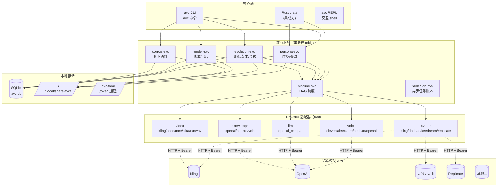

### 2.2 进程内协作（sequence）

下面这张图展示一次 `avc persona new` 在**单进程内**跑过的所有 in-process 调用——尽管图中画了多个服务，实际都在同一进程、同一 tokio runtime 里。

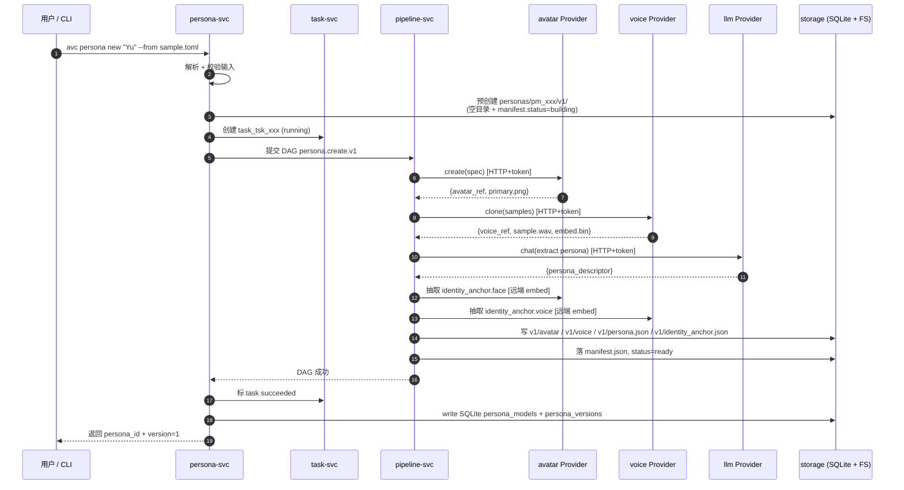

---

## 3. 五个子模块

| 子模块 | 主要服务 | 负责 | 不负责 |
|--------|----------|------|--------|
| [persona-modeling](./modules/persona-modeling.md) | `persona-svc` | PersonaModel v1 创建 | 训练、渲染 |
| [persona-evolution](./modules/persona-evolution.md) | `evolution-svc` | 训练任务 / 版本管理 / 漂移兜底 | v1 创建、渲染 |
| [video-generation](./modules/video-generation.md) | `render-svc` | 脚本 / DAG 出片 | 训练、人设设计 |
| [pipeline](./modules/pipeline.md) | `pipeline-svc` | 节点编排 / 调度 / 重试 / 断点 | 具体 Provider 调用 |
| [knowledge-aspect](./modules/knowledge-aspect.md) | `corpus-svc` | 语料 / RAG | 形象 / 声音 / 人设 |

### 3.1 子模块依赖图（flowchart）

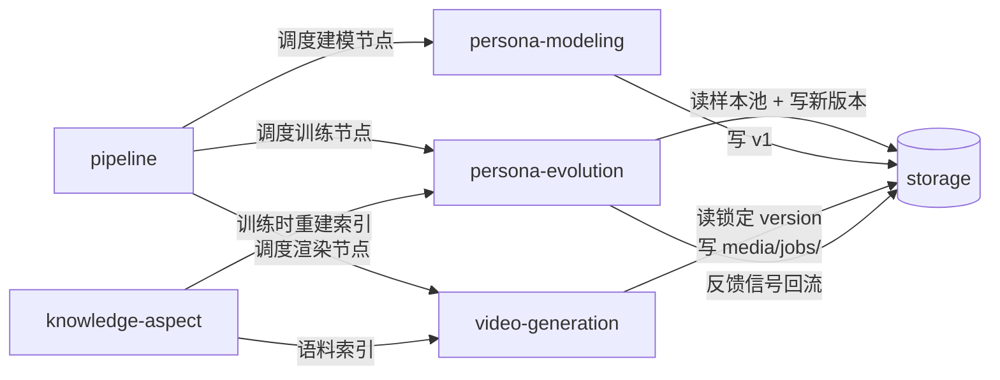

### 3.2 单一子模块内部协作（以 evolution 为例）

```mermaid
flowchart TB
    subgraph evolution["evolution-svc"]
        EP[入口] --> SF[sample_filter]
        SF -->|"scope=avatar"| AT[avatar_train 节点]
        SF -->|"scope=voice"| VT[voice_train 节点]
        SF -->|"scope=persona"| PT[persona_sft 节点]
        SF -->|"scope=knowledge"| KR[knowledge_reindex 节点]
        AT --> AN[anchor_extract]
        VT --> AN
        PT --> AN
        KR --> AN
        AN --> DE[drift_eval]
        DE -->|"≥ threshold"| PUB[publish v(N+1)]
        DE -->|"< threshold"| RB[rollback + drift_report]
        PUB --> FS[(storage<br/>写入新目录)]
        RB --> FS
    end
```

> 其他子模块的内部结构见各自章节。下面把所有跨子模块的**用户场景**完整画出。

---

## 4. 核心流程

下面四个流程构成 AVCore 的全部用户故事：

| 流程 | 触发命令 | 起始数据 | 产物 |
|------|----------|----------|------|
| 创建 v1 | `avc persona new "Yu" --from ./samples.toml` | 设定 + 样本 | `personas/pm_xxx/v1/` + SQLite row |
| 持续训练 | `avc persona evolve yu --scope voice --add ./new.wav` | 样本池 | `personas/pm_xxx/v2/` (or rollback) |
| 出片 | `avc render video --persona yu --topic "..."` | topic + 锁定 version | `media/jobs/job_xxx/final.mp4` |
| 反馈回灌 | `avc job feedback job_xxx --signal looks_unlike` | 反馈 | `persona_samples(kind=feedback)` |

### 4.1 流程 A：创建 PersonaModel v1

#### 4.1.1 逻辑流（flowchart）

```mermaid
flowchart TB
    A["avc persona new 'Yu' --from ./samples.toml"] --> B{input 校验}
    B -->|failed| ER1[返回 invalid_input]
    B -->|ok| C[预创建 v1 目录<br/>manifest.status=building]
    C --> D[avatar Provider<br/>create(spec)]
    D --> E[voice Provider<br/>clone(samples)]
    E --> F[llm Provider<br/>extract_persona]
    F --> G{KnowledgeBinding?}
    G -->|yes| H[corpus-svc: index chunks]
    G -->|no| I[skip]
    H --> J
    I --> J
    J[抽取 identity_anchor<br/>face/voice/style embedding] --> K[写 v1/avatar/voice/persona/identity_anchor]
    K --> L[manifest.status=ready + 写 SQLite]
    L --> M[任务 succeeded<br/>返回 persona_id]
```

#### 4.1.2 异常路径（flowchart）

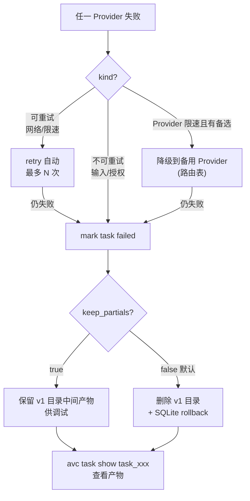

### 4.2 流程 B：持续训练 v1 → v2

#### 4.2.1 整体时序（sequence）

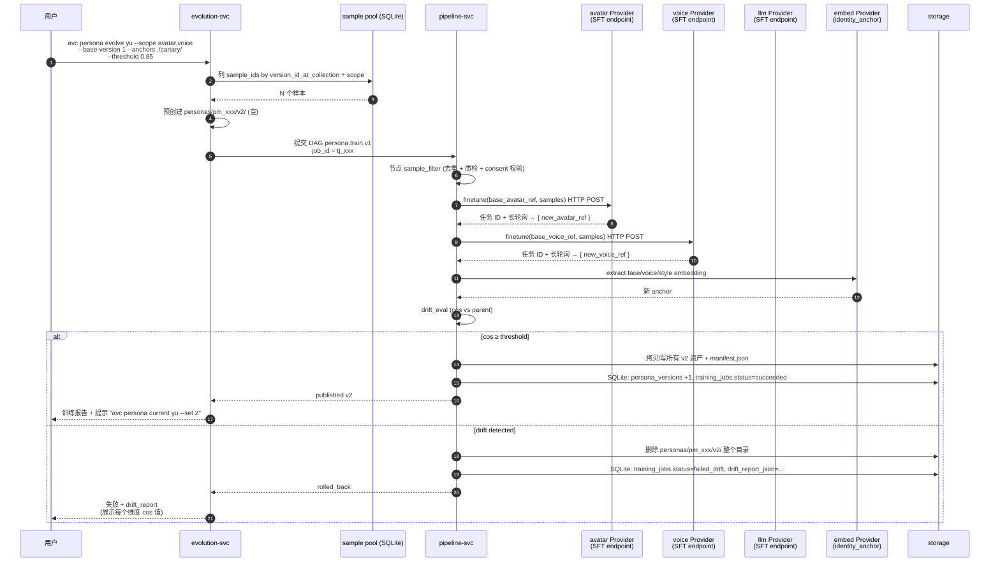

#### 4.2.2 DAG 节点拓扑（flowchart）

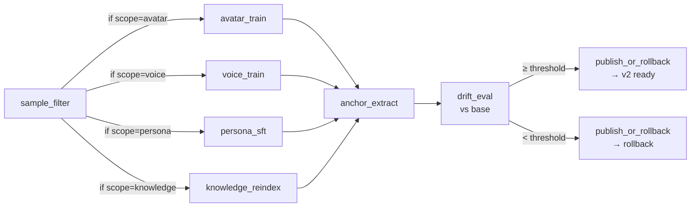

#### 4.2.3 训练任务状态机

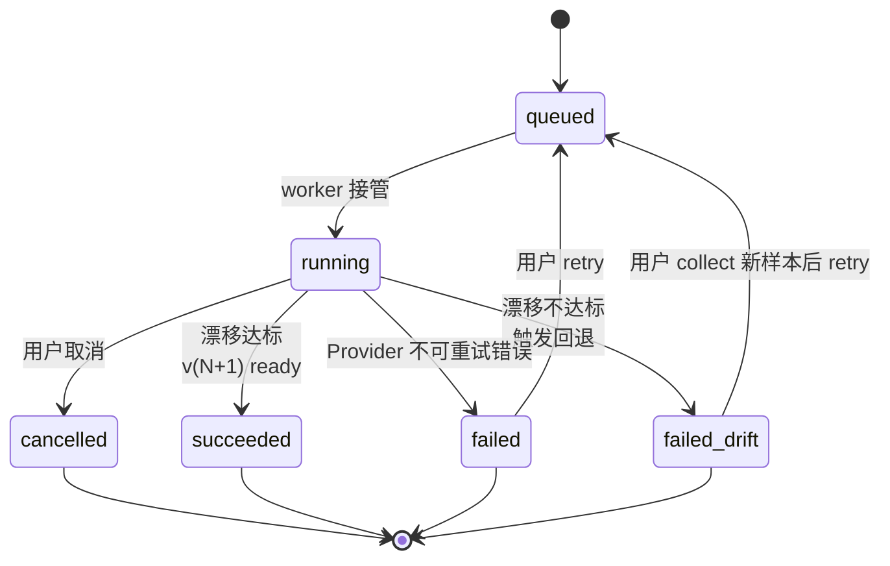

#### 4.2.4 版本时间轴（gitgraph）

```mermaid
gitgraph
    commit id: "v1<br/>initial"
    commit id: "samples +n"
    branch retry-1
    commit id: "v2 candidate<br/>drift=0.79"
    commit id: "rollback"
    checkout main
    commit id: "samples +m<br/>(canary)"
    branch retry-2
    commit id: "v2 candidate<br/>drift=0.92"
    commit id: "publish v2"
    checkout main
    commit id: "samples +k"
    branch alt
    commit id: "v3 candidate<br/>drift=0.88"
    commit id: "publish v3"
    checkout main
    commit id: "current=v3"
```

> 实际产品里 `current_version` 是 PersonaModel 的一个独立指针，可改回拨而不影响已渲染视频。

### 4.3 流程 C：视频渲染

#### 4.3.1 用户视角时序（sequence）

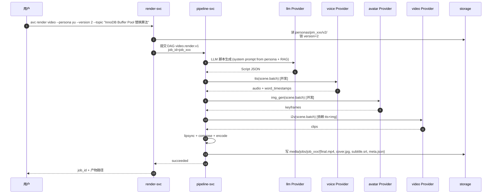

#### 4.3.2 DAG 节点拓扑（flowchart）

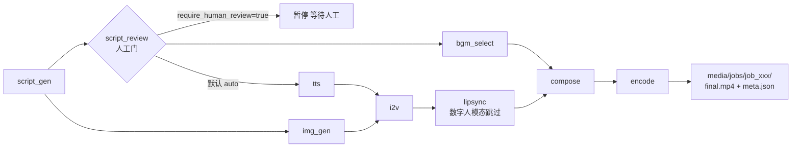

#### 4.3.3 渲染任务状态机

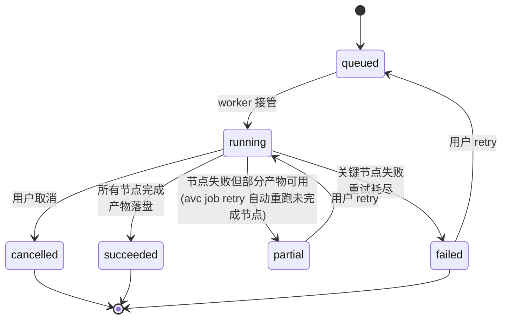

### 4.4 流程 D：反馈回灌

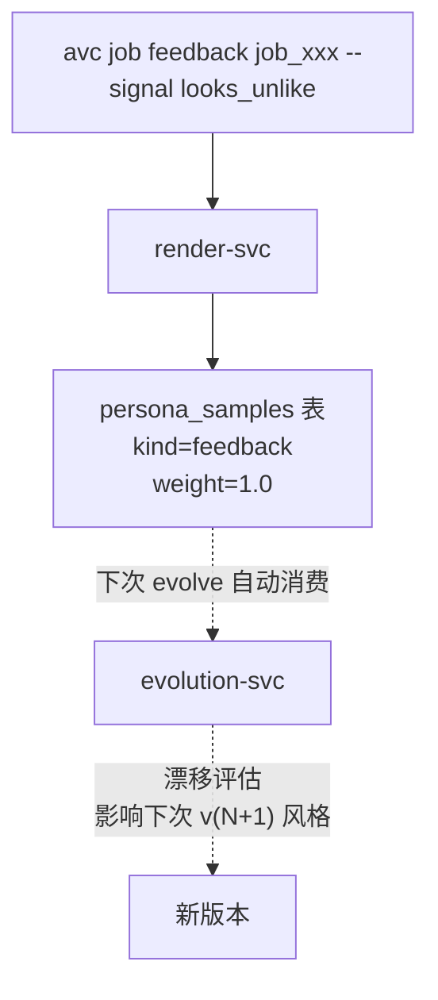

### 4.5 流程 E：切版本 / 回滚 / A/B

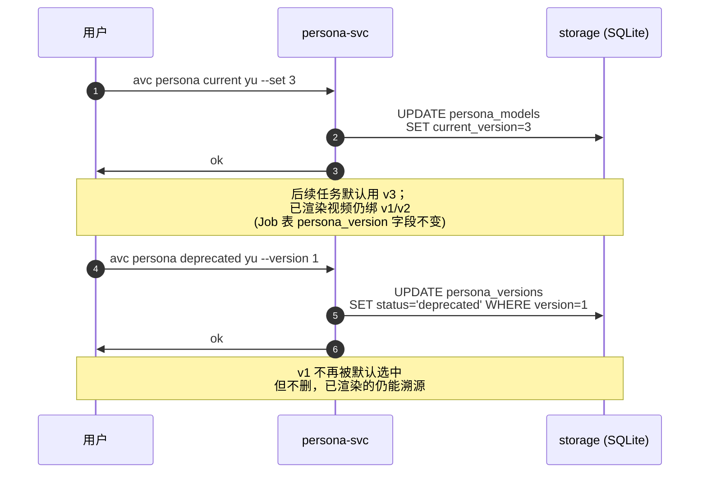

---

## 5. Provider 与 token 鉴权

### 5.1 鉴权流（sequence）

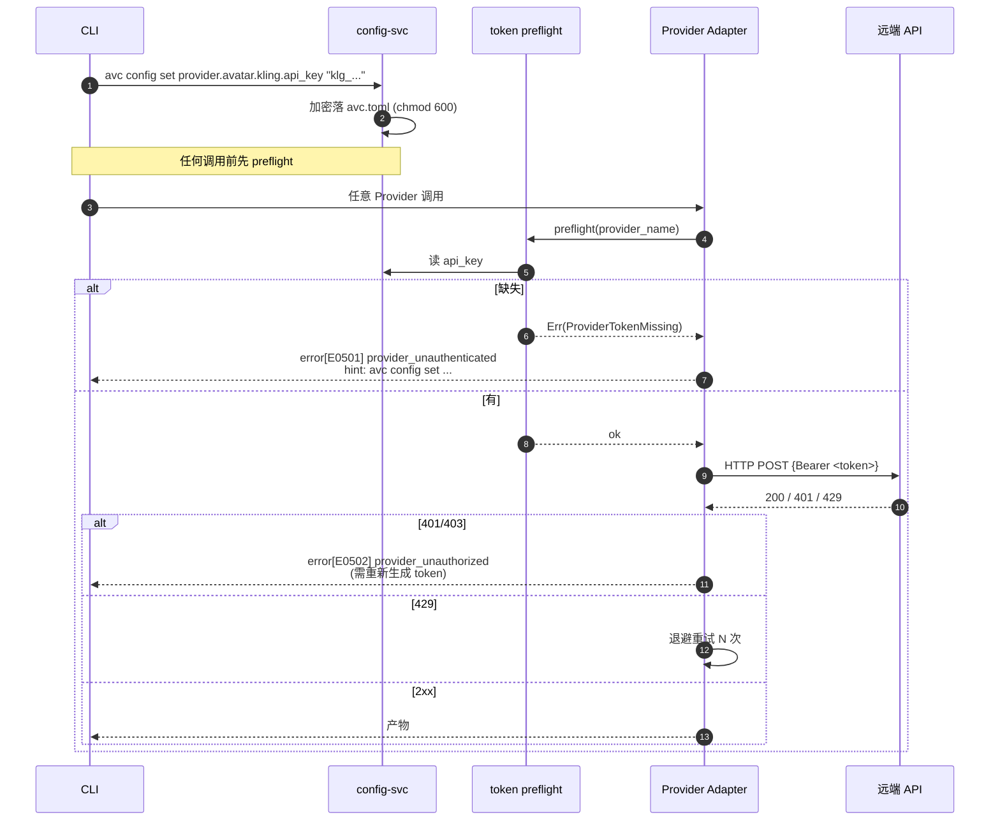

### 5.2 Provider 路由降级（flowchart）

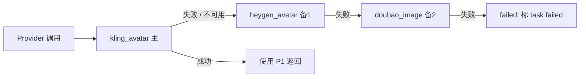

> Provider 注册到 `provider_registry`，`avc provider config` 可调整主/备顺序与启用列表。

---

## 6. 信息存储（重点：本框架怎么存）

> **一句话**：全部状态进单一 SQLite 文件 `~/.local/share/avc/avc.db`，配置 / token 走 `~/.config/avc/avc.toml`。
>
> 用户给定的规模约束：≤ 50 persona，单机运行。在这个量级，**单一 SQLite + BLOB 列**比"FS + SQLite"和"对象存储"都简单。详见 [`storage.md`](./storage.md)。


### 6.1 顶层文件布局（graph）

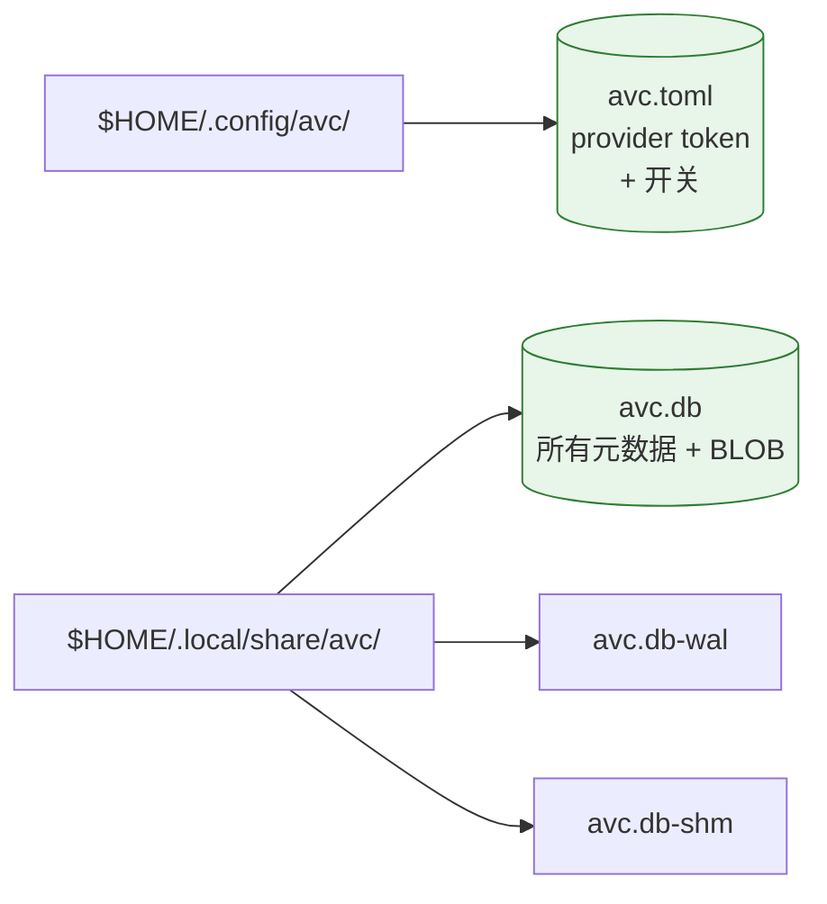

> **唯一两个稳定文件：avc.toml（配置）+ avc.db（数据）**。其余 WAL/SHM 是 SQLite 运行时临时，关闭后回收。详见 [`storage.md`](./storage.md)。

### 6.2 SQLite Schema（erDiagram）

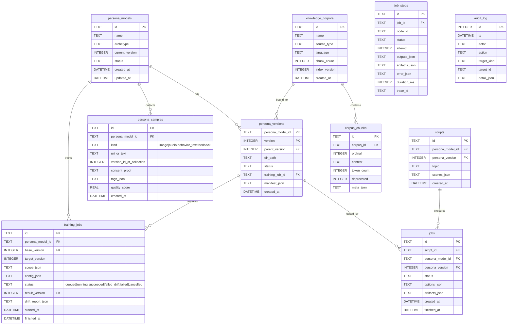

### 6.3 不可变行的语义

每个 `PersonaModelVersion` = `persona_versions` 表的一行，包含所有元数据与 BLOB 资产。版本永远以新增行的方式产生，旧行不被 UPDATE。

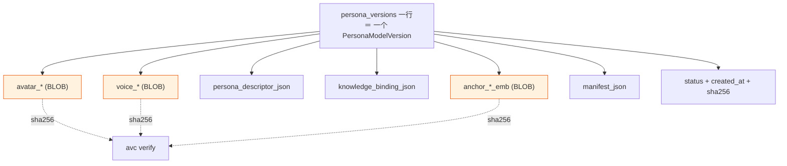

> 漂移不达标 → `DELETE FROM persona_versions WHERE version=N+1` 在事务内回退 = 整个版本消失。详见 [`storage.md §3`](./storage.md)。

## 7. 跨场景对照

| 场景 | 服务链 | 落盘位置 | 关键事件 |
|------|--------|----------|----------|
| 首次创建 persona | persona-svc → pipeline-svc → 3~4 Provider | `persona_versions` 新行 | `task_succeeded` / version=1 |
| 持续训练 | evolution-svc → pipeline-svc → 1~3 Provider | 预占 v(N+1)；成功 → INSERT；失败 → DELETE 事务回退 | `training_jobs.status` |
| 出片 | render-svc → pipeline-svc → LLM/TTS/i2v Provider | `jobs` + `artifacts.content BLOB` | `jobs.status` |
| 反馈回灌 | render-svc → `persona_samples` | SQLite 即可 | `sample(kind=feedback)` |
| 跨机迁移 | export / import | 整个 `avc.db` (or tar.zst 单 persona) | `avc export` / `import` |
| 紧急回滚 | persona-svc 改 current_version 指针 | UPDATE `persona_models` | `persona_models.current_version=vPrev` |

---

## 8. 关键技术决策（ADR 摘要）

| 编号 | 决策 | 备选 | 理由 |
|------|------|------|------|
| ADR-001 | **Rust + 单二进制** 为主仓 | Python 服务 / Go / Node | 启动快、类型强、与"CLI 优先"对齐 |
| ADR-002 | **SQLite + 本地文件系统** 起手（仅存元数据与产物引用） | Postgres / MinIO | 零运维、可拷走、单用户足够；模型权重不在本仓 |
| ADR-003 | **DAG 节点编排引擎自研** | Temporal / Argo | 起步要轻、可演进 |
| ADR-004 | **Provider 通过 trait 抽象** + 内置实现 | 配置化插件框架 | 内置足够简单；插件框架可后续加 |
| ADR-005 | **PersonaModelVersion 不可变** | 可变 + 软删 | 历史视频必须稳定 |
| ADR-006 | **训练任务独占（同一 persona 不并发）** | 并行训练 | 防止版本冲突 |
| ADR-007 | **不内嵌计费 / 可观测性 dashboard** | 内嵌 SaaS 化 | 与开源核心定位冲突 |
| ADR-008 | **CLI + REPL 双形态** | 仅 CLI / 仅 REPL | 自动化 + 探索各有需求 |
| ADR-009 | **Provider 通过 HTTP/gRPC，不在本仓跑模型** | 内置本地 GPU | 主仓是编排层，模型在 Provider |
| ADR-010 | **仅调用 token 鉴权的商业 / 开源模型 API** | 自托管 / 本地推理 | 与"开源核心、可商用接入"定位一致；免除 GPU / 驱动 / 推理服务治理负担 |

---

## 9. 演进路线

### Phase 0 — 最小闭环（4 周）
- `avc persona new` 跑通：v1 生成（avatar / voice / persona 全部 token API）
- `avc render video` 跑通：1 条视频（脚本 + tts + i2v + compose，全部远端 API）
- 不做版本管理（先用 `current_version = 1`）
- 验收：`avc persona new Yu → avc render video --persona yu --topic hi` 出一个能看的 mp4

### Phase 1 — Provider 矩阵 + 持续训练（8 周）
- 形象（商用）：kling_avatar / heygen_avatar / doubao_image / seedream
- 形象（开源-via-API）：replicate_flux_lora / hf_inference
- 声音：volc_tts / azure_tts / elevenlabs / doubao_tts / openai_tts
- LLM：openai_compat
- 视频：kling / doubao_seedance / pika / runway / replicate_cogvideox
- 微调：openai_compat_sft / replicate_trainer / kling_avatar_finetune
- 多版本 + 漂移评估 + 切版本 + 强制回滚
- 反馈回灌（手动 + 自动）

### Phase 2 — 可选插件能力（4 周）
- **对象存储插件**（`avc storage plugin install s3`）—— 默认仍推荐本地 FS，本插件只在空间 / 共享成为瓶颈时启用
- OpenTelemetry 可选导出
- 训练并行（同 persona 多 base / 多 worker）
- 评测集 / canary 样本管理

### Phase 3 — 平台化扩展（不属本仓范围）
- Web 控制台、模板市场、A/B 实验、多租户 SaaS — 由独立上层项目承担
- AVCore 始终保持**纯 CLI 核心**

---

## 10. 风险与对策

| 风险 | 影响 | 对策 |
|------|------|------|
| Provider 限速 / 涨价 | 吞吐 / 成本 | 多 Provider + 路由表（§5.2） |
| Provider token 失效 / 错误 | 任务中断 | preflight + 401 自动重试 + 自动告警 |
| 数字人合规 | 法务 | 强制 consent + 可关闭"真实人物复刻"开关 |
| 训练漂移 | 用户体验 | 漂移自动评估 + 回退 + drift_report |
| 版本错乱 | 团队 | 版本不可变 + 切版本原子化 |
| Provider API 变更 | 中断 | provider.json 多版本兼容；token preflight catch change |
| 模型效果不稳 | 口碑 | canary 样本 + 评测集 + 漂移告警 |
| 跨机迁移 | 体验 | `avc export / import` tar.zst 包 |

---

## 11. 后续阅读

- 设计：[design.md](./design.md)
- **资产存储（含目录树与 SQLite 表示例）：**[storage.md](./storage.md) ⭐
- CLI / REPL 用法：[cli.md](./cli.md)
- 子模块详细设计：
  - [persona-modeling.md](./modules/persona-modeling.md)
  - [persona-evolution.md](./modules/persona-evolution.md)
  - [video-generation.md](./modules/video-generation.md)
  - [pipeline.md](./modules/pipeline.md)
  - [knowledge-aspect.md](./modules/knowledge-aspect.md)
- Provider / API 参考：[api/README.md](./api/README.md)
