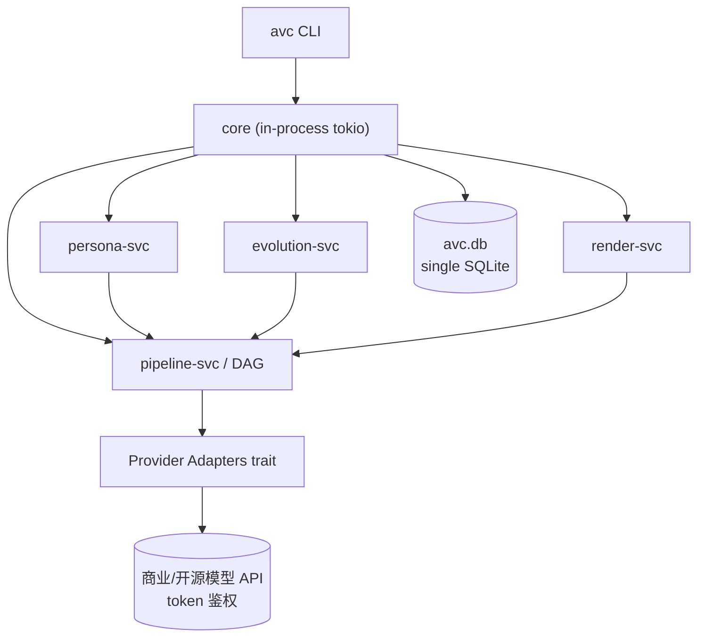
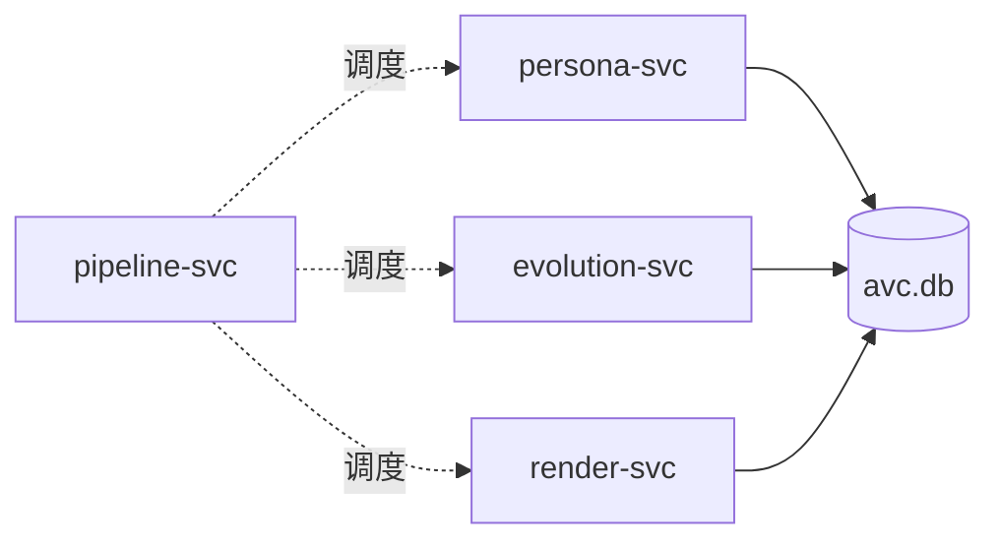
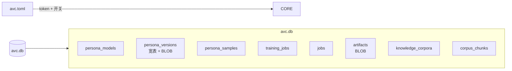

# 架构文档

> 极简内核：单进程 tokio runtime + 单一 SQLite + DAG Pipeline + Provider trait。

---

## 1. 顶层形态



> 进程内 4 个 `*-svc` 是模块边界而非独立进程——都是同一进程同一 tokio runtime。

---

## 2. 子模块

| 子模块 | 服务 | 负责 | 不负责 |
|--------|------|------|--------|
| persona-modeling | `persona-svc` | 创建 PersonaModel v1（含可选知识绑定） | 训练 / 渲染 |
| persona-evolution | `evolution-svc` | 训练 / 版本管理 / 一致性兜底 | v1 创建 / 渲染 |
| video-generation | `render-svc` | 脚本 + 渲染出片 | 训练 / 人设 |
| pipeline | `pipeline-svc` | DAG 节点编排 / 调度 / 重试 / 断点 | 具体 Provider |



---

## 3. 技术选型

| 维度 | 选型 | 备注 |
|------|------|------|
| 主语言 | Rust | 启动快、类型强、单二进制 |
| 异步 | tokio | 跨 Provider HTTP/gRPC 通杀 |
| HTTP | reqwest (rustls) | 免 OpenSSL |
| DB | SQLite (rusqlite, bundled) | 单文件，零运维 |
| 日志 | tracing | 结构化 JSON，OTel 可选 |
| CLI | clap (derive) | 自动生成文档 |

> **不引入**：Postgres、Redis、Kafka、对象存储 SDK。

---

## 4. Provider trait

```rust
#[async_trait]
pub trait AvatarProvider: Send + Sync {
    fn name(&self) -> &str;
    async fn create(&self, spec: &AvatarSpec) -> Result<Avatar>;
    async fn finetune(&self, base: &Avatar, samples: &[Sample], cfg: &TrainCfg) -> Result<Avatar>;
}
pub trait VoiceProvider { /* clone / synth / finetune */ }
pub trait LlmProvider   { /* chat */ }
pub trait VideoProvider { /* render */ }
pub trait EmbedProvider { /* embed_text(text) -> Vec<f32> */ }
```

每个 Provider = 一份 `provider.json` + trait 实现，token 鉴权调用商业 / 开源 API。**无本地推理**。

---

## 5. 存储架构



详见 [`storage.md`](./storage.md)。

---

## 6. 任务状态机（DAG 节点）

每个 DAG 节点落 `job_steps` 表（最少字段：`job_id, node_id, status, attempt, outputs_json, error_json, duration_ms`）；节点结果持久化即支持断点续跑。

训练 / 渲染共用一套节点类型 + 同一调度引擎。

---

## 7. ADR（5 条）

| 编号 | 决策 | 理由 |
|------|------|------|
| ADR-001 | Rust 单二进制 | 启动快、类型强、与"CLI 优先"对齐 |
| ADR-002 | 单一 SQLite（含 BLOB） | ≤50 persona 完全够；单文件备份 / 迁移 |
| ADR-003 | 自研轻量 DAG | 不引入 Temporal 重量级框架 |
| ADR-004 | Provider trait + token API | 不锁模型厂商、不本地推理 |
| ADR-005 | PersonaVersion 不可变（INSERT/DELETE 整行）| 历史视频必须稳定 |

---

## 8. 路线

- **Phase 0**：单 Provider × 1 角色 × 1 视频跑通
- **Phase 1**：Provider 矩阵 + 持续训练 + 漂移兜底 + 多版本
- 后续均为可选扩展

---

## 9. 风险与对策

| 风险 | 对策 |
|------|------|
| Provider 限速 | 重试 + 退避；预设主 Provider |
| token 失效 | preflight + 401 自动提示 |
| 漂移 | DELETE 事务回退 + drift_report |
| 跨机迁移 | `avc.db` 整文件 `rsync` 或 `avc export --persona` |

---

## 10. 后续阅读

- [design.md](./design.md) · [storage.md](./storage.md) · [cli.md](./cli.md)
- 子模块：[persona-modeling](./modules/persona-modeling.md) · [persona-evolution](./modules/persona-evolution.md) · [video-generation](./modules/video-generation.md) · [pipeline](./modules/pipeline.md)
- [api/README.md](./api/README.md) · Provider trait
