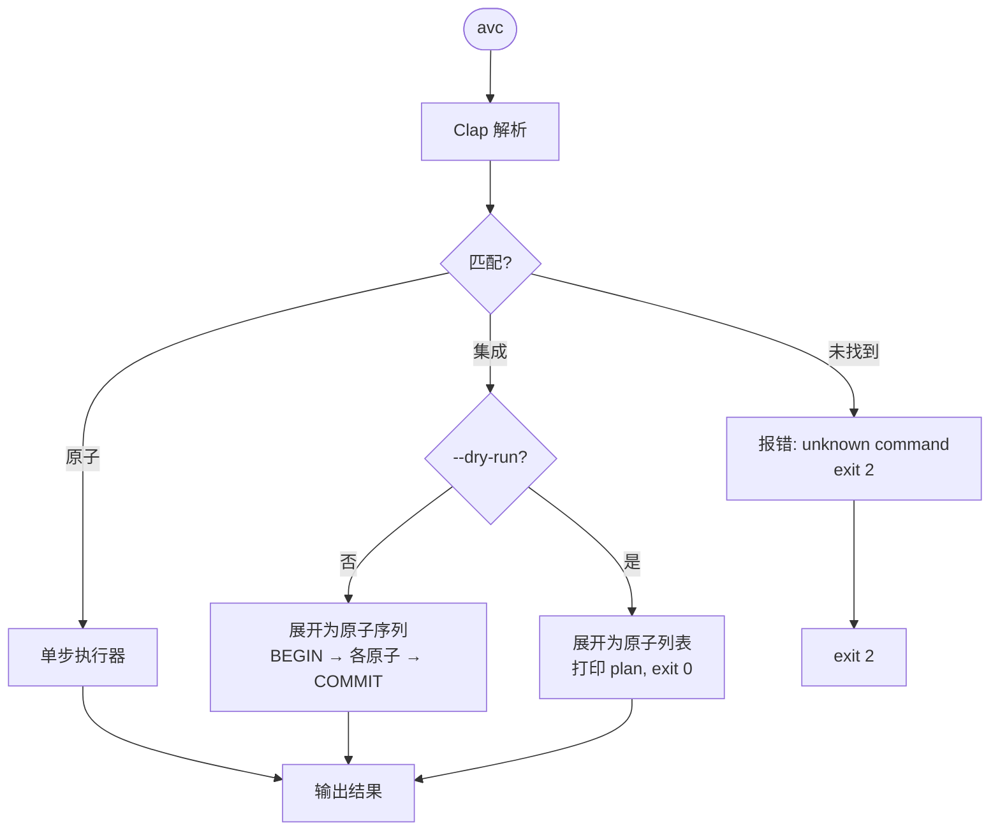

# CLI 设计

> AVCore 的根命令 `avc` 提供**三种执行入口**：精确 CLI、交互式 Shell、非交互式 ask。三者共用同一套原子命令和底层状态机——区别只在交互形态。

---

## 1. 三种执行入口

```
                avc
                 │
   ┌─────────────┼─────────────┐
   ▼             ▼             ▼
 CLI 模式    Shell 模式     ask 模式
 (默认)      (交互)
   │             │             │
   │ 一次性进程  │ 持续进程      │ 一次性进程
   │ 启动 <100ms │ NL + 原子     │ NL → 原子 → 执行
   │ 脚本友好   │ 人类友好      │ 管道友好
   ▼             ▼             ▼
avc persona    avc shell    avc ask "把 Yu
list yu        > 列出所有    的 traits 改成
                角色         严谨务实"
```

| 入口 | 何时用 | 写操作确认 |
|---|---|---|
| **CLI**（`avc <atom>`） | 脚本、CI、确定路径 | 不确认（已显式） |
| **Shell**（`avc shell` 或 TTY 下 `avc`） | 探索、人设迭代、日常 | NL 路径才确认；原子路径不确认 |
| **ask**（`avc ask "..."`） | 远程 / 管道 / 一次性 NL | 非 TTY 默认要求 `--yes` |

> **入口路由**：`avc` 无参 + TTY → Shell；无参 + 非 TTY → help；首参是 `shell` → Shell；首参是 `ask` → ask 模式；其他 → CLI 模式。

### 1.1 CLI 模式执行流（精确命令路径）



### 原则一：原子化（Atomic）

> **一条原子命令 = 一个资源 = 一个动作。**

- 单一职责；可被 shell 组合
- 幂等（能重跑）；可加 `--dry-run` 看清将做什么
- 输出**结构化**：`--json` 永远有效，机器可读
- 失败时不破坏未涉及的状态

### 原则二：集成化（Integrated / Workflow）

> **一条集成命令 = 一条典型工作流，封装 N 个原子。**

- 满足"用户最常用的 80% 路径"
- 内部依然走原子（不是黑盒魔法）：`--dry-run` 展开为原子列表
- 任何集成都能"降级"为手工跑的原子序列

### 原则三：可对话（NL / Shell）

> **Shell / ask 把"原子 + 集成"翻译成自然语言。**

- 输入 = 自然语言或原子命令都行（同一进程）
- 输出 = 翻译后的原子计划 → 用户确认 → 执行
- 底层永远落原子：可观察、可回放、可 `history` 复盘

### 一句话区分

> **原子** = 一个动词；**集成** = 一条工作流；**NL** = 一句人话。Shell 把它们装进同一个循环。

---

## 3. 资源树

```
avc
├── root        系统级（init / doctor / config / backup / ...）
├── persona     角色管理
├── sample      训练样本
├── iterate     refine 任务账本
├── finetune    finetune 任务账本
├── job         渲染任务账本
├── render      出片工作流
├── corpus      知识语料
├── daemon      后台守护进程（start/stop/status/logs）
├── provider    Provider 注册、诊断、健康、限速
├── shell       进入交互式 Shell（也可由 TTY 下裸 `avc` 触发）
└── ask         非交互式自然语言执行（avc ask "..."）
```

资源命名**与 SQLite 表一一对应**。一个原子命令 = 表的一次操作。

---

## 4. 完整命令表

> 命令格式：`avc <noun> <verb> [--flags]`。  
> 标记 **`[A]`** = 原子；标记 **`[I]`** = 集成。

### 4.1 root（系统级）

| 命令 | 类型 | 说明 |
|------|------|------|
| `avc init` | `[A]` | 初始化 `~/.local/share/avc/avc.db` + `~/.config/avc/avc.toml` |
| `avc doctor` | `[I]` | 集成：`verify` + token preflight + 网络探测 |
| `avc verify [--persona <id>]` | `[A]` | 重算 / 比对 SHA256 |
| `avc backup --out <path>` | `[A]` | WAL checkpoint + atomic copy |
| `avc restore --from <path>` | `[A]` | 替换 `avc.db` |
| `avc export --persona <id> --out <tar>` | `[A]` | 单 persona 导出 |
| `avc import <tar>` | `[A]` | 单 persona 导入 |
| `avc prune [--archive-older-than <days>]` | `[I]` | 集成：扫描 archived + 物理清理 |
| `avc config get <key>` / `set <key> <val>` | `[A]` | 读写 `avc.toml` |
| `avc version` | `[A]` | 打印版本 |
| `avc shell` | `[I]` | 进入交互式 Shell（同 TTY 下裸 `avc`） |
| `avc ask "..."` | `[I]` | 非交互式自然语言 → 原子计划 → 执行 |

### 4.2 persona

#### 原子（最小操作集）

| 命令 | 作用 |
|------|------|
| `avc persona create --name <n> --archetype <a>` | 预占 `persona_models` 行 + 新版本号 status=`pending` |
| `avc persona show <name>` | 概要 |
| `avc persona list [--status pending\|active\|archived]` | 列表 |
| `avc persona versions <name>` | 历史版本 |
| `avc persona attach-avatar <name> --version <v> --ref ` | 写 `avatar_*` 列 |
| `avc persona attach-voice <name> --version <v> --ref <wav>` | 写 `voice_*` 列 |
| `avc persona attach-persona <name> --version <v> --descriptor <json>` | 写 `persona_descriptor_json` |
| `avc persona attach-knowledge <name> --version <v> --corpus <id>` | 写 `knowledge_binding_json` |
| `avc persona set-traits <name> --version <v> --traits <list>` | refine：改 `persona_descriptor_json.traits` |
| `avc persona set-catchphrase <name> --version <v> --add <s>` / `--remove <s>` | refine：改 catchphrases |
| `avc persona set-render <name> --version <v> --resolution 1080p ...` | refine：改 `manifest_json.render_options` |
| `avc persona commit <name> --version <v>` | pending → ready，触发 anchor 抽取并落行 |
| `avc persona promote <name> --to <v>` | 改 `current_version` |
| `avc persona demote <name> --version <v>` | 该版本 status=`deprecated` |
| `avc persona archive <name>` | 软删除 |
| `avc persona delete <name> --confirm` | 硬删除（要求 `--confirm`，默认拒绝） |
| `avc persona current <name> [--set <v>]` | 读 / 设当前版本 |
| `avc persona inspect <name> --version <v>` | 结构化展示整行 |
| `avc persona dump <name> --version <v> --out <dir>` | 一次性导出可读目录 |

#### 集成（典型工作流）

| 命令 | 内部等价于 |
|------|----------|
| `avc persona onboard --name <n> --avatar <png> --voice <wav> --descriptor <json> [--corpus <id>] [--archetype <a>] [--description <s>]` | `create` + `attach-avatar` + `attach-voice` + `attach-persona` (+ 可选 `attach-knowledge`) + `commit` |
| `avc persona finetune --name <n> --scope <avatar\|voice\|persona> [--with-feedback] [--threshold <n>]` | 收集样本 + `finetune start` + drift 评估 + 达标 → `commit` + `promote`，不达标 → `DELETE` 整行事务回退 |

> 注：v0.3 起 `avc persona` 不再有 `refine` 或 `finetune` 子动词——refine
> 走 `avc iterate apply`（`--set-persona/--set-knowledge/--set-manifest`），
> finetune 走 `avc finetune start/run/drift ...`（顶层）。`onboard` 的入参是离散
> flag（见上），不是 `--from <yaml>`。

### 4.3 sample

| 命令 | 类型 | 作用 |
|------|------|------|
| `avc sample add <persona> --kind image\|audio\|behavior_text\|feedback --uri <p>\|--text <s> --consent <p>` | `[A]` | 入训练池 |
| `avc sample list <persona> [--kind ...]` | `[A]` | 列出 |
| `avc sample show <id>` | `[A]` | 详情 |
| `avc sample remove <id>` | `[A]` | 删除 |

### 4.4 iterate（refine 任务账本）

| 命令 | 类型 | 作用 |
|------|------|------|
| `avc iterate list <persona>` | `[A]` | 列出该 persona 的 iterate 任务（位置参数，v0.3.3 改） |
| `avc iterate show <id>` | `[A]` | 任务详情（含 `changes_json`） |
| `avc iterate apply <name> --version <v> [--set-persona <json>] [--set-knowledge <json>] [--set-manifest <json>]` | `[A]` | 把 changes 应用到 (pm, v) 同一行的可改列；同步落 `iterate_jobs(status=succeeded)` |
| `avc iterate cancel <id>` | `[A]` | 取消 queued |

### 4.5 finetune（SFT 任务账本）

| 命令 | 类型 | 作用 |
|------|------|------|
| `avc finetune start <persona> --scope ... --base-version <v> [--threshold <n>]` | `[A]` | 启动 finetune 任务（建 fj 行 + 预占 target_version） |
| `avc finetune run <fj_id> [--embed <name>]` | `[A]` | 端到端：拉 samples → 调 vendor CLI SFT → 算 voice drift → publish/rollback |
| `avc finetune drift eval <fj_id> [--embed <name>]` | `[A]` | 只算 drift，不动 fj.status（与 run 配套的可观测 verb） |
| `avc finetune list <persona>` | `[A]` | 列出该 persona 的 finetune 任务（位置参数，v0.3.3 改） |
| `avc finetune show <id>` | `[A]` | 任务详情 |
| `avc finetune publish <id> --passed` | `[A]` | 测试用：手动 publish（不走真 SFT 也不调 Provider）。`--failed` 保留字段但当前不生效（实现仅识别 `--passed`） |
| `avc finetune report <id> --json` | `[A]` | drift_report_json 结构化输出 |
| `avc finetune cancel <id>` | `[A]` | 取消 queued / running |

### 4.6 job

| 命令 | 类型 | 作用 |
|------|------|------|
| `avc job list --persona <n>` | `[A]` | 列出该 persona 的渲染任务 |
| `avc job show <id> [--watch]` | `[A]` | 任务详情 |
| `avc job wait <id> --until <status>` | `[A]` | 阻塞到目标状态 |
| `avc job cancel <id>` | `[A]` | 取消 |
| `avc job export <id> --out <dir>` | `[A]` | 拷 BLOB 到本地 FS（`<kind>__<name>__<id>.bin`） |
| `avc job export <id> --target s3://bucket/prefix/` | `[A]` | 走 `[export.s3].upload_cmd` 模板（默认 `aws s3 cp`）上传每个 artifact；`--out` 和 `--target` 互斥 |
| `avc job feedback <id> --looks-unlike [--reason <text>]` | `[A]` | 把"不像"标记写入 `persona_samples(kind=feedback)` |

### 4.7 render

**原子**：

```bash
avc render script  --persona yu --version 2 --topic "..." --out script.json
avc render script edit script.json --patch '{"op":"replace","path":"/scenes/0/duration_ms","value":9000}'
avc render video --from-script script.json --quiet    # 返 job_id
```

**集成**：

```bash
avc render run --persona yu --version 2 --topic "InnoDB Buffer Pool" --duration 60 --resolution 1080p
avc render pack --persona yu --topics-file ./daily_topics.txt
```

### 4.8 corpus

| 命令 | 类型 | 作用 |
|------|------|------|
| `avc corpus create --name <n> --source <path>` | `[A]` | 切 chunk + 调 embed API |
| `avc corpus chunks <id>` | `[A]` | 列 chunk |
| `avc corpus search <id> --query <q> --topk 5` | `[A]` | embed cosine top-K |
| `avc corpus attach <persona> --version <v> --corpus <id>` | `[A]` | 写 `knowledge_binding_json` |
| `avc corpus detach <persona> --version <v>` | `[A]` | 清空 `knowledge_binding_json` |
| `avc corpus reindex <id>` | `[A]` | 重跑 embed |
| `avc corpus delete <id> --confirm` | `[A]` | 硬删除 |

### 4.9 provider

| 命令 | 类型 | 作用 |
|------|------|------|
| `avc provider list` | `[A]` | 已注册 provider |
| `avc provider show <name>` | `[A]` | 元数据 + endpoint + auth scheme |
| `avc provider test <name>` | `[A]` | 一次轻量 ping |
| `avc provider config <name> --set-key` | `[A]` | 写 token 到 `avc.toml` |
| `avc provider status [--dim <llm\|embed\|avatar\|voice\|video>] [--json]` | `[A]` | 健康查询（默认查 DB 最近 1 条/provider；`--dim` 单维过滤；`--json` 机器读） |
| `avc provider rate-limit [--json]` | `[A]` | 限速查询（`in_cooldown` / `hit_count_24h` / 触发的 dim/name） |

`status` / `rate-limit` 读 daemon 写入的 `provider_health` / `provider_rate_limit` 表；
daemon 未运行时显示"无记录"。

输出（text 模式）：

```
dim      name           status         latency_ms  source  checked_at
llm      openai         healthy        234         probe   2026-08-04T10:00:00Z
embed    openai         auth           -           hook    2026-08-04T09:30:00Z
voice    elevenlabs     rate_limited   -           hook    2026-08-04T09:00:00Z
```

status 取值：`healthy` / `rate_limited` / `unauthenticated` / `timeout` /
`upstream_error` / `unknown`。`source` 取值：`probe`（daemon 主动 ping）/
`hook`（Provider 错误分支旁路记录）。

### 4.10 daemon

后台进程管理。daemon 启动后**自动 ping 所有配置的 provider**（按
`ping_interval_s` 间隔）并把 Provider 调用 hook 写入 DB；同进程绑定
HTTP loopback 端口供 `provider status/rate-limit` 查询。

| 动词 | 行为 |
|------|------|
| `avc daemon start [--foreground]` | fork 子进程（执行 `avc _run`）；pid 写到 `~/.local/share/avc/avc.pid`；`--foreground` 不 fork（CI/调试用） |
| `avc daemon stop` | 给 pidfile 中的 pid 发 `SIGTERM`（Unix）；Windows 不支持（报 exit 1） |
| `avc daemon status` | 显示 pid / alive / uptime / port / bind / log 路径 |
| `avc daemon logs` | tail `~/.local/share/avc/avc.log`（最近 2000 字符） |

`status` 输出示例：

```
daemon    pid=12345   alive=true   uptime=14m
          bind=127.0.0.1   port=7891
          log=/home/user/.local/share/avc/avc.log
          last_ping_at=2026-08-04T10:00:00Z
```

#### 配置 (`avc.toml`)

```toml
[daemon]
enabled = true                       # 默认
port = 7891                          # 默认
bind = "127.0.0.1"                   # 默认（不允许 0.0.0.0，强校验失败）
ping_interval_s = 60                 # 默认
log_level = "info"                   # tracing filter（debug/info/warn/error）
auto_record_hook = true              # 默认；provider 错误分支旁路是否写 DB
```

#### HTTP endpoints（axum 0.7，loopback only）

| 端点 | 用途 |
|------|------|
| `GET /health/all` | 全 provider 健康快照（JSON） |
| `GET /limits/all` | 全 provider 限速快照（JSON） |
| `GET /version` | daemon 元数据（pid / uptime / 配置摘要） |

仅监听 `[daemon].bind`；外部访问需 SSH tunnel，不暴露公网。

### 4.11 shell（交互式）

详见 [`shell.md`](./shell.md)。

```bash
avc shell                 # 启动 Shell（同 TTY 下裸 avc）
```

Shell 内建命令：

| 命令 | 作用 |
|------|------|
| `help` / `?` | 列出原子 + NL 示例 |
| `exit` / `quit` / `Ctrl-D` | 退出 |
| `clear` / `Ctrl-L` | 清屏 |
| `history` | 历史命令 |
| `!N` | 重跑历史第 N 条 |
| `!str` | 重跑最近以 `str` 开头的命令 |
| `--help` | 同 `help` |

### 4.12 ask（非交互式 NL）

```bash
avc ask "列出所有角色"                      # 只读：自动执行
avc ask "把 Yu 的 traits 改成严谨务实"      # 写：TTY 下确认；非 TTY 默认拒绝
avc ask --yes "出 Yu 主题 InnoDB 的视频"    # 跳过确认（脚本里用）
avc ask --json "yu 的当前版本是什么"         # JSON 输出
avc ask --dry-run "..."                     # 只展示计划，不执行
```

---

## 5. 典型 shell 组合

集成命令把"大多数情况"一行搞定；原子命令 + shell 把"边角情况"完全覆盖。

```bash
# A. 完整闭环：创建 → 迭代 → 出片
NAME=yu
avc persona onboard $NAME --avatar ./yu.png --voice ./yu.wav --descriptor '{"traits":["严谨","务实"]}'

# 改 prompt / 知识（纯数据，常做）
avc iterate apply $NAME --version "$(avc persona current $NAME)" --set-persona '{"tone":"严谨"}'

# 加样本 + 微调（花 token，慢）
avc finetune start $NAME --scope voice --base-version 1
avc sample add $NAME --kind audio --uri ./new.wav --consent ./auth.pdf
avc finetune run fj_xxx --embed openai_embed

# 4. 出片
v=$(avc persona show $NAME --json | jq -r .current_version)
jid=$(avc render run --persona "$NAME" --version "$v" --topic "$TOPIC" --json | jq -r .jobid)
avc job wait "$jid" --until succeeded

# 5. 导出
avc job export "$jid" --all --out "./out/$TOPIC/"
```

或者在 `avc shell` 里：

```
avc> 列出所有角色
[plan] read only — execute
  → persona list
yu        v=3  active    数据库内核专家
momo      v=1  active    日常 vlog

avc> 把 Yu 的 traits 改成严谨务实
[plan] refine persona yu (1 step)
  1. persona set-traits yu --version 3 --traits 严谨,务实
[y/n]? y
✓ updated version=3

avc> 出 Yu 的 InnoDB Buffer Pool 视频
[plan] render video (1 step)
  1. render run --persona yu --version 3 --topic "InnoDB Buffer Pool 替换算法" --duration 60
     (long-running)
[y/n]? y
✓ job_id=job_01H...  watch with: avc job show job_01H --watch
```

---

## 6. 输出约定

### 6.1 默认输出

人类可读，TTY 下加颜色。非 TTY 退化为纯文本。

### 6.2 `--json`

所有命令都接受 `--json`，输出**稳定** JSON：

```bash
avc persona show yu --json
{
  "id": "pm_01H...",
  "name": "yu",
  "current_version": 2,
  "versions": [1, 2],
  "status": "active"
}
```

### 6.3 `--quiet`

只输出最关键 ID / 退出码，便于脚本里赋值：

```bash
jid=$(avc render run --persona yu --version 2 --topic "..." --quiet)
```

### 6.4 进度流

长任务支持 `--watch`：默认轮询 / 输出进度，Ctrl+C 干净退出。

### 6.5 退出码

| code | 含义 |
|------|------|
| 0 | ok |
| 1 | 通用失败 |
| 2 | 参数错 |
| 3 | 资源不存在 |
| 4 | 状态冲突 |
| 5 | token 鉴权失败 |
| 6 | token 未配置 |
| 10 | Provider 限速 |
| 11 | Provider 上游错 |
| 12 | Provider 超时 |

### 6.6 错误格式

```
error[E0501]: provider_unauthenticated
  provider: provider.avatar.kling
  hint: avc config set provider.avatar.kling.api_key ...
  doc:   https://avc.dev/errors/E0501
```

---

## 7. 集成命令的"展开"规则

每个集成命令都必须做两件事：

1. 接受 `--dry-run`：打印**将执行**的原子列表，不真执行
2. 实际执行时，所有变更都体现为 SQLite 的 INSERT / UPDATE，长任务进度写到 `job_steps` 与 `iterate_jobs` / `finetune_jobs`

### 7.1 `avc iterate apply yu --version 1 --set-persona '{"tone":"严谨"}' --dry-run` 输出

> 注：v0.3 起 persona 不再有 `refine` 子命令；refine 走顶层 `avc iterate apply`，
> 内部分解为"读现 JSON → deep merge 三个 patch 列 → 写回"单事务。`--dry-run`
> 仅打印将落 `iterate_jobs` 的 changes 摘要，不写 DB。

```
plan (no changes made):

  1. iterate apply yu --version 1 --set-persona '{"tone":"严谨"}'   (atomic)
  no Provider SFT calls.  no new version.  no drift eval.
```

### 7.2 `avc finetune start yu --scope voice --base-version 1 --dry-run` 输出

```
plan (no changes made):

  1. finetune start yu --scope voice --base-version 1    (atomic)
  2.   ↳ voice SFT → voice drift eval (3-dim: face/voice/style, all ≥ threshold)
  3. publish_or_rollback branch
  4. persona commit yu --version <v>   if drift ok       (atomic)
  5. persona promote yu --to <v>      if drift ok        (atomic)
```

集成命令 = **原子列表 + 默认值 + 顺序**。可观察、可回放。

---

## 8. 命令矩阵总览

```
                         atomic        integrated
                    ───────────────  ──────────────
root                init/verify/...   doctor/prune/config
daemon              start/stop/status/logs               ← Phase 3
persona             create           onboard
                    attach-*         （无 refine/finetune 子动词；refine → iterate.apply，finetune → 顶层 finetune.*）
                    set-traits/...
                    commit
                    promote/demote
                    archive/delete
sample              add/list/remove
iterate             list/apply/show/cancel
finetune            start/run/drift/list/show/report/cancel/publish
job                 list/show/wait/cancel/export/feedback
render              script/video     run / pack
corpus              create/chunks/search/attach/detach/reindex
provider            list/show/test/config
                    status/rate-limit                   ← Phase 3
shell                                 shell           ← 交互入口
ask                                   ask             ← 非交互 NL
```

合计：

- 原子：**约 56** 条（daemon 4 + provider status/rate-limit 2）
- 集成（不含 shell / ask）：**约 8** 条（去掉了 `persona refine` / `persona finetune`）
- shell / ask：**2** 条入口
- 总计：**约 66** 条

---

## 9. 与 SQLite 操作的对应

每条原子命令原则上对应一行 SQL：

| 原子命令 | 主要 SQL |
|---------|---------|
| `persona create` | `INSERT persona_models` + `INSERT persona_versions(status=pending)` |
| `persona attach-avatar` | `UPDATE persona_versions SET avatar_primary=...` |
| `persona commit` | `UPDATE persona_versions SET status='ready'` |
| `persona set-traits` | `UPDATE persona_versions SET persona_descriptor_json=...`（refine 路径） |
| `iterate apply` | `BEGIN; UPDATE persona_versions ... COMMIT;` + `INSERT iterate_jobs(status='succeeded')` |
| `finetune start` | `BEGIN; INSERT finetune_jobs; INSERT persona_versions(version=N+1, status=building); ... COMMIT;` |
| `persona promote` | `UPDATE persona_models SET current_version=...` |
| `persona archive` | `UPDATE persona_models SET status='archived'` |
| `sample add` | `INSERT persona_samples` |
| `job feedback` | `INSERT persona_samples(kind='feedback')` |
| `job export` | `SELECT content FROM artifacts WHERE ...` |
| `daemon start` | fork + write `daemon_meta` row（pid / bind / port） |
| `daemon stop` | read pidfile + `SIGTERM` + clear `daemon_meta` |
| `daemon _run` (internal) | PingLoop: `INSERT/UPSERT provider_health` each tick；hook: `INSERT/UPSERT provider_health` & `provider_rate_limit` on Provider error |
| `provider status` | `SELECT … FROM provider_health ORDER BY checked_at DESC LIMIT 1 [WHERE dim=?]` |
| `provider rate-limit` | `SELECT … FROM provider_rate_limit WHERE in_cooldown=1 OR hit_count_24h > 0` |

> 集成命令是 `BEGIN; ... COMMIT;` 内多步原子。失败 → `ROLLBACK`，状态不变。

---

## 10. 不在 CLI 的事

这些**不该**用 CLI 暴露（让 Rust crate 处理）：

- `BLOB` 直接读写（用 `inspect / dump` 而不是 cat）
- 内部 DAG 配置（pipeline 引擎读 YAML，不开放 edit）
- schema migration（自动跑，不由用户触发）
- Provider 内部路由表

---

## 11. 速查

```bash
# 精确 CLI（脚本）
avc persona list
avc iterate apply yu --version 1 --set-persona '{"tone":"严谨"}'
avc render run --persona yu --topic "InnoDB Buffer Pool"

# 交互式 Shell（人类）
avc shell
avc> 列出所有角色
avc> 把 Yu 的 traits 改成严谨务实
avc> 出 Yu 的 InnoDB Buffer Pool 视频

# 非交互式 NL（管道）
echo "把 Yu 的 traits 改成严谨务实" | avc ask
avc ask --yes "出 Yu 主题 InnoDB 的视频" > job.log

# 镜像某次发布的快照
avc export --persona yu --out yu.tar.zst
avc import yu.tar.zst

# 删除一个归档超过 30 天的 persona
avc prune --archive-older-than 30d

# 一次性看 schema
sqlite3 ~/.local/share/avc/avc.db ".schema persona_versions"

# 强制回滚到 v1
avc persona promote yu --to 1

# daemon + provider 健康（Phase 3）
avc daemon start
avc provider status                 # 看最近一次 ping
avc provider status --dim llm --json
avc provider rate-limit             # 限速状态
curl -s http://127.0.0.1:7891/health/all | jq
avc daemon stop
```

完整 Shell 设计见 [`shell.md`](./shell.md)。
