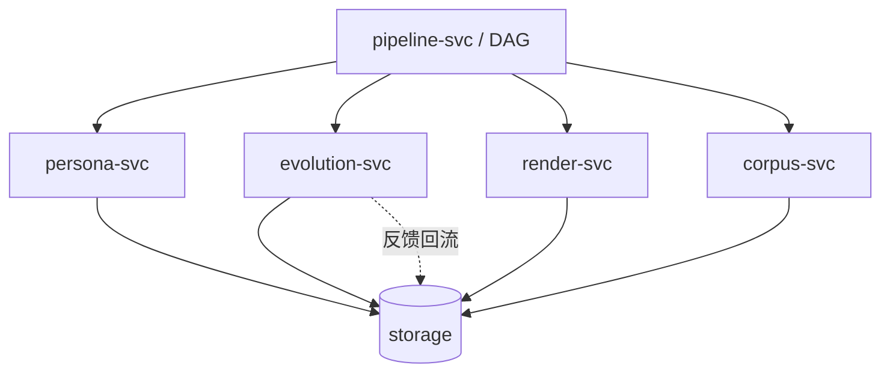

# AVCore 设计文档（Design Document）

> 面向开发者的**纯后端 AI 数字人核心框架**——以 CLI / REPL 驱动，本地优先，开源核心。本文档回答"做什么、怎么用、模块怎么协作、为什么这么做"。

---

## 1. 项目定位

**AVCore（AI Video Core）** 是一个开源核心框架，让个人开发者、团队、集成方能围绕一个**人物角色模型（PersonaModel）** 实现"塑形 → 持续训练演进 → 视频消费"完整链路。

模型既可以是：
- **技术专家 / 行业讲师**（带领域语料）
- **形象鲜明的虚构人物**（虚拟主播、品牌代言人、游戏 NPC）
- **真实人物的数字孪生**（本人授权的形象 + 声音复刻）
- **虚拟员工 / 数字助手**（可带可不带知识）

最重要的承诺：

> **模型被持续训练**。它不是造一次定型，而是随业务运营**不断追加样本、微调、出新版本**；演进的版本与历史版本身份**一致、不漂移**；并且**历史产出的视频永不因后续训练而改变**。

### 1.1 设计原则（精简到 5 条 + 1 条强约束）

1. **CLI 优先** —— 不是 SaaS、不带 web 控制台；REPL 即交互面
2. **本地优先** —— 默认 SQLite + 本地文件系统；不强求 server / K8s
3. **可演进** —— PersonaModel 多版本、不可变快照、漂移兜底
4. **核心框架只做核心事** —— 不内置计费、可观测性 dashboard、多租户；这些由外部系统承担
5. **Provider 化** —— 形象 / 声音 / LLM / 视频 / 知识 全部可替换，主仓不锁定任何模型厂商

> 🔒 **强约束** —— AVCore **只调用商业 / 开源模型的 HTTP API（全部 token 鉴权）；不加载、不推理任何本地模型**。本框架不持有模型权重；LoRA / 微调产物只存远端返回的 `model_id`，不下载到本机。

### 1.2 不做什么

- ❌ 不内置计费 / 配额 / 多租户管理（集成方自搭）
- ❌ 不内置可观测性 dashboard（可选接 OpenTelemetry，但不默认）
- ❌ 不内置内容审核策略（接入方自挂）
- ❌ 不会"自动"创建 persona（必须由人触发）
- ❌ 不强制云存储 / 云 GPU（本地能跑就跑）
- ❌ **不加载 / 不推理任何本地模型**（没有自托管 SDXL / CosyVoice / LLaMA 等）


### 1.3 全局流程一览（看图就用这张）

> 完整图集见 [`architecture.md`](./architecture.md)。这里给最精简的两张。

**全流程总览**：

```mermaid
flowchart LR
    subgraph S1[阶段 1：建模]
        A1[avc persona new] --> A2[personas/pm_xxx/v1/]
    end
    subgraph S2[阶段 2：演进]
        B1[追加样本] --> B2[avc persona evolve]
        B2 --> B3[v(N+1) 达标]
        B2 --> B4[drift→rollback]
    end
    subgraph S3[阶段 3：消费]
        C1[avc render video] --> C2[media/jobs/job_xxx/final.mp4]
        C2 --> C3[反馈回灌]
        C3 --> B1
    end
    S1 --> S2 --> S3
```

**子模块协作**：



---
---

## 2. 核心概念与领域模型

### 2.1 顶层抽象

```
PersonaModel         ── 一个被运营的角色（一次创建、跨版本不变）
PersonaModelVersion  ── PersonaModel 的某次不可变快照（v1 / v2 / v3 ...）
PersonaSample        ── 训练样本（图 / 音 / 行为文本 / 反馈）
TrainingJob          ── 从一个版本产出下一个版本的训练任务
KnowledgeCorpus      ── 可选语料（仅当该角色是领域专家时绑定）
Script               ── 一次视频任务的"剧本"
VideoJob             ── 端到端渲染任务
```

### 2.2 实体表

| 概念 | 说明 | 关键属性 |
|------|------|----------|
| `PersonaModel` | 一个"被运营的角色"的顶层聚合 | id, name, archetype, current_version, status |
| `PersonaModelVersion` | 不可变快照 | version, parent_version, avatar, voice, persona_descriptor, knowledge?, identity_anchor, metrics |
| `Avatar` | 视觉形象 | primary_image, ref_images[], lora?, face_id |
| `Voice` | 声音 | sample, voice_id, language, supported_emotions, embedding |
| `PersonaDescriptor` | 人设 | traits, tone, catchphrases, taboos, scenario_prompts, formality, temperature |
| `IdentityAnchor` | 跨版本一致性锚点 | face_embedding, voice_embedding, style_embedding |
| `KnowledgeCorpus` | 领域语料（可选） | source_type, chunk_count, index_version |
| `KnowledgeBinding` | 把语料挂到 persona | corpus_ids, domain, grounding_mode, retrieval |
| `PersonaSample` | 训练样本 | kind (image/audio/behavior_text/feedback), uri/text, consent_proof |
| `TrainingJob` | 训练任务实例 | base_version, scope[], sample_ids, config, status, result_version |
| `Script` | 视频剧本 | persona_model_id, persona_version_id, scenes[] |
| `Scene` | 分镜 | narration, visual_prompt, avatar_action, duration_ms |
| `VideoJob` | 渲染任务 | script_id, persona_version_id, status, artifacts |

### 2.3 关系

```
PersonaModel ──┬─ PersonaModelVersion[] ──┬─ Avatar        (不可变快照)
               │                        ├─ Voice         (不可变快照)
               │                        ├─ PersonaDescriptor
               │                        ├─ KnowledgeBinding (0..1)
               │                        └─ IdentityAnchor
               │
               ├─ PersonaSample[]         (训练样本池，跨版本累积)
               ├─ TrainingJob[]           (演进历史)
               └─ current_version → PersonaModelVersion

Script ──┬─ PersonaModel
         ├─ PersonaModelVersion (锁定，永不漂移)
         └─ Scene[]

VideoJob ─── Script
              绑定 persona_version_id（不变）
```

详细的资产落盘格式见 [`storage.md`](./storage.md)；这是核心框架最重要的"实现约束"。

---

## 3. 端到端业务流

```
┌─────────────────────────────────────────────────────────────┐
│  阶段 1: 人物角色模型生成（一次创建）                         │
│   设定 + 参考图/声音样本 + 行为样本 + (可选)领域语料          │
│       → PersonaModel + Version v1                          │
└──────────────────────────┬──────────────────────────────────┘
                           ▼
┌─────────────────────────────────────────────────────────────┐
│  阶段 2: 人物角色模型完善演进（持续发生）                     │
│   追加样本(用户上传/反馈回灌) → TrainingJob                  │
│   → Version vN (含 Identity Anchor + 漂移检测)              │
│   → 决定发布或回退                                          │
└──────────────────────────┬──────────────────────────────────┘
                           ▼
┌─────────────────────────────────────────────────────────────┐
│  阶段 3: 视频消费（按需触发）                                │
│   topic + 锁定 PersonaModelVersion + Script                  │
│       → VideoJob → final.mp4 (meta 烙印 version)            │
│   用户反馈 → 回流到阶段 2 的样本池                          │
└─────────────────────────────────────────────────────────────┘
```

关键点：
- **PersonaModelVersion 不可变**：已渲染的视频永远绑定生成时的版本，不因后续训练而改变
- **`current_version` 指针独立**：切版本只影响"之后新任务默认用哪个版本"
- **强制回滚 = 指针回拨**：不删任何数据

---

## 4. 用例（典型场景）

### 4.1 案例 A：技术专家
- v1：形象 + 声音 + 严谨人设 + 高中物理语料 → "高中物理讲解视频"
- v2：追加更高质量的题目语料 → 重建索引，知识更新
- v3：根据完播率补开场白样本 → 人设微调

### 4.2 案例 B：虚拟品牌代言人
- v1：形象 + 声音 + 活力人设（**不挂任何知识**）
- v2：根据"今年新品"补充专属 prompt → 人设微调
- v3：把"活泼风"换成"高级感风" → 视觉重训

### 4.3 案例 C：真实人物数字孪生
- v1：本人的视频做声音克隆，本人照片做形象建模
- v2：补表情样本让笑容更像本人 → 视觉微调
- v3：换新一年造型 → 视觉迭代

### 4.4 案例 D：游戏 NPC 二创
- v1：手绘风 LoRA + 自录对白 + 写实略夸张人设
- v2：玩家投稿大量对白 → 人设 SFT
- v3：根据玩家社区数据改进反应风格

> **只有案例 A 真正用了知识**——其他三个完全不需要领域语料，依然能跑得很开心。

---

## 5. 交互模式

AVCore 暴露两种交互：

### 5.1 命令式 CLI
```bash
avc persona new "Lily" --from ./samples.toml
avc persona evolve lily --scope voice --add ./new.wav
avc render video --persona lily --topic "..."
```

### 5.2 交互式 REPL
```bash
avc repl
> persona new "Lily"
> evolve lily --add ./new.wav
> render video --persona lily --topic "..."
```

详细命令 / 用法见 [`cli.md`](./cli.md)。

> 不做 web / 不做 SaaS 是有意识的选择：
> - 集成方可以基于 CLI 写自己的 web
> - 研究者直接 REPL 探索
> - 自动化脚本天然好用

---

## 6. 关键流程图

### 6.1 首次创建 + 首次出片
```
$ avc persona new "Lily" --from ./samples.toml
  └─ persona-svc.create(v1)  ──▶  avatar ──▶ voice ──▶ persona (──▶ knowledge?)
  └─ identity_anchor_extract
  └─ 落盘 personas/pm_xxx/v1/

$ avc render video --persona lily --topic "..."
  └─ script_gen (LLM + RAG)
  └─ tts（v1.voice）
  └─ img_gen（v1.avatar）
  └─ i2v → compose → encode
  └─ 产物：media/jobs/job_xxx/final.mp4 (meta 含 persona_version_id=1)
```

### 6.2 持续训练闭环
```
$ avc persona sample add lily --kind audio --uri ./new.wav ...
$ avc persona evolve lily --scope voice --anchors ./canary/

  person-svc.evolve(v1 → v2)
  └─ sample_filter (quality / dedup / consent)
  └─ voice_train (incremental)
  └─ identity_anchor (re-extract)
  └─ drift_eval (cos ≥ threshold?)
        ├─ yes → publish v2
        └─ no  → rollback + drift_report

$ avc render video --persona lily --version 2 --topic "..."
  └─ 历史视频绑 v1 不变；新视频绑 v2
```

### 6.3 用户反馈回灌
```
$ avc job feedback job_xxx --signal looks_unlike --note "侧脸不像本人"
  └─ 转 PersonaSample(kind=feedback, weight=...)
  └─ 下次 evolve 自动参与训练
```

---

## 7. Provider 扩展性

> 所有 Provider 都通过 token 鉴权的 HTTP API 调用商业 / 开源模型；不加载本地权重。

5 类 Provider：

```rust
trait AvatarProvider {
    fn create(&self, spec: &AvatarSpec) -> Result<Avatar>;
    fn render(&self, avatar: &Avatar, prompt: &str, motion: &Motion) -> Result<Media>;
    fn finetune(&self, base: &Avatar, samples: &[Sample], cfg: &TrainCfg) -> Result<Avatar>;
}

trait VoiceProvider { ... }   // clone / synth / finetune
trait LlmProvider   { ... }   // chat / sft
trait VideoProvider { ... }   // render(i2v)
trait KnowledgeProvider { ... } // chunk / embed / search
```

每个 Provider 是一份 `provider.json` + 一段 trait 实现，动态从 SDK 加载，主仓不绑定模型厂商。

新增模型不影响核心代码。

---

## 8. 数据持久化（高层）

参考 [`storage.md`](./storage.md) 全文。这里只点约束：

- **目录即版本**：每个版本 = 一个固定布局的目录树，拷目录 = 拷 persona
- **大文件落盘**：图 / 音 / LoRA / 嵌入向量直接落盘；元数据走 SQLite 索引
- **不可变**：老版本只可停用（deprecated），永不物理删除（除非显式 `prune` 过期归档）
- **原子替换**：写文件先临时再 `rename`，避免半成品

---

## 9. 内容审核与安全（最小集）

为了不内嵌审核策略，AVCore 只做"事件 + 钩子"，把策略交给接入方：

- **形象 / 声音授权**：每个 PersonaSample 可附 `consent_proof`（文件 URI / 哈希）；创建 / 训练时校验
- **真实人物复刻开关**：默认禁止；开启需 `avc config set safety.real_person.enabled true` 且附额外存证
- **不可见水印**：可选；水滴 / 像素扰动均可，由 Provider 决定实现
- **trace_id / version 透传**：每条产物 `meta.json` 含生成时的 persona_version_id 与 provider 全量参数，便于事后审计

---

## 10. 后续阅读

- 架构：[architecture.md](./architecture.md)
- 资产落盘格式：[storage.md](./storage.md) ⭐
- CLI / REPL：[cli.md](./cli.md)
- 子模块设计：
  - [人物角色模型生成](./modules/persona-modeling.md)
  - [人物角色模型完善演进](./modules/persona-evolution.md)
  - [视频生成](./modules/video-generation.md)
  - [工作流编排](./modules/pipeline.md)
  - [知识能力（可选）](./modules/knowledge-aspect.md)
- Provider / API 参考：[api/README.md](./api/README.md)
