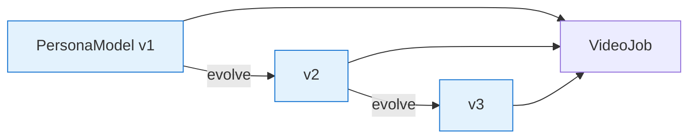
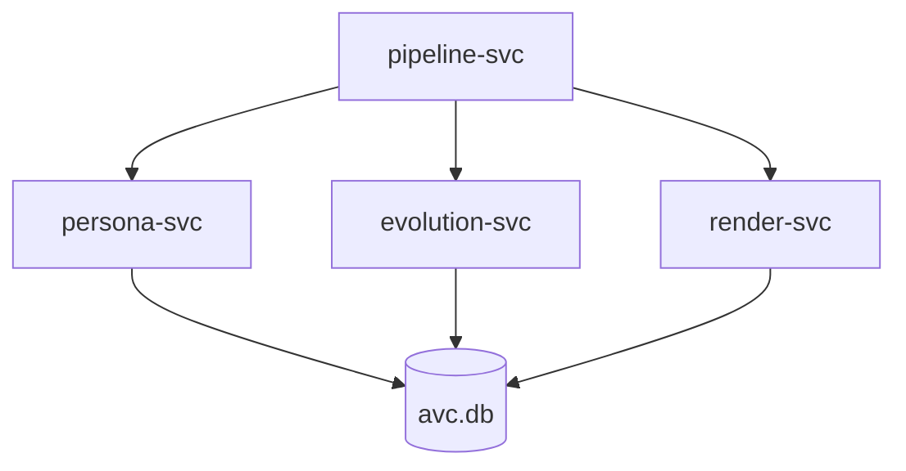
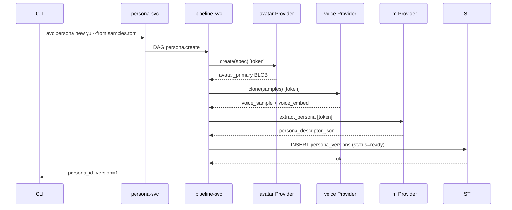
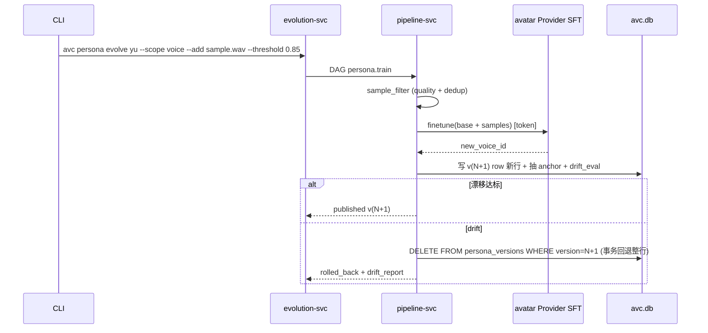
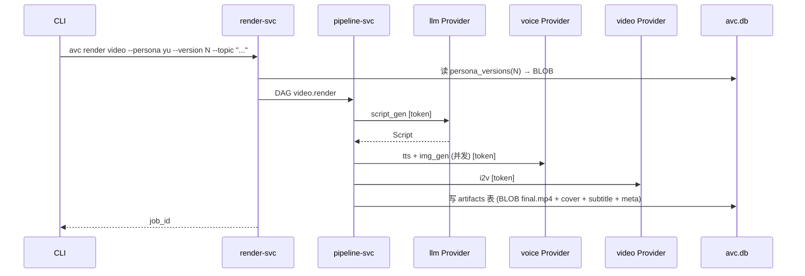

# 设计文档

> 极简内核设计：PersonaModel 持续训练多版本，用某个版本出片。商业 / 开源模型 API + 单一 SQLite。

---

## 1. 顶层抽象

| 概念 | 含义 |
|------|------|
| **PersonaModel** | 一个角色。跨版本不变的顶层 ID。 |
| **PersonaModelVersion** | PersonaModel 的一次**不可变快照**（v1 / v2 / ...）。 |
| **PersonaSample** | 训练样本（图 / 音 / 行为文本 / 用户反馈）。 |
| **TrainingJob** | 从一个版本产出下一个版本的训练任务。 |
| **KnowledgeCorpus** | 可选语料。仅当 PersonaModel 真正"懂某领域"时绑定。 |
| **Script** / **VideoJob** | 出片剧本 / 渲染任务。 |

核心 flow：



子模块协作：



---

## 2. 端到端流程

### 2.1 创建 v1



### 2.2 持续训练



### 2.3 出片



### 2.4 切版本 / 回滚

```sql
UPDATE persona_models SET current_version = N WHERE id = 'pm_xxx';
```

不影响已渲染视频（它们绑的是当时 version）。

---

## 3. 状态机

### 3.1 TrainingJob

```mermaid
stateDiagram-v2
    [*] --> queued --> running
    running --> succeeded
    running --> failed_drift
    running --> failed
    running --> cancelled
    cancelled --> [*]
    succeeded --> [*]
    failed --> [*]
    failed_drift --> [*]
```

### 3.2 VideoJob

```mermaid
stateDiagram-v2
    [*] --> queued --> running
    running --> succeeded
    running --> failed
    running --> cancelled
    cancelled --> [*]
    succeeded --> [*]
    failed --> [*]
```

---

## 4. 持久化

**单一 SQLite 文件** = 全部状态。元数据 + BLOB（avatar / voice / 嵌入向量 / 视频产物）都在 `~/.local/share/avc/avc.db`。

详见 [`storage.md`](./storage.md)。

约束：
- 一个 PersonaModelVersion = `persona_versions` 一行
- 不可变通过 INSERT 新行；DELETE 整行事务回退
- 配置 / token 走独立 `~/.config/avc/avc.toml`（不入 DB）

---

## 5. 关键不变量

1. **不可变版本**：`UPDATE persona_versions SET ...` 仅在 `building → ready` 一瞬，ready 后不可写
2. **漂移兜底**：训练任务不达标，DELETE 整行事务回退，到 vN 为止
3. **历史视频锁定**：VideoJob.persona_version 不随 persona 演进漂移
4. **回滚 = 指针回拨**：切 `current_version` 不删任何东西

---

## 6. 不做什么（内核边界）

- ❌ 不内置计费 / 配额 / 多租户 / 看板
- ❌ 不加载 / 不推理任何本地模型（全 token 鉴权 API）
- ❌ 不自动创建 PersonaModel（必须由人触发）
- ❌ 不内置审核策略（外部挂）
- ❌ 不默认对象存储

> 这些都是**外部系统**的事，不是内核的事。

---

## 7. CLI 设计原则（速读）

CLI 分为 **原子** 与 **集成** 两类命令（详见 [`cli.md`](./cli.md)）：

- **原子**：`<noun> <verb>`，单一资源单一操作；可被 shell 任意组合
- **集成**：封装典型工作流（如 `persona onboard`、`persona evolve`、`render run`），内部走原子

每个集成命令都接受 `--dry-run` 展开为原子清单——集成 = **原子 + 顺序 + 默认值**，可观察、可回放。

---

## 8. 后续阅读

- [architecture.md](./architecture.md) · 技术栈、子模块依赖
- [storage.md](./storage.md) · 完整 schema
- [cli.md](./cli.md) · 命令与用法
- 子模块：[persona-modeling](./modules/persona-modeling.md) · [persona-evolution](./modules/persona-evolution.md) · [video-generation](./modules/video-generation.md) · [pipeline](./modules/pipeline.md)
- [api/README.md](./api/README.md) · Provider trait
