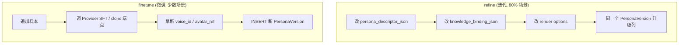
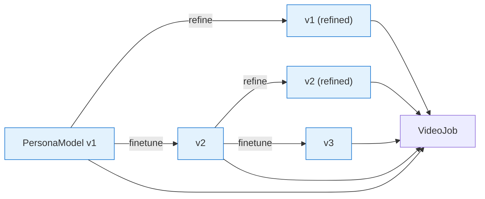
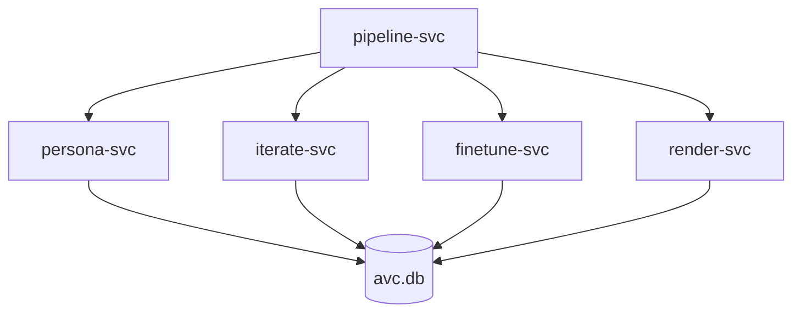
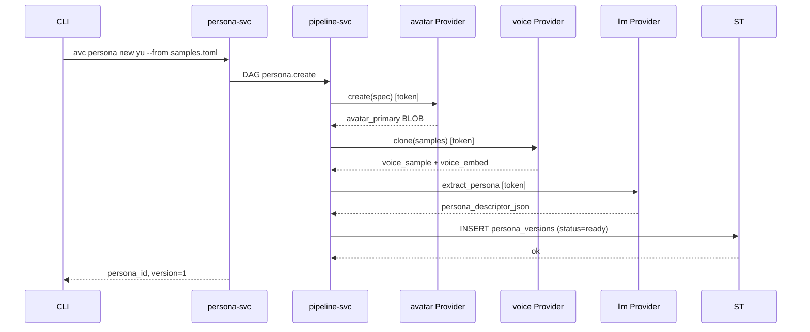
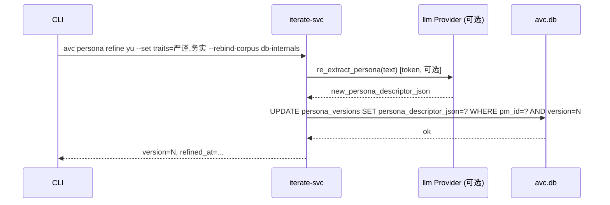
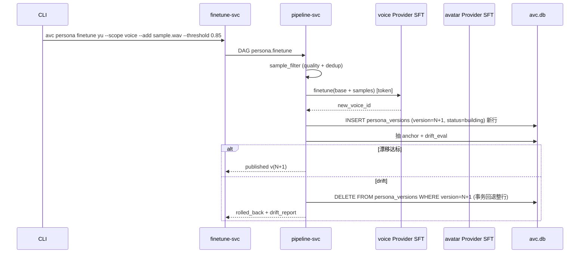
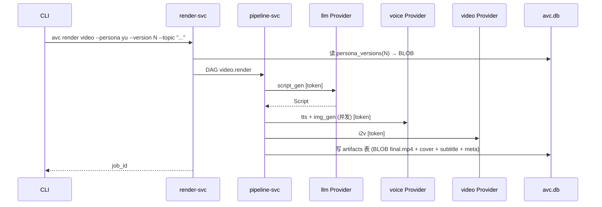

# 设计文档

> 极简内核设计：PersonaModel 持续完善，用某个版本出片。商业 / 开源模型 API + 单一 SQLite。

---

## 1. 顶层抽象

| 概念 | 含义 |
|------|------|
| **PersonaModel** | 一个角色。跨版本不变的顶层 ID。 |
| **PersonaModelVersion** | PersonaModel 的一次**不可变快照**（v1 / v2 / ...）。 |
| **PersonaSample** | 训练样本（图 / 音 / 行为文本 / 用户反馈）。 |
| **IterateJob** | 迭代任务：仅更新人设 / 知识 / 风格等**数据列**，不调 Provider SFT 端点。 |
| **FinetuneJob** | 微调任务：调 Provider 的 SFT / clone 端点，拿新 `model_id`，生成新版本。 |
| **KnowledgeCorpus** | 可选语料。仅当 PersonaModel 真正"懂某领域"时绑定。 |
| **Script** / **VideoJob** | 出片剧本 / 渲染任务。 |

### 1.1 完善角色 = 数据迭代 + 模型微调（两层）

AVCore **只调用 token 鉴权的商业 / 开源模型 API，不加载本地模型**。这意味着：  
"让角色变得更好"的绝大多数动作**只是数据更新**，根本不需要 Provider 介入。



| | refine（迭代） | finetune（微调） |
|---|---|---|
| 触发原因 | 人设要更严谨 / 知识要换 / 风格要稳 | 音色要更贴近 / 形象要更稳定 / 行为模式要新 |
| 调 Provider？ | 否，纯 SQL UPDATE | 是，调 Provider SFT 端点 |
| 数据库动作 | `UPDATE persona_versions`（同一行） | `INSERT persona_versions(version=N+1)` 新行 |
| 漂移兜底 | 不需要（数据不会让"脸"漂移） | 必须：阈值不达标 → DELETE 整行事务回退 |
| 频率 | 高（每次改 prompt / 加知识都跑） | 低（数周 / 数月一次） |
| 失败代价 | 低，可重写 | 高：要花 token 钱、重漂移 |

> 文档其余部分统一把"完善角色"称作 refine / finetune，不再使用"训练"作为主线表述。

核心 flow：



子模块协作：



---

## 2. 端到端流程

### 2.1 创建 v1



### 2.2 迭代 refine（数据层完善）

> 改的全是 persona_versions 同一行的**可改列**——`persona_descriptor_json` / `knowledge_binding_json` / `manifest_json` / `metrics_json`。  
> 不调 Provider，不新增版本号。



特点：

- 同版本号升级；不破坏历史 VideoJob 绑定
- 没有漂移问题（数据层不可能让"脸"漂走）
- 失败回退：上次成功的人设内容已被上游 toml 备份，重跑即可
- 频率最高：每次调整 prompt、加新知识、改渲染选项都走它

### 2.3 微调 finetune（模型层完善）

> 追加样本 → 调 Provider SFT / clone 端点 → 拿新 `voice_id` / `avatar_ref` → INSERT 新版本 → 漂移兜底。



特点：

- 一定产生新版本号
- 必须漂移兜底（Provider 重新训出的权重 / 嵌入可能跑偏）
- 比 refine 贵：花 token、花时间、有失败率

### 2.4 出片



### 2.5 切版本 / 回滚

```sql
UPDATE persona_models SET current_version = N WHERE id = 'pm_xxx';
```

不影响已渲染视频（它们绑的是当时 version）。

---

## 3. 状态机

### 3.1 IterateJob（refine 任务账本）

```mermaid
stateDiagram-v2
    [*] --> queued --> running --> succeeded
    running --> failed
    failed --> [*]
    succeeded --> [*]
    cancelled --> [*]
```

### 3.2 FinetuneJob（finetune 任务账本）

```mermaid
stateDiagram-v2
    [*] --> queued --> running
    running --> succeeded
    running --> failed_drift
    running --> failed
    running --> cancelled
    cancelled --> [*]
    succeeded --> [*]
    failed --> [*]
    failed_drift --> [*]
```

### 3.3 VideoJob

```mermaid
stateDiagram-v2
    [*] --> queued --> running
    running --> succeeded
    running --> failed
    running --> cancelled
    cancelled --> [*]
    succeeded --> [*]
    failed --> [*]
```

---

## 4. 持久化

**单一 SQLite 文件** = 全部状态。元数据 + BLOB（avatar / voice / 嵌入向量 / 视频产物）都在 `~/.local/share/avc/avc.db`。

详见 [`storage.md`](./storage.md)。

约束：

- 一个 PersonaModelVersion = `persona_versions` 一行
- 不可变通过 INSERT 新行；DELETE 整行事务回退
- **refine 不新增行**——同 version 上 UPDATE `persona_descriptor_json` / `knowledge_binding_json` / `manifest_json` 等可改列
- 配置 / token 走独立 `~/.config/avc/avc.toml`（不入 DB）

---

## 5. 关键不变量

1. **不可变版本**：`UPDATE persona_versions` 仅允许 refine 改可改列；ready 后 BLOBs 不可写
2. **refine 同版本**：refine 不新增版本号，历史 VideoJob 绑定永远不变
3. **finetune 漂移兜底**：finetune 任务不达标，DELETE 整行事务回退，到 vN 为止
4. **历史视频锁定**：VideoJob.persona_version 不随 persona 完善漂移
5. **回滚 = 指针回拨**：切 `current_version` 不删任何东西

---

## 6. 不做什么（内核边界）

- ❌ 不内置计费 / 配额 / 多租户 / 看板
- ❌ 不加载 / 不推理任何本地模型（全 token 鉴权 API）
- ❌ 不自动创建 PersonaModel（必须由人触发）
- ❌ 不内置审核策略（外部挂）
- ❌ 不默认对象存储

> 这些都是**外部系统**的事，不是内核的事。

---

## 7. CLI 设计原则（速读）

CLI 分为 **原子** 与 **集成** 两类命令（详见 [`cli.md`](./cli.md)）：

- **原子**：`<noun> <verb>`，单一资源单一操作；可被 shell 任意组合
- **集成**：封装典型工作流（如 `persona onboard`、`persona refine`、`persona finetune`、`render run`），内部走原子

每个集成命令都接受 `--dry-run` 展开为原子清单——集成 = **原子 + 顺序 + 默认值**，可观察、可回放。

---

## 8. 后续阅读

- [architecture.md](./architecture.md) · 技术栈、子模块依赖
- [storage.md](./storage.md) · 完整 schema
- [cli.md](./cli.md) · 命令与用法
- 子模块：[persona-modeling](./modules/persona-modeling.md) · [persona-iteration](./modules/persona-iteration.md) · [video-generation](./modules/video-generation.md) · [pipeline](./modules/pipeline.md)
- [api/README.md](./api/README.md) · Provider trait
