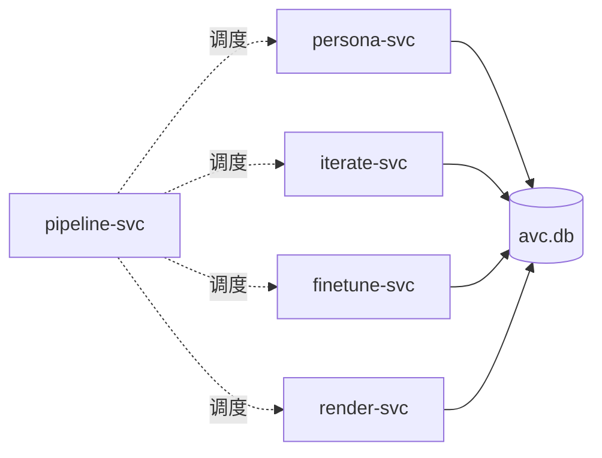

# 子模块

AVCore 4 个核心子模块（无第五个）。

| # | 模块 | 一句话 |
|---|------|--------|
| 1 | [persona-modeling](./persona-modeling.md) | 创建 PersonaModel v1（avatar / voice / persona；可选知识） |
| 2 | [persona-iteration](./persona-iteration.md) | refine（数据迭代）+ finetune（Provider SFT），保持身份不漂移 |
| 3 | [video-generation](./video-generation.md) | 锁定 version 出片 |
| 4 | [pipeline](./pipeline.md) | 训练与渲染共用的 DAG 引擎 |

**协作**：

**数据契约**：[`../storage.md`](../storage.md) 是唯一事实源。
