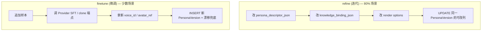

# 模块：人物角色模型迭代与微调（Persona Iteration & Finetune）

> 在 v1 之上：让 PersonaModel 变得更好。  
> 本框架**只调用 token 鉴权 API**，不加载本地模型——所以"完善角色"在绝大多数情况下**只是数据更新**，只有少数场景才调 Provider 的 SFT / clone 端点。

---

## 1. 两层语义：refine vs finetune



| 维度 | refine | finetune |
|---|---|---|
| 一句话 | 改 prompt / 人设 / 知识 / 渲染参数 | 重新训声音 / 形象 / 行为嵌入 |
| 调 Provider？ | 否（或仅 LLM 抽人设） | 是，调 Provider SFT / clone 端点 |
| 数据库动作 | `UPDATE persona_versions` 同一行可改列 | `INSERT persona_versions(version=N+1)` 新行 |
| 漂移兜底 | 不需要 | 必须（阈值不达标 → DELETE 整行事务回退） |
| 频率 | 高（每次调整 prompt / 加知识 / 改风格） | 低（数周 / 数月一次） |
| 失败代价 | 低，可重写 | 高：要花 token 钱、有重训时间 |
| 对应 Provider 节点 | 仅 `llm.extract_persona`（可选） | `avatar.finetune` / `voice.finetune` / `llm.behavior_finetune` |

> "训练"这个说法不在本框架主叙事里——调一次 Provider SFT 端点才叫 finetune；其他都是 refine。

---

## 2. 任务账本

### 2.1 IterateJob（refine 任务账本）

```rust
struct IterateJob {
    id: String,                       // ij_<ULID>
    persona_model_id: String,
    target_version: u32,              // 同版本号升级 = current_version
    changes_json: String,             // {persona_descriptor?: {...}, knowledge_binding?: {...}, manifest?: {...}}
    status: Status,                   // queued/running/succeeded/failed/cancelled
    started_at: Option<String>,
    finished_at: Option<String>,
}
```

### 2.2 FinetuneJob（微调任务账本）

```rust
struct FinetuneJob {
    id: String,                       // fj_<ULID>
    persona_model_id: String,
    base_version: u32,                // 从哪个版本开始
    target_version: u32,              // 预占 = base+1
    scope: Vec<Scope>,                // [avatar, voice, persona]
    config: FinetuneConfig,
    status: Status,                   // queued/running/succeeded/failed_drift/failed/cancelled
    result_version: Option<u32>,
    drift_report: Option<DriftReport>,
}

struct FinetuneConfig {
    full_retrain: bool,               // false=增量
    epochs: u32,
    consistency_threshold: f32,       // 默认 0.85
}
```

---

## 3. refine 数据流

### 3.1 可改列清单

refine 只动以下列，**绝不触碰 avatar / voice / anchor 的 BLOBs**：

| 列 | 改的什么 |
|---|---|
| `persona_descriptor_json` | traits / tone / catchphrases / taboos / scenario_prompts |
| `knowledge_binding_json` | 绑定 / 解绑 corpus；切换 grounding_mode |
| `manifest_json` | render options（分辨率 / 字幕样式 / 镜头偏好） |
| `metrics_json` | 人设一致性 / 表达密度 等统计 |

### 3.2 DAG（极简）

```mermaid
flowchart LR
    EX[llm.extract_persona (可选)] --> WR["UPDATE persona_versions<br/>SET persona_descriptor_json=?, knowledge_binding_json=?, manifest_json=?, metrics_json=?<br/>WHERE pm_id=? AND version=N"]
```

> 通常**不调 LLM**——人设直接来自上游 `persona.toml`；只有从自然语言推断人设时才调一次。  
> 这一支没有漂移问题：SQL UPDATE 单事务即可。

### 3.3 失败回退

- refine 写入前先在临时表 / 内存中构造新行；失败时不写
- 上次成功的人设内容应被上游 toml / git 备份，可手工 `UPDATE` 覆盖
- 不引入复杂的"双向 merge"——refine 是单向覆盖

---

## 4. finetune 数据流

> 仅在调 Provider SFT 端点时才走这条路径。

### 4.1 DAG 流水线

```mermaid
flowchart LR
    SF[sample_filter] -->|"if avatar"| AT[avatar SFT vendor CLI]
    SF -->|"if voice"| VT[voice SFT vendor CLI]
    SF -->|"if persona"| PT[persona SFT]
    AT --> AN[anchor extract]
    VT --> AN
    PT --> AN
    AN --> DE[drift_eval]
    DE -->|"≥ threshold"| PUB[→ v(N+1) ready]
    DE -->|"< threshold"| RB[DELETE 整行事务回退]
```

> 所有 SFT 节点都走 Provider 的远端 SFT 端点——**AVCore 不下载权重**。
>
> **vendor CLI 协议**（`OpenAiCompat{Avatar,Voice}Provider.finetune` 在 `cfg.binary` 设了的情况下）：
> 1. `binary finetune submit --ref-image <paths...>`（avatar）/ `--ref-audio <paths...>`（voice）→ stdout `task_id=...`
> 2. `binary finetune status --task-id <id>` → stdout `status=done|pending|failed`，500ms poll、5 min timeout
> 3. `binary finetune fetch --task-id <id> --out <path>` → 写真 PNG/WAV 文件
>
> 仿 CliVideoProvider 三段式；fetch 出来的 tmp 文件由 `TempFileGuard` 在 drop 时清。
> 未配 `binary` 时按既有行为报 "requires a vendor CLI binary"（`avc finetune publish` 走手动 drift 也保留）。

### 4.2 样本池（persona_samples）

| kind | 形态 |
|------|------|
| image | blob BLOB + mime |
| audio | blob BLOB + transcript TEXT |
| behavior_text | text TEXT |
| feedback | text + weight（来自 `avc job feedback`） |

每条样本带 `consent_proof`（授权引用）。`avc sample add` 入库前自动跑质量检查。

### 4.3 一致性兜底

```rust
async fn drift_eval(parent_anchor: &Anchor, new_anchor: &Anchor, cfg: &Cfg) -> DriftReport {
    let face = cosine(parent_anchor.face, new_anchor.face);
    let voice = cosine(parent_anchor.voice, new_anchor.voice);
    let style = cosine(parent_anchor.style, new_anchor.style);
    let avg = (face + voice + style) / 3.0;
    DriftReport { face, voice, style, avg, passed: avg >= cfg.consistency_threshold }
}
```

> 仅 `cos >= threshold` → 发布；否则 DELETE 整行事务回退。`drift_report` 写回 `finetune_jobs.drift_report_json`。

---

## 5. 不可变与回滚（仅 finetune 适用）

- finetune 后 v(N+1) 通过 INSERT 新行产生，原 vN 一字不改
- 漂移达标 → `UPDATE status='ready'`
- 漂移不达标 → `DELETE FROM persona_versions WHERE version=N+1` + `UPDATE finetune_jobs SET status='failed_drift'`
- 强制回滚：`avc persona current yu --set 1` 即把指针拨回

> refine 不存在"回滚"语义——refine 是同版本号上对可改列的覆盖；用上游 toml / git 找回历史值即可。

---

## 6. 命令

### 6.1 refine（原子 + 集成）

**原子**（精细操作）：

```bash
avc persona set-traits     yu --version 1 --traits 严谨,务实
avc persona set-catchphrase yu --version 1 --add "我们直接看源码"
avc persona set-render     yu --version 1 --resolution 1080p --subtitle-style minimal
avc corpus attach          yu --version 1 --corpus db-internals
avc corpus detach          yu --version 1
avc iterate list --persona yu
avc iterate show ij_xxx
```

**集成**（典型 80% 路径）：

```bash
avc persona refine yu --from ./yu.v2.toml
# 内部 = set-traits + set-catchphrase + set-render + corpus attach/detach (按 toml diff)
# 通常不调 Provider；纯 SQL UPDATE
```

`avc persona refine yu --from ./yu.v2.toml --dry-run` 应输出：

```
plan (no changes made):

  1. set-traits   yu --version 1 --traits 严谨,务实                  (atomic)
  2. set-catchphrase yu --version 1 --add "我们直接看源码"             (atomic)
  3. set-render   yu --version 1 --resolution 1080p                 (atomic)
  4. corpus attach yu --version 1 --corpus db-internals              (atomic)
```

### 6.2 finetune（原子 + 集成）

**原子**（精细操作）：

```bash
avc sample add yu --kind audio --uri ./new.wav --text "..." --consent ./auth.pdf
avc finetune start yu --scope voice --base-version 1 --threshold 0.85
avc finetune run fj_xxx --embed openai_embed           # 端到端：SFT → drift → publish/rollback
avc finetune drift eval fj_xxx --embed openai_embed    # 只算 drift 不动 fj.status
avc finetune list --persona yu
avc finetune show fj_xxx
avc finetune publish fj_xxx --passed                   # 测试用：手动 publish
avc finetune report fj_xxx --json
avc finetune cancel fj_xxx
```

> `avc finetune run` 是 Phase 2.5 新加的端到端 verb：
> 1. 校验 `fj.status == 'running'`（已 published → Conflict）
> 2. 拉 `persona_samples` kind=image/audio → materialize 到 tmp → 调 `provider.finetune()`
> 3. 把 vendor 返的 PNG/WAV 写到 `persona_versions` target 行（`voice_sample` / `avatar_primary`）
> 4. 若 voice scope：调 `embed.<name>.embed("persona:<name>:target:<v>")` → 写 `voice_embed` → 与 base 算 cosine
> 5. `cosine ≥ threshold` → `UPDATE persona_versions SET status='ready'` + `finetune_jobs.status='succeeded'`
>    `< threshold` → `DELETE persona_versions target` + `finetune_jobs.status='failed_drift'`
>
> 退出码：succeeded → 0、failed_drift → 4、缺 `--embed`（voice scope 时）→ 2、Provider 错误 → 11/12。

**集成**（典型工作流）：

```bash
avc persona finetune yu --scope voice --base-version 2 --threshold 0.85 --with-feedback
# 内部 = sample add (×N) + finetune start + drift_eval + promote-or-rollback
```

`avc persona finetune yu --scope voice --dry-run` 应输出：

```
plan (no changes made):

  1. sample add yu --kind audio --uri ./feedback_*.wav   (atomic)
  2. sample add yu --kind audio --uri ./new_*.wav         (atomic, --with-feedback resolved)
  3. finetune start yu --scope voice --base-version 1    (atomic)
  4.   ↳ publish_or_rollback branch
  5. persona commit yu --version <v>   if drift ok        (atomic)
  6. persona promote yu --to <v>      if drift ok        (atomic)
```

---

## 7. 关键指标

- **refine**：单次 P95 ≤ 1s（纯 SQL）；人设改动可在分钟内传播到下一次出片
- **finetune**：单维度微调 P95 ≤ 30 min；跨版本一致性 ≥ 0.85；微调成功率 ≥ 95%
