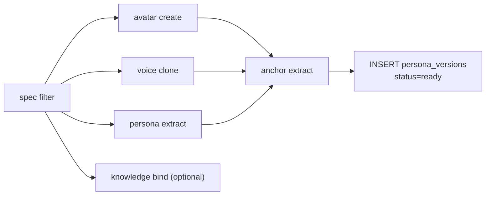

# 模块：人物角色模型生成（Persona Modeling）

> 创建 PersonaModel 的初始 v1。最小输入 = avatar + voice + persona（knowledge 可选）。

---

## 输入 / 输出

| 输入 | 说明 |
|------|------|
| 设定 | 自然语言描述 + archetype |
| avatar 样本 | 1~N 张参考图（可选） |
| voice 样本 | ≥ 30s 干净人声（可选） |
| persona 字段 | traits / tone / catchphrases / taboos / scenario_prompts |
| knowledge | **可选**——只有需要领域专家时才挂 |

输出：`persona_models` + `persona_versions(1)` 写入 SQLite（详见 [`../storage.md`](../storage.md)）。

---

## 行结构

`persona_versions` 第 1 版一行：

| 列 | 内容 |
|----|----|
| avatar_primary BLOB | 主形象 PNG |
| avatar_views_blobs BLOB | 多视角 |
| avatar_lora_ref_json TEXT | 远端 model_id（不下载权重） |
| voice_sample BLOB | WAV |
| voice_embed BLOB | speaker embedding |
| persona_descriptor_json TEXT | 人设 |
| knowledge_binding_json TEXT | 可选知识绑定 |
| anchor_face_emb / anchor_voice_emb / anchor_style_emb BLOB | 一致性基线 |
| manifest_json + metrics_json | 元数据 |

---

## 创建流（DAG 节点）



每个 Provider 节点完成后写 `persona_versions` 对应 BLOB；anchor 抽取完才落 `anchor_*_emb`；最后一次性 `COMMIT` 把 `status` 从 `building → ready`。

---

## Provider trait

```rust
#[async_trait]
pub trait AvatarProvider: Send + Sync {
    fn name(&self) -> &str;
    async fn create(&self, spec: &AvatarSpec) -> Result<Avatar>;
    async fn finetune(&self, base: &Avatar, samples: &[Sample], cfg: &TrainCfg) -> Result<Avatar>;
}

pub trait VoiceProvider {
    async fn clone(&self, samples: &[Audio]) -> Result<Voice>;
    async fn synth(&self, voice: &Voice, text: &str) -> Result<Audio>;
    async fn finetune(&self, base: &Voice, samples: &[Sample], cfg: &TrainCfg) -> Result<Voice>;
}

pub trait LlmProvider { async fn chat(&self, msgs: &[Msg]) -> Result<Msg>; }
```

**没有本地推理**。每个 Provider = 远端 API + token。

---

## 知识维度（可选）

```toml
[persona]
name = "Yu"
archetype = "db_kernel_expert"

[knowledge]                   # 整段可选；没有这节就是普通 persona
corpus = "./db-internals.md"  # 喂给 embed API，存 corpus_chunks.embed_blob
domain = "数据库内核"
grounding_mode = "loose"
```

绑定：persona 出视频时 LLM 召回 topK chunks 注入 prompt。

> 不绑知识 ≠ 不能讲内容——一个"Yu"靠人设也能讲段子。

---

## 命令

### 原子（精细版）

```bash
avc persona create yu --archetype db_kernel_expert
avc persona attach-avatar yu --version 1 --ref ./ref_*.png --style 写实
avc persona attach-voice  yu --version 1 --ref ./sample.wav --lang zh
avc persona attach-persona yu --version 1     --traits 严谨,务实 --catchphrase "我们直接看源码"
avc persona commit yu --version 1                  # → status=ready
```

### 集成（典型 80% 路径）

```bash
avc persona onboard yu --from ./yu.toml           # 一次跑完 create + attach-* + commit
```

### 错误与边界

| 场景 | 处理 |
|------|------|
| 参考图模糊 | 拒绝 `invalid_ref_image` |
| 音频含 BGM | 拒绝 `invalid_audio_sample` |
| 没声音样本 | 走商用音色 |
| 缺 token | `error[E0501] provider_unauthenticated` 阻断 |
| Provider 失败 | DAG 节点重试 N 次 → 整事务回退（不写半行） |

---

## 关键指标

- v1 创建 P50 ≤ 90s（不含 LoRA，不含知识）
- 形象一致性 ≥ 0.85 / 声音相似度 ≥ 0.80
