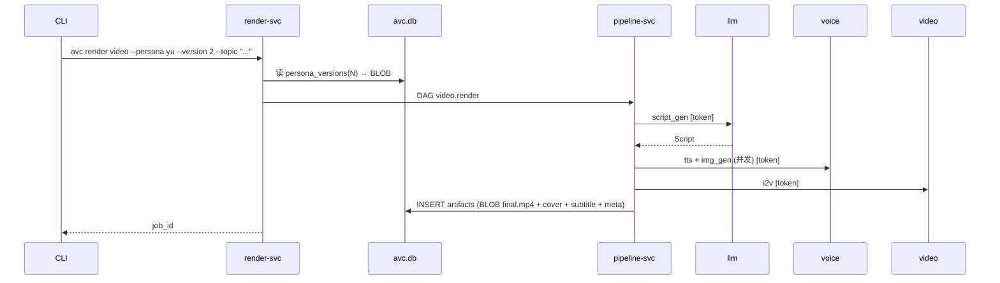

# 模块：视频生成（Video Generation）

> 锁定某个 PersonaVersion + topic → 视频文件。本模块 = persona 的消费者。

---

## 输入 / 输出

| 输入 | 说明 |
|------|------|
| `persona_model_id` + `version_id` | 锁定（不指定 = current） |
| topic / key_points / duration | 内容参数 |
| render options | 分辨率、字幕、水印等 |

输出：4 条 `artifacts` 行（BLOB）：`final_video` / `cover` / `subtitle` / `meta`。

---

## 流



---

## 锁定版本（核心不变量）

```sql
-- 脚本一生成就绑死 version
INSERT INTO scripts(persona_model_id, persona_version, ...) VALUES (?, N, ...);

-- 任务同样
INSERT INTO jobs(persona_model_id, persona_version, ...) VALUES (?, N, ...);
```

之后 persona 即使升级到 v5，已渲染视频永远锁 v2——viewer 不会因训练而变化。

---

## 产物落 DB（artifacts）

| kind | 用途 |
|------|------|
| `final_video` | mp4 BLOB |
| `cover` | jpg BLOB |
| `subtitle` | srt BLOB |
| `meta` | JSON TEXT + BLOB（provider 版本 / 参数快照） |

`avc job export job_xxx --out ./final.mp4` 把 BLOB 拷到 FS，便于分享。

---

## 命令

### 原子

```bash
avc render script  --persona yu --version 2 --topic "..." --out script.json
avc render script edit script.json --patch '{"op":"replace","path":"/scenes/0/duration_ms","value":9000}'
jid=$(avc render video --from-script script.json --quiet)

avc job list --persona yu
avc job show job_xxx --watch
avc job wait job_xxx --until succeeded
avc job export job_xxx --kind final_video --out ./final.mp4
```

### 集成

```bash
avc render run --persona yu --version 2 --topic "InnoDB Buffer Pool" \
               --duration 60 --resolution 1080p
# 内部 = render script + render video

avc render pack --persona yu --topics-file ./daily_topics.txt
# 对每行 topic 跑一次 render run
```

---

## 关键指标

- 60s 视频端到端 P95 ≤ 8 min
- 渲染成功率 ≥ 95%
