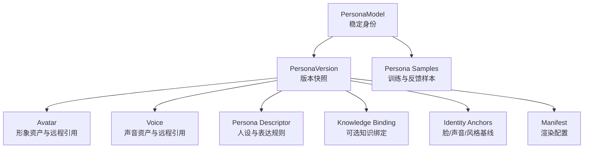
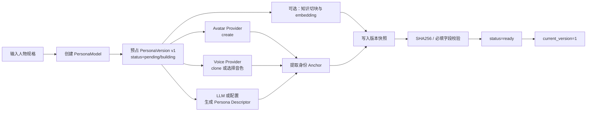
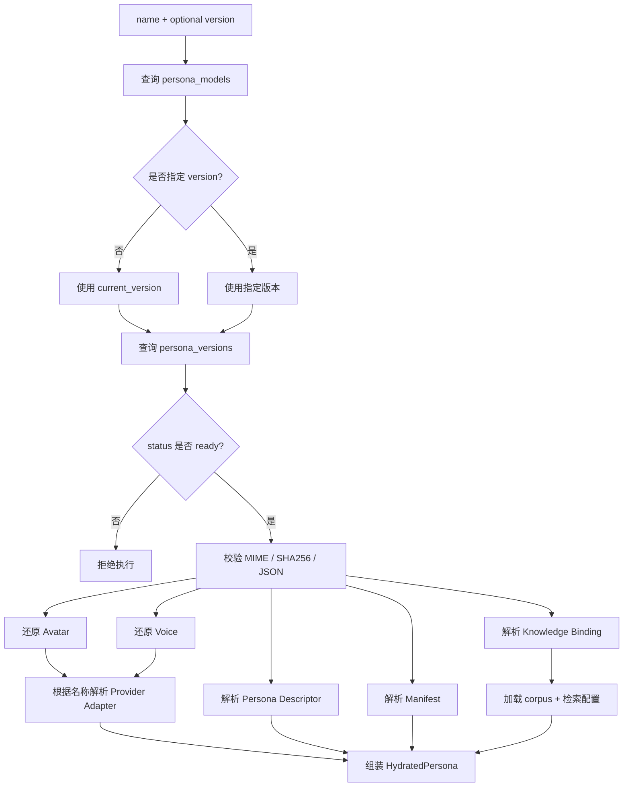
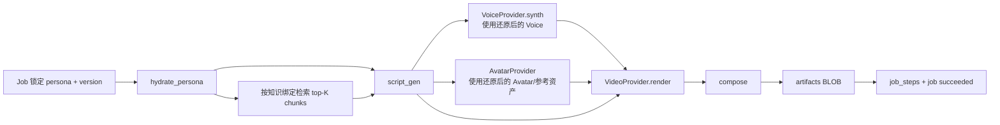

# 人物模型全生命周期：生成、持久化、还原与使用

> 本文回答一个核心问题：AVCore 中的“人物”到底是什么，它如何生成、如何保存，又如何从持久化数据还原成 Provider 可以使用的运行时模型。

---

## 1. 先给结论

AVCore 不把人物保存成一个单独的 `.model` 文件，也不在本地保存或加载模型权重。

一个人物由两部分组成：

1. **SQLite 中的版本化快照**：头像、声音样本、embedding、人设、知识绑定、渲染配置和远程模型 ID。
2. **Provider 中的远程能力**：图像生成、声音合成、视频生成或微调模型；AVCore 通过配置中的 token 和数据库中的远程 ID 调用它们。

因此，“从持久化解析成模型”并不是反序列化本地神经网络权重，而是：

```text
读取 PersonaModel + PersonaVersion
    → 校验版本和资产
    → 把 BLOB / JSON / Provider ID 还原成运行时对象
    → 根据 Provider 名称加载对应 Adapter
    → 组成 HydratedPersona
    → 交给脚本、TTS、形象和视频节点使用
```

应用状态主要保存在：

```text
~/.local/share/avc/avc.db
```

Provider token 和 endpoint 单独保存在：

```text
~/.config/avc/avc.toml
```

---

## 2. “人物模型”包含什么

人物不是单一资产，而是一个聚合对象：



| 组成 | 保存内容 | 运行时用途 |
|------|----------|------------|
| PersonaModel | ID、名称、类型、当前版本指针 | 解析默认版本、人物管理 |
| Avatar | 主图、多视角、face ID、远程 model ID | 形象生成、参考图、视频驱动 |
| Voice | 远程 voice ID、样本 WAV、speaker embedding | TTS、声音微调、一致性评估 |
| Persona Descriptor | traits、tone、catchphrases、taboos、scenario prompts | 生成符合人设的脚本和表达 |
| Knowledge Binding | corpus ID、grounding 模式、检索配置 | 检索领域知识并注入脚本 Prompt |
| Identity Anchors | face、voice、style embedding | 微调前后漂移评估 |
| Manifest | 分辨率、字幕、镜头和其他渲染选项 | 构造渲染任务参数 |
| Samples | 图像、音频、行为文本、反馈、授权记录 | refine、finetune 和质量追踪 |

---

## 3. 顶层数据结构

### 3.1 PersonaModel：稳定身份

`persona_models` 保存跨版本不变的信息：

```text
id               pm_01...
name             yu
archetype        db_kernel_expert
description      数据库内核专家
current_version  2
status           active
```

`current_version` 是默认版本指针。回滚人物通常只需要把它从 `2` 改回 `1`，不删除任何历史数据。

### 3.2 PersonaVersion：完整版本快照

`persona_versions` 使用复合主键：

```text
(persona_model_id, version)
```

一个人物可以有多行版本记录：

```text
pm_01..., v1, ready
pm_01..., v2, ready
pm_01..., v3, building
```

版本行保存人物在某个时间点的全部可用信息。视频任务锁定的也是这组复合键，而不是“始终跟随最新人物”。

### 3.3 关联数据

| 表 | 作用 |
|----|------|
| `persona_samples` | 保存图片、音频、行为文本和用户反馈 |
| `iterate_jobs` | 保存同版本 refine 的变更账本 |
| `finetune_jobs` | 保存跨版本微调、目标版本和漂移报告 |
| `knowledge_corpora` | 保存知识库元数据 |
| `corpus_chunks` | 保存知识片段和远程 embedding |
| `jobs` | 保存渲染任务并锁定人物版本 |
| `job_steps` | 保存 DAG 节点执行状态和输出 |
| `artifacts` | 保存脚本、音频、图片和视频 BLOB |

---

## 4. 人物如何生成

### 4.1 输入

创建一个完整人物通常需要：

| 输入 | 是否必需 | 说明 |
|------|----------|------|
| name / archetype / description | 是 | 人物身份和基础设定 |
| avatar prompt 或参考图 | 可选 | 没有参考图时由 Avatar Provider 生成 |
| voice 样本或商用音色 | 可选 | 有样本时 clone；否则引用已有音色 |
| traits / tone / catchphrases / taboos | 建议 | 决定脚本和表达方式 |
| knowledge corpus | 可选 | 只有领域专家型人物需要 |
| Provider 配置 | 使用远程能力时必需 | API key、model、base URL 或 vendor binary |

### 4.2 目标生成流程

完整的人物创建流程应当是：



其中：

1. 先在一个事务中创建 `persona_models` 和 `persona_versions(v1)` 占位行。
2. Provider 返回的头像、声音和远程 ID 被规范化成 AVCore 的领域对象。
3. 二进制资产从 base64 解码为原始字节后写入 SQLite BLOB。
4. JSON 字段在写入前完成结构校验和稳定序列化。
5. 所有必需资产和 anchor 完成后，版本状态才能切到 `ready`。

### 4.3 Provider 返回值如何落库

Avatar Provider 的运行时返回值可以抽象为：

```rust
Avatar {
    provider,
    provider_version,
    model_id,
    primary_png_b64,
    views_zip_b64,
    face_id,
}
```

保存时映射为：

| 运行时字段 | SQLite 字段 |
|------------|-------------|
| `provider` | `avatar_provider` |
| `provider_version` | `avatar_provider_version` |
| `model_id` | `avatar_lora_ref_json` 或其他 Provider 引用字段 |
| `primary_png_b64` 解码结果 | `avatar_primary` |
| PNG MIME | `avatar_primary_mime` |
| PNG SHA256 | `avatar_primary_sha256` |
| `views_zip_b64` 解码结果 | `avatar_views_blobs` |
| `face_id` | `avatar_face_id` |

Voice Provider 的返回值可以抽象为：

```rust
Voice {
    provider,
    provider_version,
    voice_id_remote,
    sample_wav_b64,
    transcript,
    embed_b64,
    embed_dim,
}
```

保存时映射为：

| 运行时字段 | SQLite 字段 |
|------------|-------------|
| `provider` | `voice_provider` |
| `provider_version` | `voice_provider_version` |
| `voice_id_remote` | `voice_id_remote` |
| `sample_wav_b64` 解码结果 | `voice_sample` |
| WAV MIME | `voice_sample_mime` |
| WAV SHA256 | `voice_sample_sha256` |
| `transcript` | `voice_transcript` |
| `embed_b64` 解码结果 | `voice_embed` |
| `embed_dim` | `voice_embed_dim` |

---

## 5. 人物如何持久化

### 5.1 本地持久化边界

SQLite 中保存：

- 人物身份和版本历史；
- 头像、参考图和声音样本；
- 人脸、声音和风格 embedding；
- 人设、知识绑定和渲染配置；
- Provider 名称、版本和远程模型 ID；
- 样本、任务、步骤、错误和最终视频产物；
- 每个重要 BLOB 的 MIME、大小和 SHA256。

SQLite 中不保存：

- Provider API key；
- 第三方平台上的真实模型权重；
- 第三方平台内部不可导出的训练状态。

### 5.2 为什么同时保存 BLOB 和远程 ID

它们解决的是不同问题：

| 数据 | 作用 |
|------|------|
| 本地头像 / 声音 BLOB | 预览、校验、作为后续 Provider 的参考输入、离线备份 |
| 远程 model ID / voice ID | 调用 Provider 已训练或已克隆的能力 |
| Provider 名称和版本 | 决定使用哪个 Adapter，以及如何解释远程 ID |
| Anchor embedding | 判断微调后的新版本是否仍然像原人物 |

只有 BLOB、没有远程 ID，可能无法继续调用厂商的专有能力；只有远程 ID、没有本地资产，则无法可靠预览、校验或迁移人物资料。

### 5.3 状态与事务

版本状态应遵循：

```text
pending/building → ready → deprecated
```

关键事务边界：

```text
创建：PersonaModel + v1 占位行在同一事务
微调：FinetuneJob + vN+1 占位行在同一事务
发布：drift report + vN+1 ready 在同一事务
回退：删除 vN+1 + job failed_drift 在同一事务
```

这样可以避免出现“有任务、无目标版本”或“有半个版本、无任务账本”的状态。

### 5.4 不可变原则

设计目标是：

- `ready` 后的头像、声音、Provider 引用和 anchor 不再覆盖；
- refine 只允许修改人设、知识绑定、manifest 和 metrics；
- 需要改变头像、声音或远程模型时必须创建新版本；
- 历史视频永远绑定原版本。

当前不可变约束主要由服务层执行，并未通过 SQLite trigger 完全强制。任何绕过服务层的直接 SQL 都必须自行承担破坏版本语义的风险。

---

## 6. 如何从持久化还原成运行时人物

这个过程可以称为 **hydrate**，即把数据库记录装配成可执行的 `HydratedPersona`。

### 6.1 建议的运行时聚合对象

```rust
struct HydratedPersona {
    model: PersonaModel,
    version: i64,
    avatar: Avatar,
    voice: Voice,
    descriptor: PersonaDescriptor,
    knowledge: Option<KnowledgeContext>,
    anchors: IdentityAnchors,
    render: RenderManifest,
}
```

该对象不是新的持久化格式，只是一次任务执行期间的内存视图。

### 6.2 Hydration 的完整步骤



具体步骤如下：

1. 按人物名称查询 `persona_models`。
2. 没指定版本时读取 `current_version`；指定版本时使用明确版本。
3. 按 `(persona_model_id, version)` 读取完整 `persona_versions` 行。
4. 生产渲染只接受 `ready`；`building`、`deprecated` 或缺失版本应拒绝。
5. 对所有 JSON 字段执行反序列化和 schema 校验。
6. 对 BLOB 重算 SHA256，确保资产没有损坏。
7. 将头像 BLOB base64 编码，重建 `Avatar`。
8. 将声音 BLOB 和 embedding base64 编码，重建 `Voice`。
9. 解析人设、知识绑定、manifest 和 anchor。
10. 根据 `avatar_provider`、`voice_provider` 等名称，从 `avc.toml` 构造 Provider Adapter。
11. 检查远程 ID 是否存在，必要时通过轻量探针确认 Provider 资源仍有效。
12. 组装 `HydratedPersona`，供后续 DAG 节点只读使用。

### 6.3 字段到运行时对象的映射

| 持久化字段 | 还原结果 |
|------------|----------|
| `avatar_primary` | base64 编码后写入 `Avatar.primary_png_b64` |
| `avatar_lora_ref_json` | 解析出 `Avatar.model_id` 和厂商扩展信息 |
| `avatar_face_id` | `Avatar.face_id` |
| `voice_sample` | base64 编码后写入 `Voice.sample_wav_b64` |
| `voice_id_remote` | `Voice.voice_id_remote` |
| `voice_embed` | base64 编码后写入 `Voice.embed_b64` |
| `persona_descriptor_json` | `PersonaDescriptor` |
| `knowledge_binding_json` | `KnowledgeContext` 的加载参数 |
| `anchor_*_emb` | `IdentityAnchors` |
| `manifest_json` | `RenderManifest` |

### 6.4 为什么不能只反序列化 JSON

人物能否运行取决于三类状态同时有效：

1. **数据库状态**：版本、BLOB、JSON、远程引用。
2. **本地配置状态**：Provider token、endpoint、model、binary。
3. **远程状态**：远程 model ID 或 voice ID 仍存在且当前账号有权限。

所以 hydration 必须包含校验和 Provider 解析，而不能只是 `serde_json::from_str`。

---

## 7. 还原后的人物如何使用

### 7.1 创建任务时锁定版本

渲染入口先决定版本：

```text
显式 --version N → 使用 N
未指定版本       → 使用 persona_models.current_version
```

然后把版本写进 `jobs.persona_version`。从这一刻开始，任务不得跟随人物的后续升级。

### 7.2 建议的渲染数据流



### 7.3 每个节点如何消费人物

| DAG 节点 | 使用的人物数据 |
|----------|----------------|
| `script_gen` | Persona Descriptor、Knowledge Context、topic、duration |
| `tts` | `Voice.voice_id_remote`、样本、语言和声音 Provider |
| `img_gen` | `Avatar.model_id`、主图、参考图、face ID、形象 Provider |
| `i2v` | Avatar、Voice、脚本 scene、视频 Provider |
| `compose` | 视频片段、字幕样式、分辨率和 Manifest |

脚本 Prompt 至少应包含：

```text
人物 traits / tone / catchphrases / taboos
当前场景和目标受众
知识检索结果
主题、时长和输出结构
```

否则即使头像和声音正确，人物的语言风格仍然无法稳定复现。

---

## 8. refine、finetune 与版本变化

### 8.1 refine：修改人物数据，不重建模型

refine 适合：

- 修改 traits、tone、catchphrases 或 taboos；
- 绑定、解绑或切换知识库；
- 修改字幕、分辨率和镜头偏好；
- 更新人设一致性等统计。

数据库动作：

```text
UPDATE persona_versions
SET persona_descriptor_json = ...,
    knowledge_binding_json = ...,
    manifest_json = ...,
    metrics_json = ...
WHERE persona_model_id = ? AND version = ?
```

下一次 hydration 会直接读到新数据，不需要重新加载本地权重。

### 8.2 finetune：生成新版本

finetune 适合：

- 声音更像目标人物；
- 形象更加稳定；
- 远程 Provider 需要根据新样本生成新模型 ID。

流程：

```text
vN ready
  → 收集样本
  → INSERT vN+1 building
  → 调 Provider finetune/clone
  → 写入新远程 ID、BLOB 和 anchors
  → drift_eval
      ├── 通过：vN+1 ready，可 promote
      └── 失败：DELETE vN+1，job=failed_drift
```

旧的 vN 永远不被覆盖。

---

## 9. 备份、恢复与外部依赖

### 9.1 能从数据库恢复什么

备份 `avc.db` 可以恢复：

- 人物身份和版本历史；
- 本地头像、声音、embedding 和知识；
- 人设、manifest、样本和任务记录；
- 视频和其他 artifacts；
- 远程 Provider 的引用信息。

### 9.2 不能只靠数据库恢复什么

以下内容需要额外恢复或重新配置：

- `avc.toml` 中的 token、endpoint 和 vendor binary；
- 第三方 Provider 实际保存的模型权重；
- 已被第三方删除、过期或撤权的远程 model ID；
- 依赖特定 Provider 版本但厂商已改变语义的模型。

因此，完整恢复需要：

```text
avc.db
+ avc.toml 或等价的安全凭据注入
+ 仍然有效的 Provider 账号和远程资源
```

### 9.3 建议的可恢复性检查

在人物进入生产渲染前，应检查：

- 所有本地 BLOB SHA256 正确；
- JSON 字段可以反序列化；
- 版本状态为 `ready`；
- Provider 配置存在；
- 远程 model ID / voice ID 可访问；
- 知识库和 chunk 没有缺失；
- anchor 维度符合当前 Embed Provider。

---

## 10. 当前代码实现与目标闭环的差异

!!! warning "当前持久化数据尚未真正进入渲染 Pipeline"
    当前代码已经能创建人物记录、保存版本、锁定渲染任务版本，并实现 Provider 和五节点 DAG；但是缺少把完整 `persona_versions` 行还原成 `HydratedPersona` 的服务。

当前实现状态：

| 能力 | 当前状态 |
|------|----------|
| `persona create` 创建人物主表和 v1 占位行 | 已实现 |
| 查询人物、版本列表和部分版本字段 | 已实现 |
| finetune 预占新版本、并发冲突和漂移回退 | 已实现 |
| render job 写入并锁定 `persona_version` | 已实现 |
| 完整读取 Avatar / Voice BLOB 和 Provider 引用 | 尚未实现 |
| 将版本行还原成 `Avatar` / `Voice` /人设/知识运行时对象 | 尚未实现 |
| `script_gen` 使用人物人设和知识 | 尚未实现 |
| `tts` 使用持久化的 `voice_id_remote` 或声音样本 | 尚未实现 |
| `img_gen` 使用持久化头像、face ID 或远程模型 ID | 尚未实现 |

当前渲染 Pipeline 的实际行为是：

1. `jobs` 表正确记录人物和版本。
2. Pipeline 只接收 `job_id`、DAG spec 和 topic，没有加载完整人物版本。
3. `script_gen` 主要使用 topic 和 duration。
4. `tts` 临时构造一个没有 `voice_id_remote`、没有样本的 `Voice`。
5. `img_gen` 根据脚本文本重新创建图片，没有使用已持久化的 Avatar。
6. `i2v` 使用本次 DAG 生成的音频和图片，而不是人物版本中保存的资产。

所以目前已经实现的是：

```text
人物版本锁定 + 通用 Provider 渲染 DAG
```

尚未完成的是：

```text
持久化人物版本 → HydratedPersona → 人物一致性渲染
```

---

## 11. 补齐闭环所需的实现契约

建议新增一个只读服务入口：

```rust
pub fn hydrate_persona(
    db: &Db,
    config: &Config,
    persona_name: &str,
    version: Option<i64>,
) -> AvcResult<HydratedPersona>
```

它必须保证：

1. 默认解析 `current_version`，但允许任务传入锁定版本。
2. 一次查询读取完整 `persona_versions` 行，而不是当前的摘要字段。
3. 生产渲染只接受 `ready`。
4. BLOB 必须通过 SHA256 校验。
5. JSON 必须解析成强类型结构，不能在节点中临时拼字符串。
6. Provider 名称必须能在配置中解析出 Adapter。
7. 远程 ID 缺失时，仅在 Provider 明确支持纯 BLOB 输入时继续。
8. HydratedPersona 在一次 Job 内只构造一次，并由所有节点共享只读引用。
9. Pipeline 不再自行构造空 `Voice` 或无引用 `Avatar`。
10. `script_gen` 必须消费人设和可选知识上下文。

建议的数据流调整为：

```text
render run
  → create_job 并锁定 persona_version
  → hydrate_persona(job.persona_model_id, job.persona_version)
  → retrieve_knowledge(hydrated.knowledge, topic)
  → pipeline.run(job, hydrated, knowledge, topic)
  → artifacts + job_steps
```

### 11.1 最小验收标准

- 修改人物 catchphrase 后，下一次视频脚本包含或遵循该表达规则。
- 同一 topic 使用 v1 和 v2 渲染时，分别使用各自的头像和声音引用。
- promote 到 v3 不影响已经绑定 v2 的历史任务。
- 删除或损坏头像 BLOB 后，渲染在 `img_gen` 前明确失败。
- Provider token 缺失时，返回 token 未配置，而不是静默使用空人物。
- 远程 voice ID 失效时，返回 Provider 上游错误，并记录到 `job_steps`。
- 带知识绑定的人物会检索并注入 top-K chunk；普通人物不会强制查询 corpus。

---

## 12. 一次完整流程示例

```text
1. 创建人物 Yu
   persona_models(pm_yu, current_version=1)
   persona_versions(pm_yu, v1, pending)

2. 生成并保存人物
   Avatar Provider → PNG + avatar model ID
   Voice Provider  → WAV + voice ID + embedding
   人设配置         → persona_descriptor_json
   知识配置         → knowledge_binding_json
   校验通过         → v1 ready

3. 发起渲染
   render run --persona yu --topic "InnoDB Buffer Pool"
   jobs(job_x, persona_model_id=pm_yu, persona_version=1)

4. 还原人物
   读取 pm_yu/v1
   校验 PNG/WAV/embedding/JSON
   构造 Avatar + Voice + Persona Descriptor + Knowledge Context
   解析对应 Provider

5. 使用人物
   Persona Descriptor + top-K knowledge → script_gen
   Voice → TTS
   Avatar → img_gen / reference
   Avatar + Voice + Script → video render

6. 保存结果
   每个节点写 job_steps
   每个二进制结果写 artifacts
   最终视频写 final_video BLOB
   jobs.status=succeeded

7. 后续迭代
   refine → 同版本更新人设/知识
   finetune → 创建 v2，漂移通过后 ready
   promote → current_version=2
   已有 job_x 仍锁定 v1
```

---

## 13. 相关文档

- [设计文档](./design.md)
- [架构文档](./architecture.md)
- [存储 Schema](./storage.md)
- [人物角色模型生成](./modules/persona-modeling.md)
- [人物角色模型迭代与微调](./modules/persona-iteration.md)
- [视频生成](./modules/video-generation.md)
- [工作流编排](./modules/pipeline.md)
- [Provider / API](./api/README.md)
