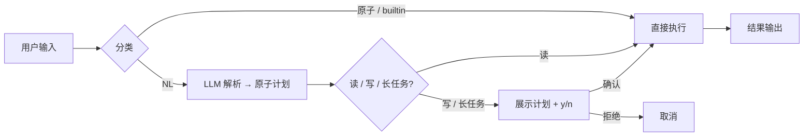
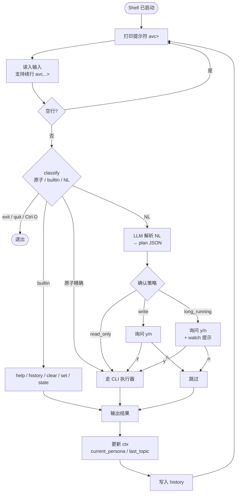
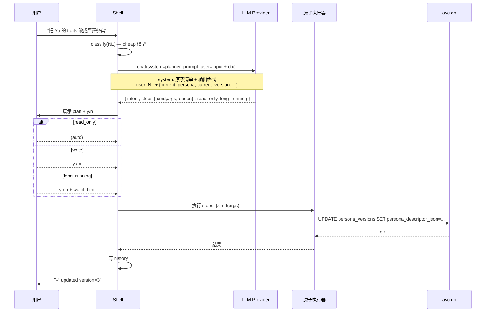
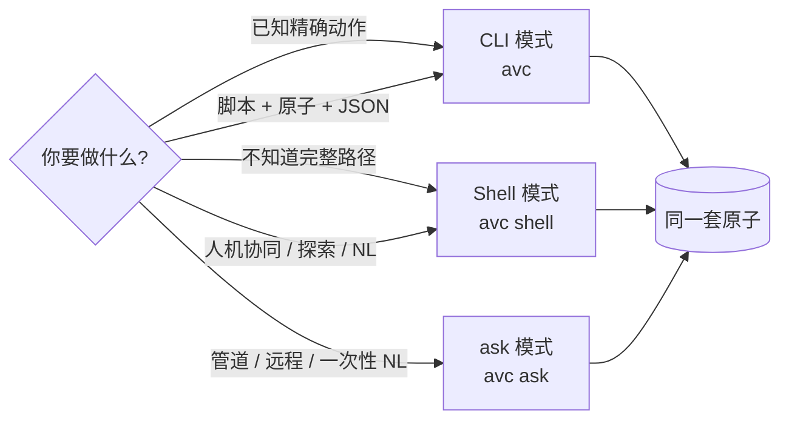

# 交互式 Shell（Shell / ask）

> AVCore 提供**三种执行入口**：`avc <atom>` 精确 CLI、`avc shell` 交互式 Shell、`avc ask "..."` 非交互式 NL。底层共享同一套原子命令——Shell 是它们的"人话界面"。

---

## 1. 为什么需要 Shell

精确原子命令（`persona list`、`finetune start ...`）是给**脚本和 CI** 用的——确定、快、可组合。

但日常迭代角色时，你更想说：

- "列出所有角色"
- "把 Yu 的 traits 改成严谨务实"
- "出 Yu 主题 InnoDB 的视频"

Shell 把这些自然语言翻译成原子计划，**展示给你看，征求确认，然后执行**——既不像 GUI 那么重，又比纯 CLI 友好。



### 1.1 入口路由（三模式分发）

```mermaid
flowchart TB
    Start([avc 启动]) --> Empty{args.is_empty?}
    Empty -->|是| TTY{isatty stdout}
    TTY -->|是| Shell[Shell 模式<br/>持续循环]
    TTY -->|否| Help[打印 help, exit 0]
    Empty -->|否| First{args[0]?}
    First -->|shell| Shell
    First -->|ask| Ask[ask 模式<br/>一次性 NL → 原子]
    First -->|其它| CLI[CLI 模式<br/>精确命令一次性执行]
    Shell --> SameEx[(同一套原子执行器)]
    Ask --> SameEx
    CLI --> SameEx
```

---

## 2. 入口

```bash
# 1. 显式启动 Shell
avc shell

# 2. TTY 下裸 avc 直接进 Shell
avc                # 仅在 isatty(stdout) 时

# 3. 非交互式 NL（管道 / 脚本）
avc ask "把 Yu 的 traits 改成严谨务实"
avc ask --yes "出 Yu 主题 InnoDB 的视频"   # 跳过确认
avc ask --json "yu 的当前版本是什么"
avc ask --dry-run "..."                     # 只展示计划
```

### 2.1 入口路由

```
fn main(args):
    if args.is_empty():
        if isatty(stdout) → shell.start()
        else              → print_help(); exit 0
    elif args[0] == "shell"        → shell.start()
    elif args[0] == "ask"          → ask.run(args[1..])
    else                            → cli.run(args)         // 现有逻辑
```

---

## 3. Shell 体验

### 3.1 提示符

```
avc> persona list                                     # 单行输入
avc...> 把 Yu 的 traits 改成                          # 续行（未闭合）
       严谨务实                                       # 完成输入
[plan] refine persona yu (1 step)
  1. persona set-traits yu --version 3 --traits 严谨,务实
[y/n]? y
✓ updated version=3
avc>
```

### 3.2 Shell 内循环（一次输入的完整路径）



### 3.2 三类输入

| 输入 | 来源 | 走法 |
|------|------|------|
| 原子命令 | `persona list` / `avc persona list` | 直接走 CLI 执行器 |
| Shell 内建 | `help` / `exit` / `history` / `clear` | 内置命令 |
| 自然语言 | "列出所有角色" / "把 Yu 的 traits 改成严谨务实" | LLM 解析 → 原子计划 |

> Shell 内识别 `avc` 前缀是可选的（`persona list` 和 `avc persona list` 等价）；脚本里必须带 `avc`。
>
> **Phase 1 实现状态：** NL 解析已在 `avc ask` 入口落地（见 `src/ask/mod.rs`：发请求到 provider.llm → 解析 Plan JSON → 验证白名单 atom → read_only 自动跑 / write 在 TTY 下 y/n）。Shell 模式下的 NL 入口尚未接通（Phase 1.3 续）。

### 3.3 NL 解析流水线



### 3.4 确认策略

| 操作 | 原子路径 | NL 路径 |
|------|---------|---------|
| 只读（list/show/inspect/versions） | 不确认 | 不确认 |
| 写（create / set-* / attach-* / commit / promote / archive / corpus attach） | 不确认（用户已显式） | **必须 y/n** |
| 长任务（finetune start / render run / render pack） | 不确认 | **必须 y/n + 提示 watch** |
| 危险（delete / prune） | `--confirm` 必填 | NL 路径默认拒绝；可 `--force` 强制确认 |

`ask` 模式在非 TTY 时默认拒绝写操作（要求 `--yes`），避免脚本意外执行。

---

## 4. Shell 内建命令

| 命令 | 说明 |
|------|------|
| `help` / `?` / `--help` | 列出原子清单 + NL 示例 |
| `exit` / `quit` / `Ctrl-D` | 退出（`Ctrl-D` 在空行时退出） |
| `clear` / `Ctrl-L` | 清屏 |
| `history` | 列出历史命令 |
| `!N` | 重跑历史第 N 条 |
| `!str` | 重跑最近以 `str` 开头的命令 |
| `!` | 重跑上一条 |
| `set` | 临时开关（如 `set no-confirm`、`set nl-model <name>`） |
| `unset` | 清除临时开关 |
| `state` | 显示当前 shell 上下文（last listed personas / current_persona 等） |

---

## 5. NL 解析模型

### 5.1 模型选择

NL 解析走**已配置的 `provider.llm`**，优先小 / 快模型：

```toml
# ~/.config/avc/avc.toml

[provider.llm.openai]
api_key = "sk-..."
model = "gpt-4o-mini"          # 默认用于 NL 解析

[shell]
nl_model = "gpt-4o-mini"        # 显式覆盖；不设则用 provider.llm.model
max_plan_steps = 8               # 单次 NL 输入最多展开几步
temperature = 0.0                # 解析要稳定，不要随机
```

### 5.2 System Prompt（节选）

```
你是 avc CLI 的命令规划器。把用户自然语言翻译成 avc 原子命令序列。

规则：
1. 优先用 set-* 原子（refine 路径），不要把改人设当 finetune
2. persona / version / topic 等参数从 shell context 与最近输出抽取
3. 输出严格 JSON：{"intent": "...", "steps": [{"cmd": "...", "args": {...}, "reason": "..."}], "read_only": bool, "long_running": bool}
4. 拿不准时宁可拆成多步 plan，不要猜用户没说的写操作

原子清单（节选）：
- persona set-traits <name> --version <v> --traits <csv>
- persona set-catchphrase <name> --version <v> --add <s>
- persona set-render <name> --version <v> --resolution <p>
- corpus attach <persona> --version <v> --corpus <id>
- corpus detach <persona> --version <v>
- render run --persona <p> --version <v> --topic <t> --duration <s>
- render pack --persona <p> --topics-file <path>
- finetune start <persona> --scope ... --base-version <v>
- persona promote <name> --to <v>
...
```

### 5.3 没配置 LLM 时

Shell / ask 在没 LLM 时返回：

```
error[E0601]: nl_model_not_configured
  hint: avc config set provider.llm.openai.api_key "sk-..."
        avc config set provider.llm.openai.model   "gpt-4o-mini"
  doc:   https://avc.dev/errors/E0601
```

**不静默回退到"啥都不做"**——明确报错，让用户决定：配 LLM 或用原子命令。

---

## 6. 上下文与连续性

Shell 维护轻量"会话上下文"：

```rust
struct ShellCtx {
    last_listed_personas: Vec<String>,     // 上次 persona list 的结果
    current_persona: Option<String>,       // 用户最近明确指定的 persona
    last_topic: Option<String>,
    last_plan: Option<Plan>,               // 上次展开的计划（用于 !1 重跑）
    confirm_mode: ConfirmMode,             // y/n / yes / no
    history: VecDeque<HistoryEntry>,
}
```

`state` 命令打印当前 ctx。多步 NL 输入时，LLM 会拿到 ctx 一起做 plan：

```
avc> 列出所有角色
[read-only] → persona list
yu  v=3
momo v=1

avc> 出 Yu 的视频，主题用刚才那条
[plan] (ctx: current_persona=yu, last_listed=[yu,momo])
  1. render run --persona yu --version 3 --topic "<从 ctx 推断>"
```

> **v1 不做"长期记忆"**——重启 Shell 即清空。跨 session 状态全部在 SQLite 里。

---

## 7. Plan 输出规范

每个 NL 输入都产出这样一个 plan：

```
[plan] <intent>  (read-only | write | long-running)
  N. <cmd> <args...>                            [atomic]
     reason: <为什么走这一步>
  ...

run? [y/n/a/N]   y=执行 n=取消 a=执行并关掉本次确认 N=执行且本次 session 都不再问
```

参数风格保持与精确 CLI 完全一致——这样用户可以直接复制粘贴执行同一行。

---

## 8. 历史与回放

```
avc> history
  1  persona list
  2  把 Yu 的 traits 改成严谨务实
  3  render run --persona yu --topic "InnoDB Buffer Pool"
  4  exit

avc> !2                                    # 重跑第 2 条
[plan] refine persona yu (1 step)
  1. persona set-traits yu --version 3 --traits 严谨,务实
[y/n]? y
```

历史持久化到 `~/.local/share/avc/shell_history`，跨 session 保留。

---

## 9. Tab 补全

| 已输入 | 补全候选 |
|--------|---------|
| 空 / 一级 | `persona / sample / iterate / finetune / job / render / corpus / provider / shell / ask / help / ...` |
| `persona ` | `create / show / list / versions / attach-* / set-* / commit / promote / ...` |
| `--` | flag 列表 |

补全用 clap 的 `Command::get_subcommands` + 自定义 noun 子集。

---

## 10. 多行输入

未闭合引号 / 括号 / 反引号 → 进入 `avc...>` 续行：

```
avc> 把 Yu 的 catchphrase 改成
avc...> "我们直接看源码——buffer pool 没那么玄"
[plan] refine persona yu (1 step)
  1. persona set-catchphrase yu --version 3 --add "我们直接看源码——buffer pool 没那么玄"
[y/n]? y
```

> 多行输入整体作为一个 NL 输入解析；不要拆成多个 plan。

---

## 11. 与 CLI / ask 的对照

| 场景 | CLI | Shell | ask |
|------|-----|-------|-----|
| 列出角色 | `avc persona list` | `persona list` 或 `列出所有角色` | `avc ask "列出所有角色"` |
| 改人设 | `avc persona set-traits yu --traits 严谨,务实` | `把 Yu 的 traits 改成严谨务实` | `avc ask --yes "把 Yu 的 traits 改成严谨务实"` |
| 出视频 | `avc render run --persona yu --topic ...` | `出 Yu 的 InnoDB 视频` | `avc ask --yes "出 Yu 主题 InnoDB 的视频"` |
| 探索性 | 不适合（要输完整路径） | **首选**（NL + 上下文 + 计划确认） | 不适合（无上下文） |
| 脚本 | **首选**（原子 + JSON） | 不适合 | 可（`--json --yes`） |
| CI | **首选** | 不适合 | 可（`--yes`） |

### 11.1 决策图：什么时候走哪条路



## 12. 关键指标

- Shell 启动 P95 ≤ 200ms（不调 LLM）
- NL 解析 P95 ≤ 2s（小模型 + 短 prompt）
- 历史命令重跑 P95 ≤ 200ms（不调 LLM，直接用历史 plan）
