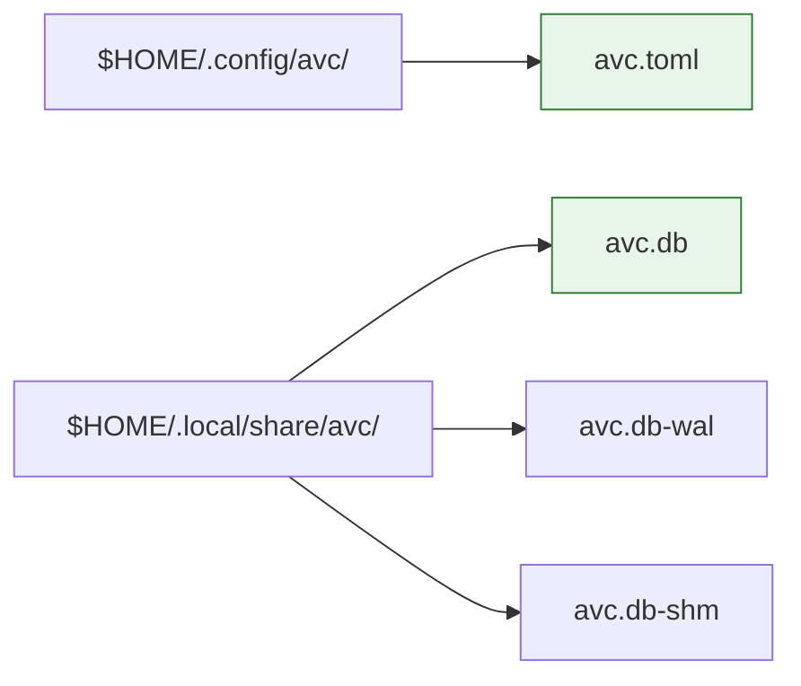
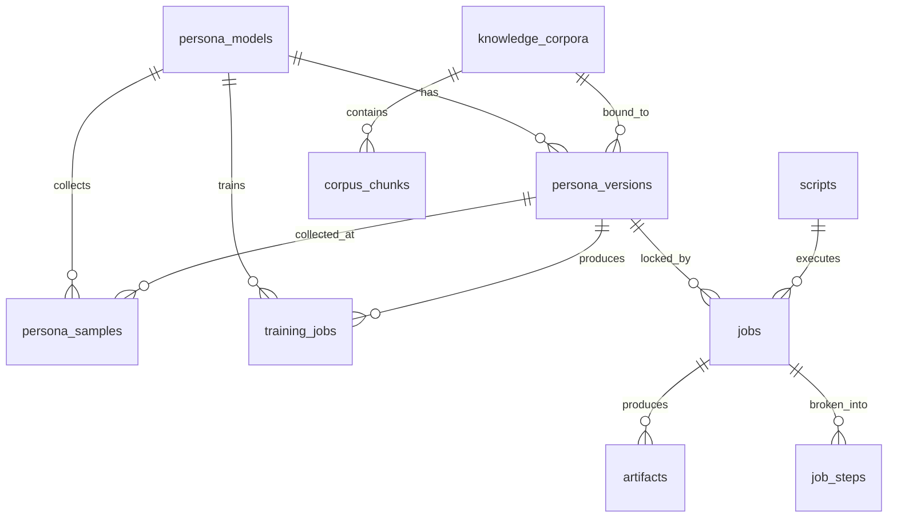
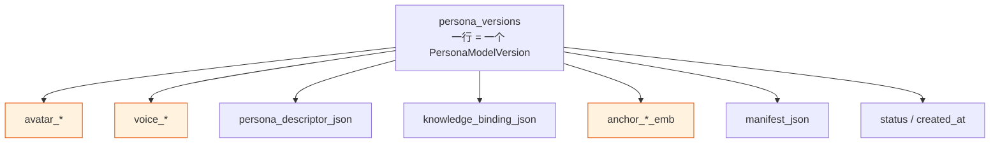

# 人物形象资产存储格式（Persona Asset Storage）

> AVCore 的全部状态 — 元数据 + 二进制（形象图、声音样本、嵌入向量、视频产物） — 都落在**一个 SQLite 文件**里：`~/.local/share/avc/avc.db`。
>
> 这份规范有约束力。所有 Provider 实现都按此 schema 写入。

---

## 0. 为什么是单一 SQLite？——规模与权衡

> **强约束**（用户给的）：persona ≤ 50 个，只在本机运行。

### 0.1 规模账
- 单 persona 单版本典型占用：**~35 MB**（详见 §1.1）
- 50 persona × 5 版本 ≈ **8.75 GB**——单一 SQLite 完全撑得住

### 0.2 候选方案

| 方案 | 描述 | 取舍 |
|------|------|------|
| **A. 单一 SQLite（含 BLOB）** ← 采用 | 全部状态进 `avc.db` | 单文件、可拷走；BLOB 在 KB 到几十 MB 范围性能良好；事务保证原子性 |
| B. SQLite 元数据 + FS 二进制 | 旧设计 | 引入两套同步机制与 FS 目录协议；50 persona 没有性能收益 |
| C. 对象存储（S3 / OSS） | 远端 | 单机单用户完全无必要，反而引入网络、token、bucket 配置负担 |
| D. 多 SQLite 分库 | 元数据/产物/日志分文件 | 50 persona 不需要拆分；增加备份/恢复复杂度 |

### 0.3 SQLite 完全够用的几条技术理由

1. **BLOB 列对 KB~几十 MB 完全 OK**：SQLite 单个 BLOB 上限理论 ~1.4 EB，实测中 KB~GB 范围都顺畅
2. **WAL 提供并发读 + 单写**：单用户单进程下，连写竞争都罕见
3. **事务 = 原子性**：版本创建 / 漂移回退 都是一个事务，回滚 `ROLLBACK` 即可，无需 `tmp + rename`
4. **单一文件 = 单一备份**：`cp avc.db backup.db` 或 `avc backup` 一条命令
5. **跨机迁移极简**：`rsync avc.db` 或者 `avc export --persona yu` 即可

### 0.4 SQLite 的不可行边界（透明告知）

| 阈值 | 反应 |
|------|------|
| ≤ 50 persona × 10 版本 ≈ 20 GB | 单一 SQLite 完全没问题 |
| 100~200 persona | 开始考虑把视频产物拆到 side-file（详见 §11） |
| > 500 persona / 多用户 / 多机 | 单机 + SQLite 不再适用，应改造为 SQLite 元数据 + S3 对象存储（这是另一个项目的事） |

> 当前规模我们做**单一 SQLite**，心里清楚到哪一步该升级即可。

---

## 1. 顶层文件布局

```
$HOME/.config/avc/avc.toml           # 唯一配置文件（含 token，写入 0600）
$HOME/.local/share/avc/avc.db        # 唯一数据库文件（含全部资产 + 元数据 + 产物）
$HOME/.local/share/avc/avc.db.wal    # WAL 日志（运行时存在，checkpoint 后回收）
$HOME/.local/share/avc/avc.db-shm    # 共享内存文件（运行时存在）
```

> 只有两个稳定文件：`avc.toml` + `avc.db`。其余都是 WAL / 临时，关闭后会清理。



### 1.1 单 persona 单版本大小估算（KB~几十 MB 全在 BLOB）

| 资产 | 典型大小 | 存储位置 |
|------|----------|----------|
| 主形象 PNG（1024px） | ~2 MB | `persona_versions.avatar_primary` BLOB |
| 视角图 × 6 | ~12 MB | `persona_versions.avatar_views_blobs` BLOB（zip/合并） |
| 参考图（用户上传） | KB~MB | `persona_versions.avatar_refs_blobs` BLOB |
| LoRA 引用 | <1 KB | `persona_versions.avatar_lora_ref_json` TEXT（JSON） |
| Voice 样本（60s WAV） | ~10 MB | `persona_versions.voice_sample` BLOB |
| 声音 transcript | KB | `persona_versions.voice_transcript` TEXT |
| Speaker embedding | ~2 KB | `persona_versions.voice_embed` BLOB |
| Persona descriptor | KB | `persona_versions.persona_descriptor_json` TEXT |
| Knowledge binding | KB | `persona_versions.knowledge_binding_json` TEXT |
| Identity anchor × 3 | ~12 KB | `persona_versions.anchor_*_emb` BLOB |
| Manifest + metrics | KB | `persona_versions.manifest_json` TEXT |
| **单版本合计** | **~25 MB** | |

50 persona × 5 版本 ≈ **6 GB**（实际比账小，因为不是每版都挂知识）。

---

## 2. 完整 schema

下面 12 张表覆盖 AVCore 全部状态。**主表 `persona_versions` 是宽表**，一个版本一行，把所有资产 BLOB 都放进去——避免频繁 JOIN 与跨表复制。



### 2.1 `persona_models` — 顶层角色元数据

```sql
CREATE TABLE persona_models (
    id TEXT PRIMARY KEY,           -- pm_<ULID>
    name TEXT NOT NULL,            -- "Yu"
    archetype TEXT,                -- db_kernel_expert
    description TEXT,
    current_version INTEGER NOT NULL,  -- 当前默认版本号
    status TEXT NOT NULL,          -- active / archived
    created_at TEXT NOT NULL,
    updated_at TEXT NOT NULL
);
```

### 2.2 `persona_versions` — 不可变版本快照（**宽表**）

一行 = 一个 PersonaModelVersion。所有资产 BLOB 直接在此行内。

```sql
CREATE TABLE persona_versions (
    persona_model_id TEXT NOT NULL,
    version INTEGER NOT NULL,
    parent_version INTEGER,                       -- 训练时父版本
    status TEXT NOT NULL,                          -- building / ready / deprecated

    -- ============ avatar ============
    avatar_provider TEXT,
    avatar_provider_version TEXT,
    avatar_primary BLOB,                          -- PNG / JPEG
    avatar_primary_mime TEXT,
    avatar_primary_sha256 TEXT,
    avatar_views_blobs BLOB,                      -- zip-of-PNGs OR concatenation
    avatar_views_mime TEXT,
    avatar_views_sha256 TEXT,
    avatar_refs_blobs BLOB,                       -- 用户上传的参考图（可空）
    avatar_refs_mime TEXT,
    avatar_refs_sha256 TEXT,
    avatar_lora_ref_json TEXT,                    -- {model_id, provider, trained_at, base_model}
    avatar_face_id TEXT,

    -- ============ voice ============
    voice_provider TEXT,
    voice_provider_version TEXT,
    voice_id_remote TEXT,                         -- 远端 voice_id
    voice_sample BLOB,                            -- WAV 30~60s
    voice_sample_mime TEXT,
    voice_sample_sha256 TEXT,
    voice_transcript TEXT,
    voice_embed BLOB,                             -- speaker embedding (512-d float32)
    voice_embed_dim INTEGER,
    voice_embed_sha256 TEXT,

    -- ============ persona descriptor ============
    persona_descriptor_json TEXT,                 -- 完整 descriptor JSON

    -- ============ knowledge (可选) ============
    knowledge_binding_json TEXT,                  -- 完整 KnowledgeBinding JSON
    knowledge_corpus_ids_json TEXT,               -- 用于 join 回 knowledge_corpora

    -- ============ identity anchor ============
    anchor_face_emb BLOB,                         -- 512-d
    anchor_face_dim INTEGER,
    anchor_face_sha256 TEXT,
    anchor_voice_emb BLOB,                        -- 512-d
    anchor_voice_dim INTEGER,
    anchor_voice_sha256 TEXT,
    anchor_style_emb BLOB,                        -- 768-d
    anchor_style_dim INTEGER,
    anchor_style_sha256 TEXT,
    anchor_computed_at TEXT,
    anchor_encoder_versions_json TEXT,            -- {face: "arcface-r100", voice: "wespeaker", style: "..."}

    -- ============ manifest / metrics ============
    manifest_json TEXT,                           -- 完整 manifest JSON（导出用）
    metrics_json TEXT,                            -- {identity_consistency, style_consistency, quality_score, drift_alerts}
    notes TEXT,

    -- ============ traceability ============
    training_job_id TEXT,
    created_at TEXT NOT NULL,

    PRIMARY KEY (persona_model_id, version)
);

CREATE INDEX idx_persona_versions_status ON persona_versions(status);
```

> **不可变原则**：`UPDATE persona_versions SET ...` 仅在 `building → ready` 这一窗口发生；`ready` 之后任何字段不再被 UPDATE，只能新增新行（v(N+1)）。

### 2.3 `persona_samples` — 训练样本池

```sql
CREATE TABLE persona_samples (
    id TEXT PRIMARY KEY,                          -- smp_<ULID>
    persona_model_id TEXT NOT NULL,
    version_id_at_collection INTEGER,             -- 收集时所在的 version
    kind TEXT NOT NULL,                           -- image / audio / behavior_text / feedback
    blob BLOB,                                    -- 二进制样本（image/audio）
    blob_mime TEXT,
    text TEXT,                                    -- 文本样本（behavior_text/feedback 可走文本）
    source TEXT NOT NULL,                         -- user_upload / system_extracted / feedback_pool
    consent_proof TEXT,                           -- 授权文件 ID 或 hash
    consent_proof_sha256 TEXT,
    tags_json TEXT,
    quality_score REAL,
    sha256 TEXT,
    byte_size INTEGER,
    created_at TEXT NOT NULL
);

CREATE INDEX idx_samples_pm ON persona_samples(persona_model_id, kind, created_at);
CREATE INDEX idx_samples_version ON persona_samples(version_id_at_collection);
```

### 2.4 `training_jobs` — 训练任务账本

```sql
CREATE TABLE training_jobs (
    id TEXT PRIMARY KEY,                          -- tj_<ULID>
    persona_model_id TEXT NOT NULL,
    base_version INTEGER NOT NULL,
    target_version INTEGER,                       -- 训练前预占，成功后即 result_version
    scope_json TEXT NOT NULL,                     -- ["avatar","voice","persona","knowledge"]
    config_json TEXT,
    status TEXT NOT NULL,                         -- queued/running/succeeded/failed_drift/failed/cancelled
    progress REAL,
    result_version INTEGER,                       -- 成功时 = target_version
    drift_report_json TEXT,                       -- 失败时详细报告
    started_at TEXT,
    finished_at TEXT
);
```

### 2.5 `scripts` — 分镜

```sql
CREATE TABLE scripts (
    id TEXT PRIMARY KEY,                          -- scr_<ULID>
    persona_model_id TEXT NOT NULL,
    persona_version INTEGER NOT NULL,             -- 锁定
    topic TEXT,
    template_id TEXT,
    scenes_json TEXT NOT NULL,
    style_overrides_json TEXT,
    bgm_id TEXT,
    duration_ms INTEGER,
    created_at TEXT
);
```

### 2.6 `jobs` — 渲染任务

```sql
CREATE TABLE jobs (
    id TEXT PRIMARY KEY,                          -- job_<ULID>
    script_id TEXT,
    persona_model_id TEXT NOT NULL,
    persona_version INTEGER NOT NULL,             -- 锁定，永不漂移
    status TEXT NOT NULL,
    options_json TEXT,
    artifacts_json TEXT,
    error_json TEXT,
    progress REAL,
    current_step TEXT,
    step_progress_json TEXT,
    eta_seconds INTEGER,
    created_at TEXT,
    finished_at TEXT
);
```

### 2.7 `artifacts` — 视频产物（嵌入 DB，无 FS 路径）

```sql
CREATE TABLE artifacts (
    id TEXT PRIMARY KEY,                          -- art_<ULID>
    job_id TEXT NOT NULL,
    kind TEXT NOT NULL,                           -- final_video / cover_image / subtitle / meta
    name TEXT NOT NULL,                           -- final.mp4 / cover.jpg / subtitle.srt / meta.json
    content BLOB,
    mime TEXT,
    byte_size INTEGER,
    sha256 TEXT,
    meta_json TEXT,
    created_at TEXT
);

CREATE INDEX idx_artifacts_job ON artifacts(job_id, kind);
```

> **导出路径**：`avc job export job_xxx --out ./final.mp4` 把 BLOB 写到 FS，便于分享。

### 2.8 `job_steps` — DAG 节点账本

```sql
CREATE TABLE job_steps (
    id TEXT PRIMARY KEY,
    job_id TEXT NOT NULL,
    node_id TEXT NOT NULL,
    status TEXT NOT NULL,                         -- pending/running/succeeded/failed/skipped
    attempt INTEGER DEFAULT 1,
    inputs_json TEXT,
    outputs_json TEXT,
    artifacts_json TEXT,
    error_json TEXT,
    started_at TEXT,
    finished_at TEXT,
    duration_ms INTEGER,
    trace_id TEXT
);
CREATE INDEX idx_steps_job ON job_steps(job_id);
```

### 2.9 `knowledge_corpora` + `corpus_chunks` — 知识语料

```sql
CREATE TABLE knowledge_corpora (
    id TEXT PRIMARY KEY,
    name TEXT,
    source_type TEXT,
    language TEXT,
    chunk_count INTEGER DEFAULT 0,
    index_version INTEGER DEFAULT 0,
    created_at TEXT
);

CREATE TABLE corpus_chunks (
    id TEXT PRIMARY KEY,
    corpus_id TEXT NOT NULL,
    ordinal INTEGER NOT NULL,
    content TEXT NOT NULL,
    embed_blob BLOB,                              -- 远端 embed API 算出来的向量
    embed_dim INTEGER,
    embed_sha256 TEXT,
    token_count INTEGER,
    deprecated INTEGER DEFAULT 0,
    meta_json TEXT
);
CREATE INDEX idx_chunks_corpus ON corpus_chunks(corpus_id, ordinal);
```

### 2.10 `config_entries` — 运行时配置（仅密钥/Provider 配置等少数项）

```sql
CREATE TABLE config_entries (
    key TEXT PRIMARY KEY,
    value TEXT,                                   -- JSON / 字符串
    encrypted INTEGER DEFAULT 0,                  -- 0/1；加密条目仅 in-memory 解密落用
    updated_at TEXT
);
```

### 2.11 `audit_log` — 审计

```sql
CREATE TABLE audit_log (
    id INTEGER PRIMARY KEY AUTOINCREMENT,
    ts TEXT NOT NULL,
    actor TEXT,                                   -- user / system
    action TEXT NOT NULL,
    target_kind TEXT,
    target_id TEXT,
    detail_json TEXT
);
CREATE INDEX idx_audit_target ON audit_log(target_kind, target_id, ts);
```

---

## 3. 行级不可变快照：`persona_versions` 的事实语义

一个版本 = `persona_versions` 表的一行。**所有事实数据 + BLOB 在该行内**。



### 3.1 写一条新版本的全流程

```
BEGIN TRANSACTION;
  -- 1. 预占版本号（避免冲突）
  INSERT INTO training_jobs(target_version=N+1, status='running');
  
  -- 2. 写新版本行（status='building'）
  INSERT INTO persona_versions(?, N+1, ..., status='building');
  
  -- 3. 写样本到 persona_samples（来自外部或回灌）
  
  -- 4. 节点完成时只 UPDATE outputs_json 在 job_steps
  
COMMIT;
```

### 3.2 漂移不达标时的一键回退

```sql
BEGIN TRANSACTION;
  DELETE FROM persona_versions WHERE persona_model_id=? AND version=N+1;
  UPDATE training_jobs SET status='failed_drift', drift_report_json=?, finished_at=?
    WHERE target_version=N+1 AND persona_model_id=?;
COMMIT;
```

> SQLite 事务原子性回退 = 一句话。没有"删除半个目录然后发现漏了一个 BLOB"的可能。

---

## 4. 备份与迁移

> **整个 `avc.db` = 全部状态**。不需要分别备份 SQLite + 文件系统。

### 4.1 在线热备份（推荐）

```bash
# 框架自带命令：先做 wal-checkpoint，再安全复制
avc backup --out backup-2026-07-30.db
```

实现：
```sql
PRAGMA wal_checkpoint(FULL);   -- 把 WAL 落盘
-- 然后由 Rust 层 atomic copy avc.db -> 备份
```

### 4.2 离线冷备份

```bash
# 服务停掉时直接拷贝
cp ~/.local/share/avc/avc.db ./my_backup.db
```

### 4.3 单 persona 导出（跨机迁移友好）

```bash
avc export --persona yu --out yu-portable.tar.zst
```

实现：从 `persona_versions` 选一行（含所有 BLOB）+ 关联 `persona_samples` + 关联 `training_jobs` → tar.zst。

### 4.4 恢复

```bash
avc restore --from backup-2026-07-30.db   # 直接替换 avc.db（自动停 wal + 重启）
avc import yu-portable.tar.zst            # 增量导入单个 persona
```

---

## 5. 校验与修复

### 5.1 全量校验

```bash
avc verify
```

实现：对每个 `persona_versions` 行 / `artifacts` 行重算 sha256，与表中存的 sha256 比对。不匹配 → 标 `corrupted=1`。

```sql
SELECT id FROM persona_versions
 WHERE avatar_primary IS NOT NULL
   AND avatar_primary_sha256 != hex(sha256(avatar_primary));
```

### 5.2 单 persona 校验

```bash
avc verify --persona yu
```

---

## 6. 给人类的 inspect 入口

虽然存储是 SQLite BLOB，但用户偶尔想"看一眼"。

### 6.1 CLI inspect（推荐）

```bash
avc persona show yu                    # 概要
avc persona versions yu                 # 所有版本
avc persona show yu --version 2 --json # JSON 形式
avc persona inspect yu --version 2     # 完整结构，格式化输出
```

### 6.2 临时盘 dump（可选，便于调试）

```bash
avc persona dump yu --version 2 --out ./dump_dir/   # 一次性导出为可读目录
# 产生：
# ./dump_dir/manifest.json
# ./dump_dir/avatar/primary.png
# ./dump_dir/voice/sample.wav
# ...
```

> `dump` 是**只读视图**——不写回 DB；下次再 dump 又是同一份。

### 6.3 直接用 sqlite3 命令

```bash
sqlite3 ~/.local/share/avc/avc.db "SELECT id, name FROM persona_models"
sqlite3 ~/.local/share/avc/avc.db ".schema persona_versions"
```

---

## 7. 配置与 token 存储

**只写文件 `avc.toml`（不在 SQLite 中）**：
- 路径：`~/.config/avc/avc.toml`（XDG_CONFIG_HOME）
- 权限：0600
- 用途：Provider token、开关（真实人物复刻、隐私模式…）

```toml
[provider.avatar.kling]
api_key = "klg_..."

[provider.voice.elevenlabs]
api_key = "el_..."

[provider.llm.openai]
api_key = "sk-..."

[provider.video.kling]
api_key = "klg_..."

[safety]
real_person_enabled = false
auto_consume_feedback = true
```

> SQLite 不存 token，原因：备份库 / `avc dump` 时不泄漏密钥；同时 `avc.toml` 是稳定单文件，git / dotfile 工具可直接管理。

---

## 8. 迁移到更大规模（透明升级路径）

| 当前规模 | 推荐方案 |
|----------|----------|
| ≤ 50 persona × 10 版本 ≈ 20 GB | 单 SQLite（本方案） |
| 100~200 persona | 视频产物 → side-file（其他仍 SQLite） |
| > 200 persona / 多用户 / 跨机 | SQLite 元数据 + S3 对象存储产物（独立项目，本框架仍负责格式规范） |
| 集群级 | 与本框架无关 |

升级时**不需要破坏 schema**：`artifacts.content` BLOB 列允许为 `NULL` 表示 "BLOB 已迁出到 `<uri>`"，`avc job export` 仍可读。

---

## 9. 总结

> **一切都在一个文件里**：`~/.local/share/avc/avc.db`。
> 
> - 元数据 / 嵌入向量 / 视频产物 → 表的 BLOB 列
> - 50 persona × 5 版本 ≈ 几 GB，单文件 SQLite 完全够
> - 备份 = 拷一个文件；迁移 = `rsync` 一个文件；恢复 = `cp` 一下
> - `avc verify` 用 sha256 自动校验，`avc inspect / dump` 给人类看
> - token 单独走 `~/.config/avc/avc.toml`，不进 DB
> - 跨到更大规模时只需把 `artifacts.content` 拆出 side-file，schema 不破

`avc.db` 是本框架的**唯一事实源**。
