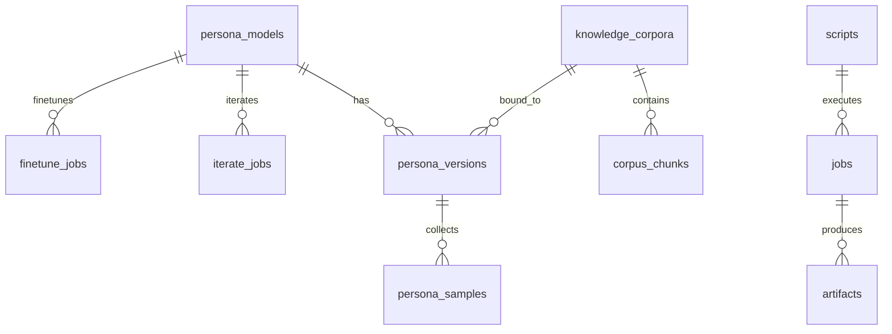
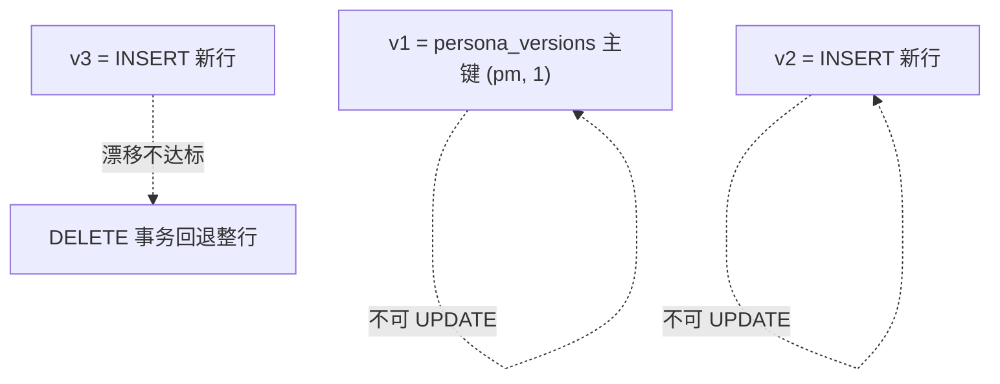

# 存储（Storage）

> AVCore 的全部状态——元数据 + BLOB（avatar / voice / 嵌入向量 / 视频产物）——落在**一个 SQLite 文件** `~/.local/share/avc/avc.db`。
>
> 配置 / token 走 `~/.config/avc/avc.toml`（不入 DB，便于备份库不泄漏密钥）。

---

## 1. 规模账

| 资产 | 单版本大小 |
|------|----------|
| avatar_primary PNG | ~2 MB |
| avatar_views_blobs（zip） | ~12 MB |
| voice_sample WAV (60s) | ~10 MB |
| voice_embed | ~2 KB |
| persona_descriptor_json | KB |
| anchor_*_emb × 3 | ~12 KB |
| manifest_json + metrics | KB |
| **单版本合计** | **~25 MB** |

50 persona × 5 版本 ≈ **6 GB**——单一 SQLite 完全够。

---

## 2. 顶层文件

```
~/.config/avc/avc.toml                # 配置 + provider token (0600)
~/.local/share/avc/avc.db             # 全部状态（含 BLOB）
~/.local/share/avc/avc.db-wal         # WAL（运行时）
~/.local/share/avc/avc.db-shm         # 共享内存（运行时）
```

只有 `avc.toml` + `avc.db` 是稳定文件，其余是 SQLite 运行时临时。

---

## 3. Schema（精简版）



---

## 4. 表

### 4.1 `persona_models`

```sql
CREATE TABLE persona_models (
    id TEXT PRIMARY KEY,                    -- pm_<ULID>
    name TEXT NOT NULL,
    archetype TEXT,                         -- db_kernel_expert / vlogger / anchor / ...
    description TEXT,
    current_version INTEGER NOT NULL,
    status TEXT NOT NULL,                   -- active / archived
    created_at TEXT NOT NULL,
    updated_at TEXT NOT NULL
);
```

### 4.2 `persona_versions` —— **不可变版本宽表**

一行 = 一个 PersonaModelVersion。所有元数据 + BLOB 在这一行内。

```sql
CREATE TABLE persona_versions (
    persona_model_id TEXT NOT NULL,
    version INTEGER NOT NULL,
    parent_version INTEGER,
    status TEXT NOT NULL,                   -- building / ready / deprecated

    -- avatar
    avatar_provider TEXT,
    avatar_provider_version TEXT,
    avatar_primary BLOB,
    avatar_primary_mime TEXT,
    avatar_primary_sha256 TEXT,
    avatar_views_blobs BLOB,
    avatar_refs_blobs BLOB,
    avatar_lora_ref_json TEXT,              -- {model_id, provider, trained_at, base_model}
    avatar_face_id TEXT,

    -- voice
    voice_provider TEXT,
    voice_provider_version TEXT,
    voice_id_remote TEXT,
    voice_sample BLOB,
    voice_sample_mime TEXT,
    voice_sample_sha256 TEXT,
    voice_transcript TEXT,
    voice_embed BLOB,
    voice_embed_dim INTEGER,
    voice_embed_sha256 TEXT,

    -- persona
    persona_descriptor_json TEXT,

    -- knowledge (optional)
    knowledge_binding_json TEXT,

    -- identity anchor
    anchor_face_emb BLOB,
    anchor_voice_emb BLOB,
    anchor_style_emb BLOB,
    anchor_anchor_sha256 TEXT,              -- 整体 sha256

    -- manifest
    manifest_json TEXT,
    metrics_json TEXT,

    training_job_id TEXT,
    created_at TEXT NOT NULL,
    PRIMARY KEY (persona_model_id, version)
);
```

> 不可变：`UPDATE` 仅在 `building → ready` 一瞬，ready 后仅可新增版本；漂移不达标时 `DELETE` 整行事务回退。

### 4.3 `persona_samples`

```sql
CREATE TABLE persona_samples (
    id TEXT PRIMARY KEY,                    -- smp_<ULID>
    persona_model_id TEXT NOT NULL,
    version_id_at_collection INTEGER,       -- 收集时 persona 的版本号
    kind TEXT NOT NULL,                     -- image / audio / behavior_text / feedback
    blob BLOB,                              -- binary sample (image/audio)
    blob_mime TEXT,
    text TEXT,                              -- text sample
    source TEXT NOT NULL,                   -- user_upload / system_extracted / feedback_pool
    consent_proof TEXT,                     -- 授权书引用
    tags_json TEXT,
    quality_score REAL,
    sha256 TEXT,
    created_at TEXT NOT NULL,
    FOREIGN KEY (persona_model_id) REFERENCES persona_models(id)
);
```

### 4.4 `iterate_jobs`（refine 任务账本）

```sql
CREATE TABLE iterate_jobs (
    id TEXT PRIMARY KEY,                    -- ij_<ULID>
    persona_model_id TEXT NOT NULL,
    target_version INTEGER NOT NULL,        -- 同版本号升级 = current_version
    changes_json TEXT NOT NULL,             -- {persona_descriptor?, knowledge_binding?, manifest?, metrics?}
    status TEXT NOT NULL,                   -- queued/running/succeeded/failed/cancelled
    started_at TEXT,
    finished_at TEXT
);
```

> 同版本号；不调 Provider；不存在漂移问题。

### 4.5 `finetune_jobs`（SFT 任务账本）

```sql
CREATE TABLE finetune_jobs (
    id TEXT PRIMARY KEY,                    -- fj_<ULID>
    persona_model_id TEXT NOT NULL,
    base_version INTEGER NOT NULL,
    target_version INTEGER,                 -- 预占 = base+1
    scope_json TEXT NOT NULL,               -- ["avatar","voice","persona"]
    config_json TEXT,
    status TEXT NOT NULL,                   -- queued/running/succeeded/failed_drift/failed/cancelled
    result_version INTEGER,
    drift_report_json TEXT,
    started_at TEXT,
    finished_at TEXT
);
```

### 4.6 `scripts`

```sql
CREATE TABLE scripts (
    id TEXT PRIMARY KEY,                    -- scr_<ULID>
    persona_model_id TEXT NOT NULL,
    persona_version INTEGER NOT NULL,       -- 锁定
    topic TEXT,
    scenes_json TEXT NOT NULL,
    bgm_id TEXT,
    duration_ms INTEGER,
    created_at TEXT
);
```

### 4.7 `jobs`

```sql
CREATE TABLE jobs (
    id TEXT PRIMARY KEY,                    -- job_<ULID>
    script_id TEXT,
    persona_model_id TEXT NOT NULL,
    persona_version INTEGER NOT NULL,       -- 锁定，永不漂移
    status TEXT NOT NULL,                   -- queued/running/succeeded/failed/cancelled
    progress REAL,
    current_step TEXT,
    options_json TEXT,
    error_json TEXT,
    created_at TEXT,
    finished_at TEXT
);
```

### 4.8 `artifacts`

视频产物。**BLOB 入 DB**——`avc job export` 可拷到 FS 分享。

```sql
CREATE TABLE artifacts (
    id TEXT PRIMARY KEY,                    -- art_<ULID>
    job_id TEXT NOT NULL,
    kind TEXT NOT NULL,                     -- final_video / cover / subtitle / meta
    name TEXT NOT NULL,
    content BLOB,
    mime TEXT,
    byte_size INTEGER,
    sha256 TEXT,
    created_at TEXT
);
CREATE INDEX idx_artifacts_job ON artifacts(job_id, kind);
```

### 4.9 `job_steps`（DAG 节点账本）

```sql
CREATE TABLE job_steps (
    id TEXT PRIMARY KEY,
    job_id TEXT NOT NULL,
    node_id TEXT NOT NULL,
    status TEXT NOT NULL,                   -- pending/running/succeeded/failed/skipped
    attempt INTEGER DEFAULT 1,
    outputs_json TEXT,
    error_json TEXT,
    started_at TEXT,
    finished_at TEXT,
    duration_ms INTEGER
);
CREATE INDEX idx_steps_job ON job_steps(job_id);
```

### 4.10 `knowledge_corpora` + `corpus_chunks`（**可选维度**）

> 仅当 PersonaModel "懂某领域" 时才用。普通虚拟主播 / 品牌代言人 / 虚拟员工**完全不需要**这张表。

```sql
CREATE TABLE knowledge_corpora (
    id TEXT PRIMARY KEY,
    name TEXT,
    source_type TEXT,                       -- upload / url / faq
    language TEXT,
    chunk_count INTEGER DEFAULT 0,
    index_version INTEGER DEFAULT 0,
    created_at TEXT
);

CREATE TABLE corpus_chunks (
    id TEXT PRIMARY KEY,
    corpus_id TEXT NOT NULL,
    ordinal INTEGER NOT NULL,
    content TEXT NOT NULL,
    embed_blob BLOB,                        -- 远端 embed API 算的向量
    embed_dim INTEGER,
    token_count INTEGER,
    deprecated INTEGER DEFAULT 0,
    meta_json TEXT
);
```

chunks 检索：`SELECT ... FROM corpus_chunks WHERE corpus_id=?` 全表扫 + `embed_blob + 应用层 cosine` 即可——50 corpus × 1000 chunk 完全够。

---

## 5. 不可变原则



写入原子性（以新版本为例）：

```sql
BEGIN;
  INSERT INTO finetune_jobs(target_version=N+1, status='running');
  INSERT INTO persona_versions(?, N+1, ..., status='building');
  -- 节点结果 UPDATE 在 job_steps
COMMIT;
```

回退（漂移不达标）：

```sql
BEGIN;
  DELETE FROM persona_versions WHERE persona_model_id=? AND version=N+1;
  UPDATE finetune_jobs SET status='failed_drift', drift_report_json=? WHERE id=?;
COMMIT;
```

事务边界 = 数据边界。无半行；无临时文件。

---

## 6. 校验 / 修复

```bash
avc verify                 # 全表 sha256 重算 vs 表中 stored sha256
avc verify --persona yu    # 单 persona
```

不匹配 → 报错 `asset_corrupted`。修复策略：删除 corrupted 行 + 重新走 finetune 任务出 v(N+1)（绝不"修补"覆盖原行）。

---

## 7. 备份与迁移

```bash
avc backup --out backup.db             # 在线 WAL checkpoint + atomic copy
avc restore --from backup.db
avc export --persona yu --out yu.tar.zst
avc import yu.tar.zst
```

整个 `avc.db` = 全部状态；不需要分别备份不同文件。

---

## 8. 配置 / token

```toml
# ~/.config/avc/avc.toml (0600)
[provider.avatar.kling]
api_key = "klg_..."

[provider.voice.elevenlabs]
api_key = "el_..."

[provider.llm.openai]
api_key = "sk-..."

[provider.video.kling]
api_key = "klg_..."

[provider.embed.openai]
api_key = "sk-..."

[safety]
real_person_enabled = false
auto_consume_feedback = true
```

不存 DB = 备份 / `avc dump` 不泄漏密钥；可被 dotfile / git 工具管理。

---

## 9. CLI inspect（人类读）

```bash
avc persona show yu                       # 概要
avc persona versions yu                   # 历史版本
avc persona inspect yu --version 2        # 详细字段
avc persona dump yu --version 2 --out ./dump/   # 一次性导出可读目录（只读）
sqlite3 ~/.local/share/avc/avc.db ".schema persona_versions"
```

---

## 10. export 目标（Local | S3）

`svc::render::export_artifacts(db, job_id, target)` 支持两种 target：

| target | CLI | 行为 |
|--------|-----|------|
| `ExportTarget::Local(&Path)` | `--out <dir>` | mkdir -p + 每条 artifact 落 `<kind>__<name>__<id>.bin` |
| `ExportTarget::S3 { bucket, prefix, upload_cmd }` | `--target s3://bucket/prefix/` | 每条 artifact 写到 tmp，跑 `sh -c <upload_cmd>`（占位符 `{local} {bucket} {prefix} {name}` 替换），完即清 tmp |

`upload_cmd` 来自 `[export.s3]` config 段；默认：

```toml
[export.s3]
upload_cmd = "aws s3 cp --region us-east-1 {local} s3://{bucket}/{prefix}{name}"
```

可换：

- `mc`： `[export.s3] upload_cmd = "mc cp {local} minio/{bucket}/{prefix}{name}"`
- `rclone`：`[export.s3] upload_cmd = "rclone copyto {local} s3remote:{bucket}/{prefix}{name}"`
- 自家脚本：`[export.s3] upload_cmd = "/usr/local/bin/upload.sh {local} {bucket} {prefix} {name}"`

`--out` 和 `--target` 互斥；都不传 → Arg 错（exit 2）。

## 11. 升级阈值（透明告知）

| 规模 | 方案 |
|------|------|
| ≤ 50 persona × 10 版本（≤20 GB） | 单一 SQLite（当前） |
| 100~200 persona | 视频产物拆 side-file（其他仍 SQLite） |
| > 200 persona / 多用户 / 跨机 | SQLite 元数据 + S3 产物（独立项目） |
| 集群 | 与本框架无关 |

升级时 schema 不破：`artifacts.content` 可为 `NULL` 表示已迁出。
