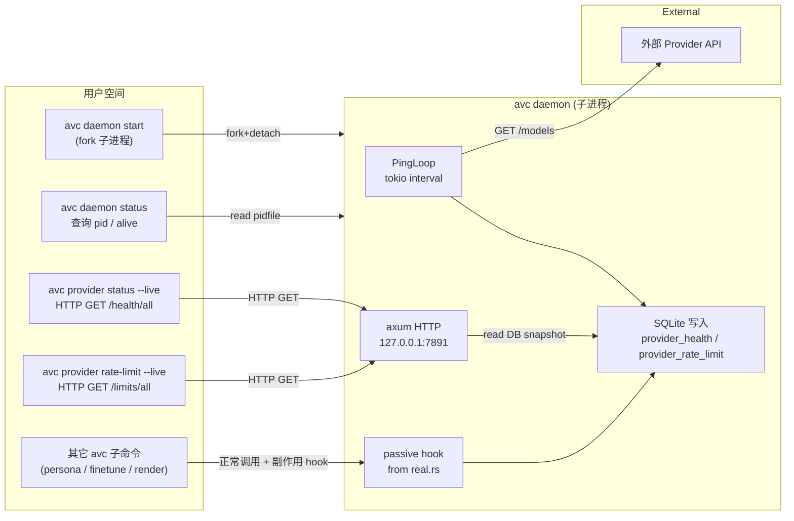

# Provider 健康检查 daemon — 设计

> **状态**：草稿 v1，待用户 review
> **日期**：2026-08-03
> **范围**：在现有 avc 仓库内新增后台进程 + HTTP 探活 + 被动 hook + 查询 CLI
> **不在范围**：Web UI、多用户、跨机同步、Phase 3+ 其他功能

---

## 1. 目标

为 `avc` 增加**对外部 Provider 的可观测性**，让用户在不连真 API 的情况下也能回答：

1. 某个 Provider 当前是否健康？
2. 是否在限速冷却期？下次何时可试？
3. 历史上是否经常失败？
4. **正在跑的 daemon** 是否还在响应？

实现形式：独立后台进程 + tokio 定时 ping + 现有调用路径的被动 hook + CLI 实时/历史查询。

---

## 2. 架构

### 2.1 顶层架构图



### 2.2 组件清单

| 组件 | 位置 | 职责 |
|---|---|---|
| `cli::daemon` | `src/cli/daemon.rs`（新增） | `start` / `stop` / `status` / `logs` 4 个动词 |
| `svc::health` | `src/svc/health.rs`（新增） | DB CRUD：写 health / rate_limit、查 health / rate_limit |
| `svc::daemon_runtime` | `src/svc/daemon.rs`（新增） | tokio 后台进程：PingLoop + HTTP 服务器 + 信号处理 |
| `provider::probe` | `src/provider/probe.rs`（新增） | `probe_llm / probe_embed / probe_avatar / probe_voice / probe_cli_video` 5 个函数 |
| `provider::hook` | `src/provider/real.rs` 内 | 在 4 个 `OpenAiCompat*` Provider 的 `send` 错误分支调用 `health::record_*` |
| `migrations/0003_provider_health.sql` | 新增 | 3 张表（provider_health, provider_rate_limit, daemon_meta） |
| `config::DaemonCfg` | `src/config.rs` | port / ping_interval / log_level / auto_record_hook |

### 2.3 跨平台进程分离

- **Unix**：手写 fork + setsid（~50 行），避免引入新依赖
- **Windows**：`CreateProcess` with `DETACHED_PROCESS | CREATE_NEW_PROCESS_GROUP`
- pidfile：`~/.local/share/avc/avc.pid`，跨平台一致
- 文件锁：`/tmp/avc.{uid}.lock`（fcntl flock, Unix）；`LockFileEx`（Windows）

### 2.4 HTTP 端点（最小集）

| 方法 | 路径 | 返回 |
|---|---|---|
| GET | `/health/all` | `[{dim, name, status, latency_ms, last_check_at, last_error}]` |
| GET | `/health/{dim}/{name}` | 单条记录 |
| GET | `/limits/all` | `[{dim, name, in_cooldown, until_ts, retry_after_s, hit_count_24h}]` |
| GET | `/limits/{dim}/{name}` | 单条 |
| GET | `/version` | daemon 版本 + 启动时间 |

默认端口 `7891`，bind `127.0.0.1`（安全：不允许远程访问）。

---

## 3. 数据模型

### 3.1 新增迁移 `migrations/0003_provider_health.sql`

```sql
-- Provider 健康状态滚动窗口
CREATE TABLE IF NOT EXISTS provider_health (
    id INTEGER PRIMARY KEY AUTOINCREMENT,
    provider_key TEXT NOT NULL,          -- 'llm.openai' / 'voice.elevenlabs' 等
    status TEXT NOT NULL,                -- 'healthy' / 'auth' / 'rate_limited' / 'timeout' / 'upstream_error' / 'unconfigured'
    latency_ms INTEGER,                  -- NULL if status != healthy
    error_msg TEXT,                      -- 可空：上游错误摘要
    checked_at TEXT NOT NULL,            -- ISO8601 UTC
    source TEXT NOT NULL                 -- 'probe'（daemon 主动）/ 'hook'（real.rs 被动）
);
CREATE INDEX IF NOT EXISTS idx_provider_health_key_time
    ON provider_health(provider_key, checked_at DESC);

-- Provider 限速状态（仅在 hit_rate_limit 时写）
CREATE TABLE IF NOT EXISTS provider_rate_limit (
    provider_key TEXT PRIMARY KEY,
    last_hit_at TEXT NOT NULL,
    retry_after_s INTEGER,               -- NULL 表示未知
    until_ts TEXT,                       -- ISO8601, NULL 表示未冷却
    hit_count_24h INTEGER NOT NULL DEFAULT 1,
    updated_at TEXT NOT NULL
);

-- 启动元信息（让 `avc daemon status` 直接显示版本 / 启动时间）
CREATE TABLE IF NOT EXISTS daemon_meta (
    key TEXT PRIMARY KEY,
    value TEXT NOT NULL
);
```

### 3.2 字段设计要点

- `provider_health` 用滚动窗口：每次写新记录时，对同 provider_key 跑 `DELETE FROM provider_health WHERE provider_key = ? AND id NOT IN (SELECT id FROM provider_health WHERE provider_key = ? ORDER BY id DESC LIMIT 50)`；保留最近 50 条 / provider。
- `provider_rate_limit` 用**主键 on provider_key**：表示当前冷却状态，覆盖式更新。
- `daemon_meta` 是 K-V 表：`{started_at, version, port}` 三行，由 daemon 启动时 upsert。
- 三张表都参与 schema migration runner（`db/schema.rs` 自动捡起）。

### 3.3 schema 不破坏性

- 完全新增表，无 ALTER、不动现有 schema。
- 与 `job_steps.job_id` / `artifacts.job_id` 的弱外键约束无关。
- 卸载时 `DROP TABLE` 三张表即可，无跨表依赖。

### 3.4 Provider key 命名

统一格式 `{dim}.{name}`，由 `config.rs` 现有 `provider.{dim}.{name}` 直接拼出：
- `llm.openai` / `llm.ollama` / `llm.zhipu`
- `embed.openai` / `embed.cohere`
- `avatar.dall_e` / `avatar.kling`
- `voice.elevenlabs` / `voice.minimax_tts`
- `video.kling` (CLI video)

---

## 4. 核心数据流

### 4.1 流程 A：Daemon 启动

```text
1. `avc daemon start [--port 7891] [--foreground]`
2. 加文件锁：`/tmp/avc.{uid}.lock`
3. 若锁失败 → 检查已运行进程 pid 是否还活着
   - 活着 → 报错 "already running"（exit 1）
   - 不活（僵死） → 抢锁继续
4. 写 pidfile：`~/.local/share/avc/avc.pid`
5. fork (Unix) / spawn-detached (Windows)
   - 子进程：执行 `avc daemon _run`（隐藏 verb）
   - 父进程：返回 exit 0
```

`_run` 是隐藏子命令（不暴露在 help 里），行为：
- 加载 config、打开 SQLite
- 写 `daemon_meta` 表（started_at / version / port）
- 起 tokio runtime：
  - **PingLoop task**：每 60s 遍历 config 中所有 provider，调用 `probe::*` 写 `provider_health`
  - **HTTP task**：axum bind 127.0.0.1:7891
  - **Signal task**：监听 SIGTERM/SIGINT（Unix）/ CTRL_BREAK_EVENT（Windows）

### 4.2 流程 B：被动 hook

每个 `OpenAiCompat*Provider::send` 在 4 个错误分支加 hook：

```rust
// 在 real.rs 现有 4 处错误分支后追加
health::record(&pool, &provider_key, status, latency_ms, err_msg, "hook").ok();
```

> hook 永远 best-effort，**不改变现有错误返回与 exit code**。仅作为旁路观测。

### 4.3 流程 C：CLI 查询

```text
avc provider status                  # 默认：查 DB 最新 1 条/provider
avc provider status --live           # 走 HTTP（如果 daemon 在跑）
avc provider status --dim llm        # 按维度过滤
avc provider status --json           # 机器读格式
```

逻辑：
1. 读 `daemon_meta` 看 daemon 是否在线（`port + started_at` 存在）
2. 若 `--live` 且 daemon 在线 → HTTP GET `/health/all`
3. 否则 → SQL：`SELECT * FROM provider_health WHERE id IN (SELECT MAX(id) ... GROUP BY provider_key)`

### 4.4 流程 D：限速记录

`hook` 检测到 `RateLimited` 时：
1. 解析 `Retry-After` header（seconds 或 HTTP-date）
2. UPSERT `provider_rate_limit`：retry_after_s / until_ts / hit_count_24h++
3. CLI：`avc provider rate-limit` 直接 SELECT 该表

---

## 5. 错误处理与进程生命周期

### 5.1 错误矩阵

| 场景 | 用户看到 | daemon 处理 | 主流程影响 |
|---|---|---|---|
| `avc daemon start` 已有 daemon 跑着 | `error: already running (pid 12345, port 7891)` exit 1 | 不启动 | — |
| 锁文件存在但进程僵死 | 用 `kill(pid, 0)` (Unix) / `OpenProcess` (Windows) 验活；不活则抢锁、覆盖 pidfile、继续启动；仍活则报错 | 记录 WARN 日志 | — |
| daemon 子进程 panic | 日志写到 `~/.local/share/avc/avc.log`，进程退出 exit 1 | 不自动重启 | — |
| HTTP bind 失败（端口占用） | `error: port 7891 in use` exit 1 | daemon 退出 | — |
| daemon 启动后 SQLite 写失败 | 日志记录 ERROR，继续运行（best-effort） | 探活继续但写库失败 | 主流程不受影响 |
| `--live` 时 daemon 不可达 | fallback：自动走 DB 路径 + 顶部提示 "daemon not running, showing cached" | — | exit 0 |
| 429 hook 写 DB 失败 | 用户看不到任何变化 | daemon 记录 ERROR 日志 | 主调用仍然返回 `AvcError::RateLimited` |
| 主动 ping 探活超时（5s） | 写 `provider_health` 状态 `timeout` | — | — |
| Probe 收到 401/403 | 写 `provider_health` 状态 `auth` | — | — |
| 探活时网络断开 | 写 `provider_health` 状态 `upstream_error` | — | — |
| Provider 在 config 里但**未**配置（api_key 缺） | 跳过探活，DB 不写记录 | — | CLI `provider status` 不显示此 provider |

### 5.2 进程生命周期

| 阶段 | 行为 |
|---|---|
| **start** | 父进程 fork → 子进程运行 → 父进程 exit 0 |
| **运行中** | tokio runtime 起 PingLoop + HTTP + Signal 三 task |
| **SIGTERM (Unix) / Ctrl-Break (Windows)** | 清 daemon_meta 三行 + 删 pidfile + exit 0 |
| **SIGINT (Ctrl+C)** | 同上 |
| **panic** | daemon 进程 exit 1，pidfile 残留（下次 start 会检测僵死） |
| **手动 stop** | `avc daemon stop` → 读 pidfile → send signal |
| **stop 时 daemon 已死** | `stop` 返回 "not running" exit 0 |
| **status** | `avc daemon status [--json]` → 显示 pid + alive + started_at + port |

### 5.3 日志

- daemon stdout/stderr 重定向到 `~/.local/share/avc/avc.log`（在 `_run` 启动时打开）
- 用现有 `tracing` + `tracing_subscriber::fmt::layer().with_writer(file)`
- `RUST_LOG=avc=info,avc::svc::daemon=debug` 可控制
- 不发到 syslog（避免引入依赖）
- 日志滚动**不实现**（v1 一刀切），日志文件超 50MB 时 daemon 启动时 truncate 一次

### 5.4 配置项 (`avc.toml` 新增)

```toml
[daemon]
enabled = true                       # 默认 true；false 则 `avc daemon start` 直接报错
port = 7891                          # 默认
bind = "127.0.0.1"                   # 默认；不允许改 0.0.0.0（安全）
ping_interval_s = 60                 # 默认
log_level = "info"                   # tracing filter
auto_record_hook = true              # 默认 true；false 则 real.rs hook 变成 no-op
```

---

## 6. 测试策略

### 6.1 测试金字塔

| 层 | 数量 | 覆盖 |
|---|---:|---|
| 单元（src 内 `#[cfg(test)]`） | 15 | schema CRUD、provider_key 命名、Retry-After 解析、配置解析、probe 5 维 |
| 集成（`tests/integration.rs`） | 12 | CLI 命令端到端、HTTP 端点、并发竞态 |
| **合计** | **27 新增** | 与现有 155 测试叠加，**总计 ~182** |

### 6.2 关键测试用例

#### 单元（`src/svc/health.rs`）
1. `record_writes_status_and_keeps_last_50`
2. `record_rolls_window_old_entries_dropped`
3. `rate_limit_upsert_increments_hit_count`
4. `parse_retry_after_seconds_int`
5. `parse_retry_after_http_date`
6. `parse_retry_after_invalid_returns_none`
7. `provider_key_from_config_dim_name`
8. `status_latest_per_provider_returns_distinct_rows`

#### 单元（`src/provider/probe.rs`）
9. `probe_llm_success_records_healthy`
10. `probe_llm_401_records_auth`
11. `probe_llm_429_records_rate_limited`
12. `probe_embed_timeout_records_timeout`
13. `probe_avatar_500_records_upstream_error`
14. `probe_cli_video_missing_binary_skipped`
15. `probe_unconfigured_api_key_skipped`

#### 集成（`tests/integration.rs`）
16. `daemon_start_creates_pidfile_and_meta`
17. `daemon_start_twice_returns_already_running_exit_1`
18. `daemon_stop_sends_signal_and_clears_pidfile`
19. `daemon_status_reports_pid_alive_port`
20. `daemon_status_when_dead_says_not_running_exit_0`
21. `provider_status_reads_db_when_daemon_dead`
22. `provider_status_live_uses_http_when_daemon_running`
23. `provider_status_live_fallbacks_to_db_on_connect_refused`
24. `provider_rate_limit_shows_in_cooldown_after_429`
25. `hook_records_auth_error_on_real_401`
26. `hook_records_rate_limit_on_429_with_retry_after`
27. `hook_failure_does_not_change_main_error`

### 6.3 模拟策略

- **HTTP mock**：用裸 `tokio::net::TcpListener` 模拟 Provider 端点（沿用项目已有风格：`ask_nl_plan_executes_read_only_plan` 已用 mock TCP）
- **进程隔离**：每个 daemon 测试用独立 tempdir（XDG 风格，与现有测试一致）
- **HTTP 端点测试**：直接启 axum 实例绑 ephemeral port，不走 socket 文件

### 6.4 不会覆盖的边界

- Windows 进程 detach / 信号（CI 在 ubuntu-latest；macos / windows matrix 跑 cargo test，但不验 daemon detach）
- 真 Provider 端点（项目用 mock，不连真 API）
- 跨机 / 多用户（明确 out of scope）

### 6.5 测试预算

- 新增代码 ~1,500 LOC（含 ~27 个测试）
- CI `test` job 期望时长增量：~10s（rusqlite-bundled 增量）

---

## 7. 文件变更清单（供 plan 阶段参考）

### 新增
- `migrations/0003_provider_health.sql`
- `src/cli/daemon.rs`
- `src/svc/health.rs`
- `src/svc/daemon.rs`
- `src/provider/probe.rs`

### 修改
- `src/cli/mod.rs` — 增加 `daemon` 子命令 dispatch
- `src/cli/provider.rs` — 增加 `provider status` / `provider rate-limit` 的 `--live` 选项
- `src/provider/real.rs` — 4 处错误分支加 hook
- `src/config.rs` — 增加 `DaemonCfg`
- `src/main.rs` — 识别 `_run` 隐藏子命令
- `src/lib.rs` — 导出新模块
- `src/error.rs` — 增加 `AlreadyRunning` / `BindFailed` 等错误变体
- `Cargo.toml` — 增加 `axum = "0.7"` / `tower = "0.5"` 依赖
- `docs/cli.md` / `docs/status.md` — 文档同步
- `CHANGELOG.md` — 新增 `[Unreleased]` 条目

### 测试
- `tests/integration.rs` — 增加 ~12 个集成测试
- `src/svc/health.rs` — `#[cfg(test)] mod tests`
- `src/provider/probe.rs` — `#[cfg(test)] mod tests`
- `src/svc/daemon.rs` — `#[cfg(test)] mod tests`

---

## 8. 明确 out of scope

- Web UI / TUI
- 多用户 / 跨机迁移
- 自动重启 daemon（systemd / Windows Service 由用户配置）
- 日志滚动 / syslog
- 跨 daemon 实例协调
- 真实 Provider 端点测试
- Windows daemon detach 信号验证（CI 不跑）
- Phase 3+ 其他路线图项

---

## 9. 风险与缓解

| 风险 | 缓解 |
|---|---|
| Daemon 僵死后 pidfile 残留 | `start` 步骤 3 抢锁前检查 pid 是否还活着 |
| 端口被其他进程占用 | bind 失败 exit 1，提示用户换端口或停占用者 |
| Hook 写 DB 失败影响主流程 | hook 永远 best-effort，错误吞掉 |
| SQLite 锁竞争（daemon 写 + 主 CLI 读） | WAL 模式（项目已用）；写操作 <1ms |
| 跨平台 fork 行为差异 | macOS 用 posix_spawn + setsid；Windows 用 CreateProcess；测试在 macos-latest + windows-latest matrix 跑 cargo test |
| 与现有 `avc provider test` 重复 | `provider test` 保留（一次性探测）；`provider status` 是新命令（汇总历史）；不互相替代 |